# postgres

## Tables

| Name | Columns | Comment | Type |
| ---- | ------- | ------- | ---- |
| [public.attendance](public.attendance.md) | 7 |  | BASE TABLE |
| [public.audit_log](public.audit_log.md) | 8 |  | BASE TABLE |
| [public.bis_items](public.bis_items.md) | 5 |  | BASE TABLE |
| [public.bis_requests](public.bis_requests.md) | 6 |  | BASE TABLE |
| [public.classes_specs](public.classes_specs.md) | 4 |  | BASE TABLE |
| [public.item_bosses](public.item_bosses.md) | 2 |  | BASE TABLE |
| [public.items](public.items.md) | 7 |  | BASE TABLE |
| [public.rclc_loot](public.rclc_loot.md) | 10 |  | BASE TABLE |
| [public.mplus_exclusion_requests](public.mplus_exclusion_requests.md) | 9 |  | BASE TABLE |
| [public.player_wcl_season_perf](public.player_wcl_season_perf.md) | 7 |  | BASE TABLE |
| [public.players](public.players.md) | 14 |  | BASE TABLE |
| [public.priority_order](public.priority_order.md) | 8 |  | BASE TABLE |
| [public.scoring](public.scoring.md) | 10 |  | BASE TABLE |
| [public.season_signups](public.season_signups.md) | 16 |  | BASE TABLE |
| [public.season_snapshots](public.season_snapshots.md) | 5 |  | BASE TABLE |
| [public.self_received_requests](public.self_received_requests.md) | 9 |  | BASE TABLE |
| [public.site_admins](public.site_admins.md) | 3 |  | BASE TABLE |
| [public.team_members](public.team_members.md) | 7 |  | BASE TABLE |
| [public.team_settings](public.team_settings.md) | 3 |  | BASE TABLE |
| [public.teams](public.teams.md) | 3 |  | BASE TABLE |
| [public.pending_roster](public.pending_roster.md) | 14 |  | VIEW |

## Stored procedures and functions

| Name | ReturnType | Arguments | Type |
| ---- | ------- | ------- | ---- |
| public.check_team_id_matches_player | trigger |  | FUNCTION |
| public.is_site_admin | bool |  | FUNCTION |
| public.link_auth_user_to_member | trigger |  | FUNCTION |
| public.my_team_role | text | p_team_id integer | FUNCTION |
| public.rls_auto_enable | event_trigger |  | FUNCTION |
| public.set_updated_at | trigger |  | FUNCTION |
| public.add_signup_to_roster | int4 | p_signup_id integer, p_is_trial boolean DEFAULT true, p_archive_player_id integer DEFAULT NULL::integer | FUNCTION |

## Enums

| Name | Values |
| ---- | ------- |
| auth.aal_level | aal1, aal2, aal3 |
| auth.code_challenge_method | plain, s256 |
| auth.factor_status | unverified, verified |
| auth.factor_type | phone, totp, webauthn |
| auth.oauth_authorization_status | approved, denied, expired, pending |
| auth.oauth_client_type | confidential, public |
| auth.oauth_registration_type | dynamic, manual |
| auth.oauth_response_type | code |
| auth.one_time_token_type | confirmation_token, email_change_token_current, email_change_token_new, phone_change_token, reauthentication_token, recovery_token |
| net.request_status | ERROR, PENDING, SUCCESS |
| realtime.action | DELETE, ERROR, INSERT, TRUNCATE, UPDATE |
| realtime.equality_op | eq, gt, gte, ilike, imatch, in, is, isdistinct, like, lt, lte, match, neq |
| storage.buckettype | ANALYTICS, STANDARD, VECTOR |

## Relations

```mermaid
erDiagram

"public.attendance" }o--|| "public.players" : "FOREIGN KEY (player_id) REFERENCES players(id) ON DELETE CASCADE"
"public.attendance" }o--|| "public.teams" : "FOREIGN KEY (team_id) REFERENCES teams(id) ON DELETE CASCADE"
"public.audit_log" }o--|| "public.teams" : "FOREIGN KEY (team_id) REFERENCES teams(id) ON DELETE CASCADE"
"public.bis_items" }o--|| "public.items" : "FOREIGN KEY (item_id) REFERENCES items(id) ON DELETE SET NULL"
"public.bis_items" }o--|| "public.players" : "FOREIGN KEY (player_id) REFERENCES players(id) ON DELETE CASCADE"
"public.bis_requests" }o--|| "public.items" : "FOREIGN KEY (bis_req_item_id) REFERENCES items(id) ON DELETE SET NULL"
"public.bis_requests" }o--o| "public.players" : "FOREIGN KEY (player_id) REFERENCES players(id) ON DELETE SET NULL"
"public.bis_requests" }o--|| "public.teams" : "FOREIGN KEY (team_id) REFERENCES teams(id) ON DELETE CASCADE"
"public.item_bosses" }o--|| "public.items" : "FOREIGN KEY (item_id) REFERENCES items(id) ON DELETE CASCADE"
"public.rclc_loot" }o--o| "public.items" : "FOREIGN KEY (item_id) REFERENCES items(id) ON DELETE SET NULL"
"public.rclc_loot" }o--o| "public.players" : "FOREIGN KEY (player_id) REFERENCES players(id) ON DELETE SET NULL"
"public.rclc_loot" }o--|| "public.teams" : "FOREIGN KEY (team_id) REFERENCES teams(id) ON DELETE CASCADE"
"public.mplus_exclusion_requests" }o--|| "public.players" : "FOREIGN KEY (player_id) REFERENCES players(id) ON DELETE SET NULL"
"public.mplus_exclusion_requests" }o--|| "public.teams" : "FOREIGN KEY (team_id) REFERENCES teams(id) ON DELETE CASCADE"
"public.player_wcl_season_perf" }o--|| "public.players" : "FOREIGN KEY (player_id) REFERENCES players(id) ON DELETE CASCADE"
"public.player_wcl_season_perf" }o--|| "public.teams" : "FOREIGN KEY (team_id) REFERENCES teams(id) ON DELETE CASCADE"
"public.players" }o--o| "public.classes_specs" : "FOREIGN KEY (class_spec_id) REFERENCES classes_specs(id) ON UPDATE CASCADE"
"public.players" }o--o| "public.team_members" : "FOREIGN KEY (team_member_id) REFERENCES team_members(id) ON DELETE SET NULL"
"public.players" }o--|| "public.teams" : "FOREIGN KEY (team_id) REFERENCES teams(id) ON DELETE CASCADE"
"public.priority_order" }o--|| "public.items" : "FOREIGN KEY (item_id) REFERENCES items(id)"
"public.priority_order" }o--|| "public.players" : "FOREIGN KEY (player_id) REFERENCES players(id) ON DELETE CASCADE"
"public.priority_order" }o--|| "public.teams" : "FOREIGN KEY (team_id) REFERENCES teams(id) ON DELETE CASCADE"
"public.scoring" }o--|| "public.players" : "FOREIGN KEY (player_id) REFERENCES players(id) ON DELETE CASCADE"
"public.season_signups" }o--o| "public.classes_specs" : "FOREIGN KEY (swap_class_spec_id) REFERENCES classes_specs(id) ON UPDATE CASCADE"
"public.season_signups" }o--o| "public.classes_specs" : "FOREIGN KEY (class_spec_id) REFERENCES classes_specs(id) ON UPDATE CASCADE"
"public.season_signups" }o--o| "public.players" : "FOREIGN KEY (approved_player_id) REFERENCES players(id) ON DELETE SET NULL"
"public.season_signups" }o--o| "public.team_members" : "FOREIGN KEY (reviewed_by) REFERENCES team_members(id) ON DELETE SET NULL"
"public.season_signups" }o--|| "public.teams" : "FOREIGN KEY (team_id) REFERENCES teams(id) ON DELETE CASCADE"
"public.season_snapshots" }o--|| "public.teams" : "FOREIGN KEY (team_id) REFERENCES teams(id) ON DELETE CASCADE"
"public.self_received_requests" }o--|| "public.items" : "FOREIGN KEY (self_item_id) REFERENCES items(id) ON DELETE SET NULL"
"public.self_received_requests" }o--o| "public.players" : "FOREIGN KEY (player_id) REFERENCES players(id) ON DELETE SET NULL"
"public.self_received_requests" }o--|| "public.teams" : "FOREIGN KEY (team_id) REFERENCES teams(id) ON DELETE CASCADE"
"public.team_members" }o--|| "public.teams" : "FOREIGN KEY (team_id) REFERENCES teams(id) ON DELETE CASCADE"
"public.team_settings" |o--|| "public.teams" : "FOREIGN KEY (team_id) REFERENCES teams(id) ON DELETE CASCADE"

"public.attendance" {
  integer id
  integer team_id FK
  integer player_id FK
  date raid_date
  text status
  boolean report_excluded
  text report_id
}
"public.audit_log" {
  integer id
  integer team_id FK
  uuid actor_id FK
  text action
  text target_type
  integer target_id
  jsonb detail
  timestamp_with_time_zone created_at
}
"public.bis_items" {
  integer id
  integer player_id FK
  integer item_id FK
  boolean obtained
  timestamp_with_time_zone updated_at
}
"public.bis_requests" {
  integer id
  integer team_id FK
  integer player_id FK
  integer bis_req_item_id FK
  timestamp_with_time_zone submitted_at
  text status
}
"public.classes_specs" {
  integer id
  text class
  text spec
  text role
}
"public.item_bosses" {
  integer item_id FK
  text boss
}
"public.items" {
  integer id
  integer wow_item_id
  text name
  text slot
  text armor_type
  integer sort_id
  boolean is_placeholder
}
"public.rclc_loot" {
  integer id
  integer team_id FK
  integer player_id FK
  integer item_id FK
  text difficulty
  text season
  timestamp_with_time_zone awarded_at
  text rclc_id
  text dedupe_key
  text boss
}
"public.mplus_exclusion_requests" {
  integer id
  integer team_id FK
  integer player_id FK
  text reason
  timestamp_with_time_zone submitted_at
  text status
  text raiderio_url
  text officer_notes
  timestamp_with_time_zone updated_at
}
"public.player_wcl_season_perf" {
  integer id
  integer player_id FK
  integer team_id FK
  text season
  numeric best_perf_avg
  numeric median_perf_avg
  timestamp_with_time_zone fetched_at
}
"public.players" {
  integer id
  integer team_id FK
  text name_realm
  integer class_spec_id FK
  boolean is_trial
  boolean is_bench
  text nickname
  text bis_link
  date join_date
  boolean m_plus_excluded
  text m_plus_note
  integer team_member_id FK
  timestamp_with_time_zone archived_at
  timestamp_with_time_zone updated_at
}
"public.priority_order" {
  integer id
  integer team_id FK
  text season
  integer item_id FK
  text difficulty
  integer rank
  integer player_id FK
  timestamp_with_time_zone updated_at
}
"public.scoring" {
  integer id
  integer player_id FK
  numeric recent_score
  numeric trend_score
  numeric best_score
  numeric performance_score
  numeric attendance_score
  numeric attendance_pct
  text season
  timestamp_with_time_zone updated_at
}
"public.season_signups" {
  integer id
  integer team_id FK
  text signup_name_realm
  integer class_spec_id FK
  text off_specs
  boolean main_swap
  text player_note
  timestamp_with_time_zone submitted_at
  text status
  integer swap_class_spec_id FK
  text season
  timestamp_with_time_zone reviewed_at
  integer reviewed_by FK
  text signup_officer_note
  integer approved_player_id FK
  timestamp_with_time_zone updated_at
}
"public.season_snapshots" {
  integer id
  integer team_id FK
  text season
  timestamp_with_time_zone snapped_at
  jsonb data
}
"public.self_received_requests" {
  integer id
  integer team_id FK
  integer player_id FK
  integer self_item_id FK
  timestamp_with_time_zone submitted_at
  text status
  text difficulty
  text source
  text note
}
"public.site_admins" {
  integer id
  text discord_id
  uuid auth_user_id FK
}
"public.team_members" {
  integer id
  integer team_id FK
  text discord_id
  uuid auth_user_id FK
  text role
  text name_realm
  timestamp_with_time_zone updated_at
}
"public.team_settings" {
  integer team_id FK
  jsonb config
  timestamp_with_time_zone updated_at
}
"public.teams" {
  integer id
  text name
  text slug
}
"public.pending_roster" {
  integer signup_id
  integer team_id
  text season
  text signup_name_realm
  integer class_spec_id
  text class
  text spec
  text role
  text off_specs
  boolean main_swap
  text player_note
  text signup_officer_note
  timestamp_with_time_zone reviewed_at
  integer reviewed_by
}
```

---

> Generated by [tbls](https://github.com/k1LoW/tbls)
