# postgres

## Tables

| Name | Columns | Comment | Type |
| ---- | ------- | ------- | ---- |
| [public.attendance](public.attendance.md) | 9 |  | BASE TABLE |
| [public.audit_log](public.audit_log.md) | 8 |  | BASE TABLE |
| [public.bis_items](public.bis_items.md) | 6 |  | BASE TABLE |
| [public.bis_requests](public.bis_requests.md) | 8 |  | BASE TABLE |
| [public.classes_specs](public.classes_specs.md) | 4 |  | BASE TABLE |
| [public.item_bosses](public.item_bosses.md) | 2 |  | BASE TABLE |
| [public.items](public.items.md) | 9 |  | BASE TABLE |
| [public.rclc_loot](public.rclc_loot.md) | 10 |  | BASE TABLE |
| [public.mplus_exclusion_requests](public.mplus_exclusion_requests.md) | 9 |  | BASE TABLE |
| [public.player_wcl_season_perf](public.player_wcl_season_perf.md) | 7 |  | BASE TABLE |
| [public.players](public.players.md) | 16 |  | BASE TABLE |
| [public.priority_order](public.priority_order.md) | 8 |  | BASE TABLE |
| [public.scoring](public.scoring.md) | 10 |  | BASE TABLE |
| [public.season_signups](public.season_signups.md) | 18 |  | BASE TABLE |
| [public.self_received_requests](public.self_received_requests.md) | 10 |  | BASE TABLE |
| [public.site_admins](public.site_admins.md) | 3 |  | BASE TABLE |
| [public.team_members](public.team_members.md) | 7 |  | BASE TABLE |
| [public.team_settings](public.team_settings.md) | 3 |  | BASE TABLE |
| [public.teams](public.teams.md) | 5 |  | BASE TABLE |
| [public.pending_roster](public.pending_roster.md) | 15 |  | VIEW |
| [public.rnlsi](public.rnlsi.md) | 6 |  | VIEW |
| [public.bis_demand_vs_awards](public.bis_demand_vs_awards.md) | 7 |  | VIEW |
| [public.priority_order_stale_entries](public.priority_order_stale_entries.md) | 10 |  | VIEW |
| [public.priority_order_gaps](public.priority_order_gaps.md) | 4 |  | VIEW |
| [public.season_loot_pace](public.season_loot_pace.md) | 6 |  | VIEW |
| [public.streamers](public.streamers.md) | 10 |  | BASE TABLE |
| [public.notifications](public.notifications.md) | 6 |  | BASE TABLE |
| [public.raid_zones](public.raid_zones.md) | 6 |  | BASE TABLE |
| [public.raid_encounters](public.raid_encounters.md) | 5 |  | BASE TABLE |
| [public.team_raid_progress](public.team_raid_progress.md) | 10 |  | BASE TABLE |
| [public.priority_order_live_first_prios](public.priority_order_live_first_prios.md) | 9 |  | VIEW |
| [public.priority_order_first_prio_counts](public.priority_order_first_prio_counts.md) | 5 |  | VIEW |
| [public.priority_order_same_boss_conflicts](public.priority_order_same_boss_conflicts.md) | 10 |  | VIEW |
| [public.priority_order_stale_after_heroic](public.priority_order_stale_after_heroic.md) | 7 |  | VIEW |
| [public.item_preferences](public.item_preferences.md) | 9 |  | BASE TABLE |
| [public.site_settings](public.site_settings.md) | 4 |  | BASE TABLE |
| [public.incoming_roster](public.incoming_roster.md) | 6 |  | VIEW |

## Stored procedures and functions

| Name | ReturnType | Arguments | Type |
| ---- | ------- | ------- | ---- |
| public.check_team_id_matches_player | trigger |  | FUNCTION |
| public.is_site_admin | bool |  | FUNCTION |
| public.link_auth_user_to_member | trigger |  | FUNCTION |
| public.my_team_role | text | p_team_id integer | FUNCTION |
| public.rls_auto_enable | event_trigger |  | FUNCTION |
| public.set_updated_at | trigger |  | FUNCTION |
| public.add_signup_to_roster | int4 | p_signup_id integer, p_is_trial boolean DEFAULT true, p_archive_player_id integer DEFAULT NULL::integer | FUNCTION |
| public.claim_character | record | p_team_id integer, p_name_realm text | FUNCTION |
| public.write_audit_log | int4 | p_team_id integer, p_action text, p_target_type text DEFAULT NULL::text, p_target_id integer DEFAULT NULL::integer, p_detail jsonb DEFAULT NULL::jsonb | FUNCTION |
| public.resolve_actor_name | text | p_actor_id uuid, p_team_id integer | FUNCTION |
| public.import_rclc_loot | jsonb | p_team_id integer, p_season text, p_rows jsonb | FUNCTION |
| public.resolve_discord_display_name | text | p_actor_id uuid, p_team_id integer | FUNCTION |
| public.generate_priority_order | record | p_team_id integer, p_season text, p_item_id integer, p_track text | FUNCTION |
| public.save_priority_order | int4 | p_team_id integer, p_season text, p_item_id integer, p_track text, p_player_ids jsonb | FUNCTION |
| public.build_rclc_export | jsonb | p_team_id integer, p_season text | FUNCTION |
| public.danger_clear_bis_requests | int4 | p_team_id integer | FUNCTION |
| public.danger_clear_season_signups | int4 | p_team_id integer | FUNCTION |
| public.danger_clear_pending_roster | int4 | p_team_id integer | FUNCTION |
| public.danger_clear_mplus_exclusion_requests | int4 | p_team_id integer | FUNCTION |
| public.danger_clear_self_received_requests | int4 | p_team_id integer | FUNCTION |
| public.set_team_setting | jsonb | p_team_id integer, p_updates jsonb | FUNCTION |
| public.archive_current_season | jsonb | p_team_id integer, p_roster_snapshot jsonb | FUNCTION |
| public.unarchive_season | jsonb | p_team_id integer, p_index integer | FUNCTION |
| public.is_own_player | bool | p_player_id integer | FUNCTION |
| public.notify_player | int4 | p_player_id integer, p_message text | FUNCTION |
| public.submit_bis_link | int4 | p_team_id integer, p_name_realm text, p_bis_link text, p_player_note text DEFAULT NULL::text | FUNCTION |
| public.submit_mplus_exclusion | int4 | p_team_id integer, p_name_realm text, p_raiderio_url text DEFAULT NULL::text, p_reason text DEFAULT NULL::text | FUNCTION |
| public.submit_season_signup | int4 | p_team_id integer, p_name_realm text, p_class text, p_spec text, p_off_specs text DEFAULT ''::text, p_main_swap boolean DEFAULT false, p_player_note text DEFAULT NULL::text, p_swap_from_name_realm text DEFAULT NULL::text | FUNCTION |
| public.admin_create_team | int4 | p_name text, p_slug text | FUNCTION |
| public.admin_update_team | void | p_team_id integer, p_name text, p_slug text | FUNCTION |
| public.admin_set_team_archived | void | p_team_id integer, p_archived boolean | FUNCTION |
| public.admin_list_site_admins | record |  | FUNCTION |
| public.admin_grant_site_admin | int4 | p_discord_id text | FUNCTION |
| public.admin_revoke_site_admin | void | p_discord_id text | FUNCTION |
| public.admin_set_maintenance_mode | void | p_enabled boolean, p_message text DEFAULT NULL::text | FUNCTION |
| public.submit_self_received | record | p_team_id integer, p_name_realm text, p_item_name text, p_track text DEFAULT NULL::text, p_source text DEFAULT NULL::text, p_note text DEFAULT NULL::text, p_slot text DEFAULT NULL::text | FUNCTION |
| public.direct_mark_received | int4 | p_team_id integer, p_name_realm text, p_item_name text, p_track text DEFAULT NULL::text, p_source text DEFAULT NULL::text, p_note text DEFAULT NULL::text, p_slot text DEFAULT NULL::text | FUNCTION |
| public.sync_bis_obtained_from_self_received | trigger |  | FUNCTION |
| public.flag_bis_list_changed | int4 | p_team_id integer, p_name_realm text, p_player_note text DEFAULT NULL::text | FUNCTION |
| public.get_own_signup | record | p_team_id integer | FUNCTION |
| public.update_own_signup | int4 | p_signup_id integer, p_name_realm text, p_class text, p_spec text, p_off_specs text DEFAULT ''::text, p_main_swap boolean DEFAULT false, p_player_note text DEFAULT NULL::text, p_swap_from_name_realm text DEFAULT NULL::text | FUNCTION |

## Enums

| Name | Values |
| ---- | ------- |
| auth.aal_level | aal1, aal2, aal3 |
| auth.code_challenge_method | plain, s256 |
| auth.factor_status | unverified, verified |
| auth.factor_type | phone, totp, webauthn |
| auth.oauth_authorization_status | approved, denied, expired, pending |
| auth.oauth_client_type | confidential, public |
| auth.oauth_registration_type | dynamic, manual |
| auth.oauth_response_type | code |
| auth.one_time_token_type | confirmation_token, email_change_token_current, email_change_token_new, phone_change_token, reauthentication_token, recovery_token |
| net.request_status | ERROR, PENDING, SUCCESS |
| realtime.action | DELETE, ERROR, INSERT, TRUNCATE, UPDATE |
| realtime.equality_op | eq, gt, gte, ilike, imatch, in, is, isdistinct, like, lt, lte, match, neq |
| storage.buckettype | ANALYTICS, STANDARD, VECTOR |

## Relations

```mermaid
erDiagram

"public.attendance" }o--o| "public.players" : "FOREIGN KEY (player_id) REFERENCES players(id) ON DELETE SET NULL"
"public.attendance" }o--|| "public.teams" : "FOREIGN KEY (team_id) REFERENCES teams(id) ON DELETE CASCADE"
"public.audit_log" }o--o| "public.teams" : "FOREIGN KEY (team_id) REFERENCES teams(id) ON DELETE CASCADE"
"public.bis_items" }o--|| "public.items" : "FOREIGN KEY (item_id) REFERENCES items(id) ON DELETE SET NULL"
"public.bis_items" }o--|| "public.players" : "FOREIGN KEY (player_id) REFERENCES players(id) ON DELETE CASCADE"
"public.bis_requests" }o--o| "public.players" : "FOREIGN KEY (player_id) REFERENCES players(id) ON DELETE SET NULL"
"public.bis_requests" }o--|| "public.teams" : "FOREIGN KEY (team_id) REFERENCES teams(id) ON DELETE CASCADE"
"public.item_bosses" }o--|| "public.items" : "FOREIGN KEY (item_id) REFERENCES items(id) ON DELETE CASCADE"
"public.rclc_loot" }o--o| "public.items" : "FOREIGN KEY (item_id) REFERENCES items(id) ON DELETE SET NULL"
"public.rclc_loot" }o--o| "public.players" : "FOREIGN KEY (player_id) REFERENCES players(id) ON DELETE SET NULL"
"public.rclc_loot" }o--|| "public.teams" : "FOREIGN KEY (team_id) REFERENCES teams(id) ON DELETE CASCADE"
"public.mplus_exclusion_requests" }o--|| "public.players" : "FOREIGN KEY (player_id) REFERENCES players(id) ON DELETE SET NULL"
"public.mplus_exclusion_requests" }o--|| "public.teams" : "FOREIGN KEY (team_id) REFERENCES teams(id) ON DELETE CASCADE"
"public.player_wcl_season_perf" }o--|| "public.players" : "FOREIGN KEY (player_id) REFERENCES players(id) ON DELETE CASCADE"
"public.player_wcl_season_perf" }o--|| "public.teams" : "FOREIGN KEY (team_id) REFERENCES teams(id) ON DELETE CASCADE"
"public.players" }o--o| "public.classes_specs" : "FOREIGN KEY (class_spec_id) REFERENCES classes_specs(id) ON UPDATE CASCADE"
"public.players" }o--o| "public.team_members" : "FOREIGN KEY (team_member_id) REFERENCES team_members(id) ON DELETE SET NULL"
"public.players" }o--|| "public.teams" : "FOREIGN KEY (team_id) REFERENCES teams(id) ON DELETE CASCADE"
"public.priority_order" }o--|| "public.items" : "FOREIGN KEY (item_id) REFERENCES items(id)"
"public.priority_order" }o--|| "public.players" : "FOREIGN KEY (player_id) REFERENCES players(id) ON DELETE CASCADE"
"public.priority_order" }o--|| "public.teams" : "FOREIGN KEY (team_id) REFERENCES teams(id) ON DELETE CASCADE"
"public.scoring" }o--|| "public.players" : "FOREIGN KEY (player_id) REFERENCES players(id) ON DELETE CASCADE"
"public.season_signups" }o--o| "public.classes_specs" : "FOREIGN KEY (swap_class_spec_id) REFERENCES classes_specs(id) ON UPDATE CASCADE"
"public.season_signups" }o--o| "public.classes_specs" : "FOREIGN KEY (class_spec_id) REFERENCES classes_specs(id) ON UPDATE CASCADE"
"public.season_signups" }o--o| "public.players" : "FOREIGN KEY (approved_player_id) REFERENCES players(id) ON DELETE SET NULL"
"public.season_signups" }o--o| "public.team_members" : "FOREIGN KEY (reviewed_by) REFERENCES team_members(id) ON DELETE SET NULL"
"public.season_signups" }o--|| "public.teams" : "FOREIGN KEY (team_id) REFERENCES teams(id) ON DELETE CASCADE"
"public.self_received_requests" }o--|| "public.items" : "FOREIGN KEY (self_item_id) REFERENCES items(id) ON DELETE SET NULL"
"public.self_received_requests" }o--o| "public.players" : "FOREIGN KEY (player_id) REFERENCES players(id) ON DELETE SET NULL"
"public.self_received_requests" }o--|| "public.teams" : "FOREIGN KEY (team_id) REFERENCES teams(id) ON DELETE CASCADE"
"public.team_members" }o--|| "public.teams" : "FOREIGN KEY (team_id) REFERENCES teams(id) ON DELETE CASCADE"
"public.team_settings" |o--|| "public.teams" : "FOREIGN KEY (team_id) REFERENCES teams(id) ON DELETE CASCADE"
"public.streamers" |o--|| "public.players" : "FOREIGN KEY (player_id) REFERENCES players(id) ON DELETE CASCADE"
"public.streamers" }o--|| "public.teams" : "FOREIGN KEY (team_id) REFERENCES teams(id) ON DELETE CASCADE"
"public.notifications" }o--|| "public.players" : "FOREIGN KEY (player_id) REFERENCES players(id) ON DELETE CASCADE"
"public.notifications" }o--|| "public.teams" : "FOREIGN KEY (team_id) REFERENCES teams(id) ON DELETE CASCADE"
"public.raid_encounters" }o--|| "public.raid_zones" : "FOREIGN KEY (zone_id) REFERENCES raid_zones(id) ON DELETE CASCADE"
"public.team_raid_progress" }o--|| "public.teams" : "FOREIGN KEY (team_id) REFERENCES teams(id) ON DELETE CASCADE"
"public.team_raid_progress" }o--|| "public.raid_encounters" : "FOREIGN KEY (encounter_id) REFERENCES raid_encounters(id) ON DELETE CASCADE"
"public.item_preferences" }o--|| "public.items" : "FOREIGN KEY (item_id) REFERENCES items(id) ON DELETE CASCADE"
"public.item_preferences" }o--|| "public.players" : "FOREIGN KEY (player_id) REFERENCES players(id) ON DELETE CASCADE"
"public.item_preferences" }o--|| "public.teams" : "FOREIGN KEY (team_id) REFERENCES teams(id) ON DELETE CASCADE"

"public.attendance" {
  integer id
  integer team_id FK
  integer player_id FK
  date raid_date
  text status
  boolean report_excluded
  text report_id
  text source
  text report_title
}
"public.audit_log" {
  integer id
  integer team_id FK
  uuid actor_id FK
  text action
  text target_type
  integer target_id
  jsonb detail
  timestamp_with_time_zone created_at
}
"public.bis_items" {
  integer id
  integer player_id FK
  integer item_id FK
  boolean obtained
  timestamp_with_time_zone updated_at
  text slot
}
"public.bis_requests" {
  integer id
  integer team_id FK
  integer player_id FK
  timestamp_with_time_zone submitted_at
  text status
  text bis_link
  text player_note
  text officer_notes
}
"public.classes_specs" {
  integer id
  text class
  text spec
  text role
}
"public.item_bosses" {
  integer item_id FK
  text boss
}
"public.items" {
  integer id
  integer wow_item_id
  text name
  text slot
  text armor_type
  integer sort_id
  boolean is_placeholder
  text icon
  integer wcl_zone_id
}
"public.rclc_loot" {
  integer id
  integer team_id FK
  integer player_id FK
  integer item_id FK
  text track
  text season
  timestamp_with_time_zone awarded_at
  text rclc_id
  text dedupe_key
  text boss
}
"public.mplus_exclusion_requests" {
  integer id
  integer team_id FK
  integer player_id FK
  text reason
  timestamp_with_time_zone submitted_at
  text status
  text raiderio_url
  text officer_notes
  timestamp_with_time_zone updated_at
}
"public.player_wcl_season_perf" {
  integer id
  integer player_id FK
  integer team_id FK
  text season
  numeric best_perf_avg
  numeric median_perf_avg
  timestamp_with_time_zone fetched_at
}
"public.players" {
  integer id
  integer team_id FK
  text name_realm
  integer class_spec_id FK
  boolean is_trial
  boolean is_bench
  text nickname
  text bis_link
  date join_date
  boolean m_plus_excluded
  text m_plus_note
  integer team_member_id FK
  timestamp_with_time_zone archived_at
  timestamp_with_time_zone updated_at
  boolean bis_allowed
  text officer_notes
}
"public.priority_order" {
  integer id
  integer team_id FK
  text season
  integer item_id FK
  text track
  integer rank
  integer player_id FK
  timestamp_with_time_zone updated_at
}
"public.scoring" {
  integer id
  integer player_id FK
  numeric recent_score
  numeric trend_score
  numeric best_score
  numeric performance_score
  numeric attendance_score
  numeric attendance_pct
  text season
  timestamp_with_time_zone updated_at
}
"public.season_signups" {
  integer id
  integer team_id FK
  text signup_name_realm
  integer class_spec_id FK
  text off_specs
  boolean main_swap
  text player_note
  timestamp_with_time_zone submitted_at
  text status
  integer swap_class_spec_id FK
  text season
  timestamp_with_time_zone reviewed_at
  integer reviewed_by FK
  text signup_officer_note
  integer approved_player_id FK
  timestamp_with_time_zone updated_at
  text swap_from_name_realm
  uuid auth_user_id FK
}
"public.self_received_requests" {
  integer id
  integer team_id FK
  integer player_id FK
  integer self_item_id FK
  timestamp_with_time_zone submitted_at
  text status
  text track
  text source
  text note
  text slot
}
"public.site_admins" {
  integer id
  text discord_id
  uuid auth_user_id FK
}
"public.team_members" {
  integer id
  integer team_id FK
  text discord_id
  uuid auth_user_id FK
  text role
  text name_realm
  timestamp_with_time_zone updated_at
}
"public.team_settings" {
  integer team_id FK
  jsonb config
  timestamp_with_time_zone updated_at
}
"public.teams" {
  integer id
  text name
  text slug
  timestamp_with_time_zone archived_at
  integer wcl_guild_id
}
"public.pending_roster" {
  integer signup_id
  integer team_id
  text season
  text signup_name_realm
  integer class_spec_id
  text class
  text spec
  text role
  text off_specs
  boolean main_swap
  text player_note
  text signup_officer_note
  timestamp_with_time_zone reviewed_at
  integer reviewed_by
  text swap_from_name_realm
}
"public.rnlsi" {
  integer player_id
  integer team_id
  text name_realm
  text role
  timestamp_with_time_zone last_award_at
  bigint raid_nights_since_last_item
}
"public.bis_demand_vs_awards" {
  integer team_id
  integer item_id
  text item_name
  text slot
  bigint demand_count
  text season
  bigint awarded_count
}
"public.priority_order_stale_entries" {
  integer priority_order_id
  integer team_id
  text season
  integer item_id
  text item_name
  text track
  integer rank
  integer player_id
  text name_realm
  timestamp_with_time_zone archived_at
}
"public.priority_order_gaps" {
  integer team_id
  text season
  integer player_id
  text name_realm
}
"public.season_loot_pace" {
  integer team_id
  text season
  integer season_week
  text track
  text slot
  bigint items_awarded
}
"public.streamers" {
  integer id
  integer team_id FK
  integer player_id FK
  text twitch_channel
  text schedule_note
  boolean guild_wide_opt_out
  boolean is_live
  timestamp_with_time_zone last_checked_at
  timestamp_with_time_zone updated_at
  timestamp_with_time_zone created_at
}
"public.notifications" {
  integer id
  integer team_id FK
  integer player_id FK
  text message
  boolean read
  timestamp_with_time_zone created_at
}
"public.raid_zones" {
  integer id
  integer wcl_zone_id
  text name
  text season
  boolean is_mini_raid
  integer sort_index
}
"public.raid_encounters" {
  integer id
  integer zone_id FK
  integer wcl_encounter_id
  text name
  integer sort_index
}
"public.team_raid_progress" {
  integer id
  integer team_id FK
  integer encounter_id FK
  date mythic_date
  date heroic_date
  integer mythic_pulls
  numeric_5_2_ mythic_best_pct
  text mythic_report_code
  integer mythic_fight_id
  timestamp_with_time_zone updated_at
}
"public.priority_order_live_first_prios" {
  integer priority_order_id
  integer team_id
  text season
  integer item_id
  text item_name
  text track
  integer player_id
  text name_realm
  text boss
}
"public.priority_order_first_prio_counts" {
  integer team_id
  text season
  integer player_id
  text name_realm
  bigint first_prio_count
}
"public.priority_order_same_boss_conflicts" {
  integer team_id
  text season
  text track
  text boss
  integer player_id
  text name_realm
  integer item_id
  text item_name
  integer other_item_id
  text other_item_name
}
"public.priority_order_stale_after_heroic" {
  integer priority_order_id
  integer team_id
  text season
  integer item_id
  text item_name
  integer player_id
  text name_realm
}
"public.item_preferences" {
  integer id
  integer team_id FK
  integer player_id FK
  integer item_id FK
  text status
  text note
  text slot
  timestamp_with_time_zone updated_at
  timestamp_with_time_zone created_at
}
"public.site_settings" {
  integer id
  boolean maintenance_mode
  text maintenance_message
  timestamp_with_time_zone updated_at
}
"public.incoming_roster" {
  integer signup_id
  integer team_id
  text signup_name_realm
  text class
  text spec
  text role
}
```

---

> Generated by [tbls](https://github.com/k1LoW/tbls)
