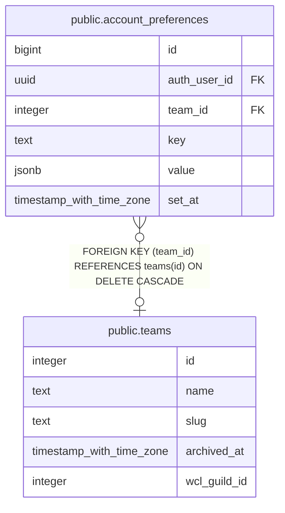

# public.account_preferences

## Description

Per-account preferences, one row per (account, team, key); team_id is null for guild-wide keys. The account_preferences_known_key CHECK lists every allowed key. Replaced no_character_dismissals (#940).

## Columns

| Name | Type | Default | Nullable | Children | Parents | Comment |
| ---- | ---- | ------- | -------- | -------- | ------- | ------- |
| id | bigint |  | false |  |  |  |
| auth_user_id | uuid |  | false |  |  |  |
| team_id | integer |  | true |  | [public.teams](public.teams.md) |  |
| key | text |  | false |  |  |  |
| value | jsonb |  | false |  |  |  |
| set_at | timestamp with time zone | now() | false |  |  |  |

## Constraints

| Name | Type | Definition |
| ---- | ---- | ---------- |
| account_preferences_known_key | CHECK | CHECK ((((key = 'no_character_dismissed'::text) AND (team_id IS NULL)) OR ((key = 'notifications_cleared_through'::text) AND (team_id IS NOT NULL)))) |
| account_preferences_auth_user_id_fkey | FOREIGN KEY | FOREIGN KEY (auth_user_id) REFERENCES auth.users(id) ON DELETE CASCADE |
| account_preferences_team_id_fkey | FOREIGN KEY | FOREIGN KEY (team_id) REFERENCES teams(id) ON DELETE CASCADE |
| account_preferences_pkey | PRIMARY KEY | PRIMARY KEY (id) |
| account_preferences_one_per_key | UNIQUE | UNIQUE NULLS NOT DISTINCT (auth_user_id, team_id, key) |

## Indexes

| Name | Definition |
| ---- | ---------- |
| account_preferences_pkey | CREATE UNIQUE INDEX account_preferences_pkey ON public.account_preferences USING btree (id) |
| account_preferences_one_per_key | CREATE UNIQUE INDEX account_preferences_one_per_key ON public.account_preferences USING btree (auth_user_id, team_id, key) NULLS NOT DISTINCT |

## Triggers

| Name | Definition |
| ---- | ---------- |
| account_preferences_touch_set_at | CREATE TRIGGER account_preferences_touch_set_at BEFORE UPDATE ON public.account_preferences FOR EACH ROW EXECUTE FUNCTION touch_account_preference_set_at() |

## Relations

---

> Generated by [tbls](https://github.com/k1LoW/tbls)
