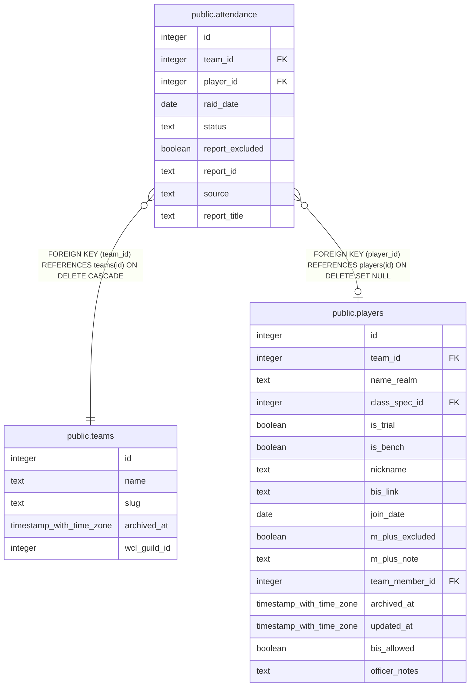

# public.attendance

## Columns

| Name | Type | Default | Nullable | Children | Parents | Comment |
| ---- | ---- | ------- | -------- | -------- | ------- | ------- |
| id | integer | nextval('attendance_id_seq'::regclass) | false |  |  |  |
| team_id | integer |  | false |  | [public.teams](public.teams.md) |  |
| player_id | integer |  | true |  | [public.players](public.players.md) |  |
| raid_date | date |  | false |  |  |  |
| status | text | 'Present'::text | false |  |  |  |
| report_excluded | boolean | false | false |  |  |  |
| report_id | text |  | true |  |  |  |
| source | text | 'Officer'::text | false |  |  |  |
| report_title | text |  | true |  |  |  |

## Constraints

| Name | Type | Definition |
| ---- | ---- | ---------- |
| attendance_source_check | CHECK | CHECK ((source = ANY (ARRAY['WCL'::text, 'Officer'::text, 'Auto (Bench)'::text]))) |
| attendance_status_check | CHECK | CHECK ((status = ANY (ARRAY['Present'::text, 'Bench'::text, 'Medical Leave'::text, 'Excused'::text, 'Extended Leave'::text, 'No Show'::text, 'Not on Roster'::text]))) |
| attendance_pkey | PRIMARY KEY | PRIMARY KEY (id) |
| attendance_team_id_player_id_raid_date_key | UNIQUE | UNIQUE (team_id, player_id, raid_date) |
| attendance_player_id_fkey | FOREIGN KEY | FOREIGN KEY (player_id) REFERENCES players(id) ON DELETE SET NULL |
| attendance_team_id_fkey | FOREIGN KEY | FOREIGN KEY (team_id) REFERENCES teams(id) ON DELETE CASCADE |

## Indexes

| Name | Definition |
| ---- | ---------- |
| attendance_pkey | CREATE UNIQUE INDEX attendance_pkey ON public.attendance USING btree (id) |
| attendance_team_id_player_id_raid_date_key | CREATE UNIQUE INDEX attendance_team_id_player_id_raid_date_key ON public.attendance USING btree (team_id, player_id, raid_date) |

## Triggers

| Name | Definition |
| ---- | ---------- |
| trg_attendance_team_id_check | CREATE TRIGGER trg_attendance_team_id_check BEFORE INSERT OR UPDATE ON public.attendance FOR EACH ROW EXECUTE FUNCTION check_team_id_matches_player() |

## Relations

---

> Generated by [tbls](https://github.com/k1LoW/tbls)
