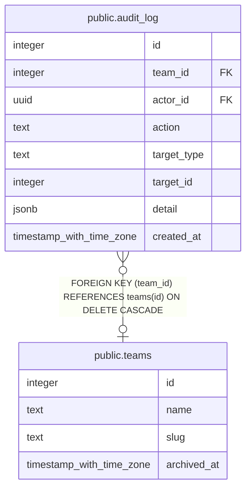

# public.audit_log

## Columns

| Name | Type | Default | Nullable | Children | Parents | Comment |
| ---- | ---- | ------- | -------- | -------- | ------- | ------- |
| id | integer | nextval('audit_log_id_seq'::regclass) | false |  |  |  |
| team_id | integer |  | true |  | [public.teams](public.teams.md) |  |
| actor_id | uuid |  | true |  |  |  |
| action | text |  | false |  |  |  |
| target_type | text |  | true |  |  |  |
| target_id | integer |  | true |  |  |  |
| detail | jsonb |  | true |  |  |  |
| created_at | timestamp with time zone | now() | false |  |  |  |

## Constraints

| Name | Type | Definition |
| ---- | ---- | ---------- |
| audit_log_actor_id_fkey | FOREIGN KEY | FOREIGN KEY (actor_id) REFERENCES auth.users(id) ON DELETE SET NULL |
| audit_log_pkey | PRIMARY KEY | PRIMARY KEY (id) |
| audit_log_team_id_fkey | FOREIGN KEY | FOREIGN KEY (team_id) REFERENCES teams(id) ON DELETE CASCADE |

## Indexes

| Name | Definition |
| ---- | ---------- |
| audit_log_pkey | CREATE UNIQUE INDEX audit_log_pkey ON public.audit_log USING btree (id) |

## Relations

---

> Generated by [tbls](https://github.com/k1LoW/tbls)
