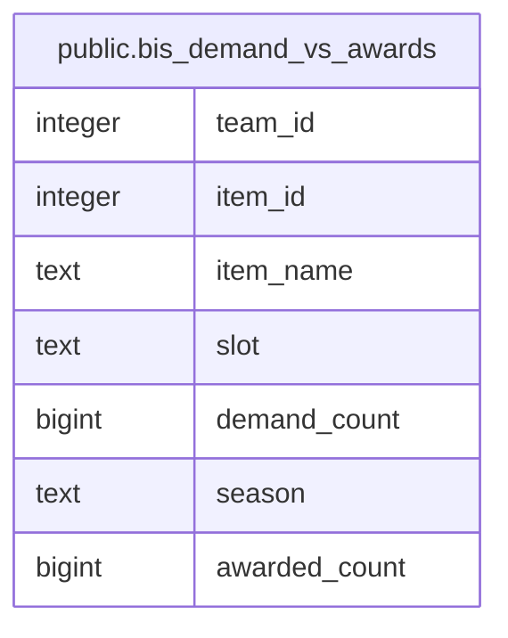

# public.bis_demand_vs_awards

## Description

<details>
<summary><strong>Table Definition</strong></summary>

```sql
CREATE VIEW bis_demand_vs_awards AS (
 WITH demand AS (
         SELECT p.team_id,
            ip.item_id,
            count(DISTINCT ip.player_id) AS demand_count
           FROM ((item_preferences ip
             JOIN players p ON ((p.id = ip.player_id)))
             JOIN items i_1 ON ((i_1.id = ip.item_id)))
          WHERE ((p.archived_at IS NULL) AND (ip.status = 'bis'::text) AND (NOT i_1.is_placeholder))
          GROUP BY p.team_id, ip.item_id
        ), awards AS (
         SELECT rclc_loot.team_id,
            rclc_loot.item_id,
            rclc_loot.season,
            count(*) AS awarded_count
           FROM rclc_loot
          WHERE (rclc_loot.item_id IS NOT NULL)
          GROUP BY rclc_loot.team_id, rclc_loot.item_id, rclc_loot.season
        )
 SELECT d.team_id,
    d.item_id,
    i.name AS item_name,
    i.slot,
    d.demand_count,
    a.season,
    COALESCE(a.awarded_count, (0)::bigint) AS awarded_count
   FROM ((demand d
     JOIN items i ON ((i.id = d.item_id)))
     LEFT JOIN awards a ON (((a.team_id = d.team_id) AND (a.item_id = d.item_id))))
  ORDER BY d.team_id, d.demand_count DESC, COALESCE(a.awarded_count, (0)::bigint)
)
```

</details>

## Columns

| Name | Type | Default | Nullable | Children | Parents | Comment |
| ---- | ---- | ------- | -------- | -------- | ------- | ------- |
| team_id | integer |  | true |  |  |  |
| item_id | integer |  | true |  |  |  |
| item_name | text |  | true |  |  |  |
| slot | text |  | true |  |  |  |
| demand_count | bigint |  | true |  |  |  |
| season | text |  | true |  |  |  |
| awarded_count | bigint |  | true |  |  |  |

## Referenced Tables

| Name | Columns | Comment | Type |
| ---- | ------- | ------- | ---- |
| [public.item_preferences](public.item_preferences.md) | 11 |  | BASE TABLE |
| [public.players](public.players.md) | 24 |  | BASE TABLE |
| [public.items](public.items.md) | 14 |  | BASE TABLE |
| [public.rclc_loot](public.rclc_loot.md) | 11 |  | BASE TABLE |
| [awards](awards.md) | 0 |  |  |

## Relations


```mermaid
erDiagram


"public.bis_demand_vs_awards" {
  integer team_id
  integer item_id
  text item_name
  text slot
  bigint demand_count
  text season
  bigint awarded_count
}
```

---

> Generated by [tbls](https://github.com/k1LoW/tbls)
