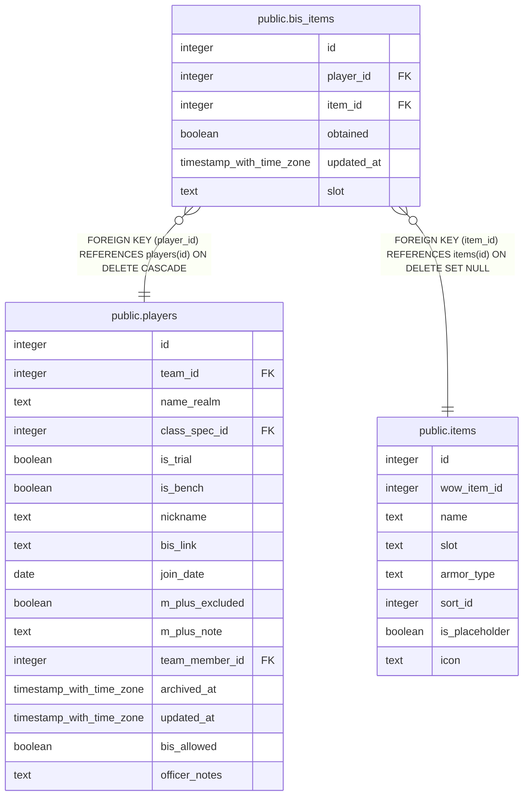

# public.bis_items

## Columns

| Name | Type | Default | Nullable | Children | Parents | Comment |
| ---- | ---- | ------- | -------- | -------- | ------- | ------- |
| id | integer | nextval('bis_items_id_seq'::regclass) | false |  |  |  |
| player_id | integer |  | false |  | [public.players](public.players.md) |  |
| item_id | integer |  | false |  | [public.items](public.items.md) |  |
| obtained | boolean | false | false |  |  |  |
| updated_at | timestamp with time zone |  | true |  |  |  |
| slot | text |  | true |  |  |  |

## Constraints

| Name | Type | Definition |
| ---- | ---- | ---------- |
| bis_items_pkey | PRIMARY KEY | PRIMARY KEY (id) |
| bis_items_item_id_fkey | FOREIGN KEY | FOREIGN KEY (item_id) REFERENCES items(id) ON DELETE SET NULL |
| bis_items_player_id_fkey | FOREIGN KEY | FOREIGN KEY (player_id) REFERENCES players(id) ON DELETE CASCADE |

## Indexes

| Name | Definition |
| ---- | ---------- |
| bis_items_pkey | CREATE UNIQUE INDEX bis_items_pkey ON public.bis_items USING btree (id) |
| bis_items_no_dupe_item_key | CREATE UNIQUE INDEX bis_items_no_dupe_item_key ON public.bis_items USING btree (player_id, item_id, COALESCE(slot, ''::text)) |

## Triggers

| Name | Definition |
| ---- | ---------- |
| trg_bis_items_updated_at | CREATE TRIGGER trg_bis_items_updated_at BEFORE UPDATE ON public.bis_items FOR EACH ROW EXECUTE FUNCTION set_updated_at() |

## Relations

---

> Generated by [tbls](https://github.com/k1LoW/tbls)
