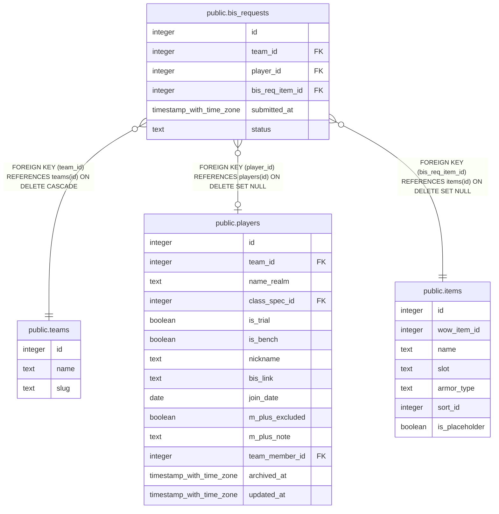

# public.bis_requests

## Columns

| Name | Type | Default | Nullable | Children | Parents | Comment |
| ---- | ---- | ------- | -------- | -------- | ------- | ------- |
| id | integer | nextval('bis_requests_id_seq'::regclass) | false |  |  |  |
| team_id | integer |  | false |  | [public.teams](public.teams.md) |  |
| player_id | integer |  | true |  | [public.players](public.players.md) |  |
| bis_req_item_id | integer |  | false |  | [public.items](public.items.md) |  |
| submitted_at | timestamp with time zone | now() | false |  |  |  |
| status | text | 'pending'::text | false |  |  |  |

## Constraints

| Name | Type | Definition |
| ---- | ---- | ---------- |
| bis_requests_status_check | CHECK | CHECK ((status = ANY (ARRAY['pending'::text, 'approved'::text, 'rejected'::text]))) |
| bis_requests_pkey | PRIMARY KEY | PRIMARY KEY (id) |
| bis_requests_bis_req_item_id_fkey | FOREIGN KEY | FOREIGN KEY (bis_req_item_id) REFERENCES items(id) ON DELETE SET NULL |
| bis_requests_player_id_fkey | FOREIGN KEY | FOREIGN KEY (player_id) REFERENCES players(id) ON DELETE SET NULL |
| bis_requests_team_id_fkey | FOREIGN KEY | FOREIGN KEY (team_id) REFERENCES teams(id) ON DELETE CASCADE |

## Indexes

| Name | Definition |
| ---- | ---------- |
| bis_requests_pkey | CREATE UNIQUE INDEX bis_requests_pkey ON public.bis_requests USING btree (id) |

## Triggers

| Name | Definition |
| ---- | ---------- |
| trg_bis_requests_team_id_check | CREATE TRIGGER trg_bis_requests_team_id_check BEFORE INSERT OR UPDATE ON public.bis_requests FOR EACH ROW EXECUTE FUNCTION check_team_id_matches_player() |

## Relations

---

> Generated by [tbls](https://github.com/k1LoW/tbls)
