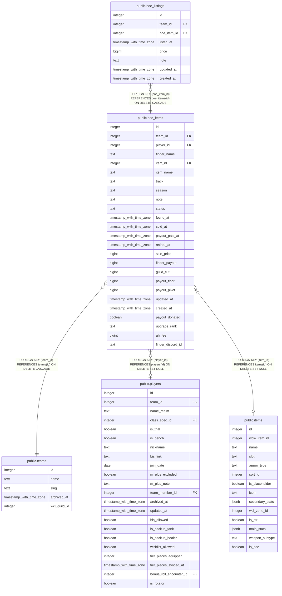

# public.boe_items

## Columns

| Name | Type | Default | Nullable | Children | Parents | Comment |
| ---- | ---- | ------- | -------- | -------- | ------- | ------- |
| id | integer | nextval('boe_items_id_seq'::regclass) | false | [public.boe_listings](public.boe_listings.md) |  |  |
| team_id | integer |  | false |  | [public.teams](public.teams.md) |  |
| player_id | integer |  | true |  | [public.players](public.players.md) |  |
| finder_name | text |  | true |  |  |  |
| item_id | integer |  | true |  | [public.items](public.items.md) |  |
| item_name | text |  | false |  |  |  |
| track | text |  | true |  |  |  |
| season | text |  | true |  |  |  |
| note | text |  | true |  |  |  |
| status | text | 'found'::text | false |  |  |  |
| found_at | timestamp with time zone | now() | false |  |  |  |
| sold_at | timestamp with time zone |  | true |  |  |  |
| payout_paid_at | timestamp with time zone |  | true |  |  |  |
| retired_at | timestamp with time zone |  | true |  |  |  |
| sale_price | bigint |  | true |  |  |  |
| finder_payout | bigint |  | true |  |  |  |
| guild_cut | bigint |  | true |  |  |  |
| payout_floor | bigint |  | true |  |  |  |
| payout_pivot | bigint |  | true |  |  |  |
| updated_at | timestamp with time zone |  | true |  |  |  |
| created_at | timestamp with time zone | now() | false |  |  |  |
| payout_donated | boolean | false | false |  |  |  |
| upgrade_rank | text |  | true |  |  | Upgrade rank as the tooltip shows it ("2/6"); with the track it is the identity of the item in the queue (#865). Null on rows imported from the sheets. |
| ah_fee | bigint |  | true |  |  | The auction house fee the game kept on the sale, whole gold: round(sale_price * 5 / 100), half away from zero (#861). Present iff sold/paid; finder_payout + guild_cut + ah_fee = sale_price by constraint. |
| finder_discord_id | text |  | true |  |  | Discord id of the signed-in account that submitted the find, stamped by submit_boe_found() and never client-supplied (#889); null for a signed-out submit. Backfilled from the player chain for rows whose player reached a member. |

## Constraints

| Name | Type | Definition |
| ---- | ---- | ---------- |
| boe_items_ah_fee_nonneg | CHECK | CHECK ((ah_fee >= 0)) |
| boe_items_finder_payout_nonneg | CHECK | CHECK ((finder_payout >= 0)) |
| boe_items_floor_nonneg | CHECK | CHECK ((payout_floor >= 0)) |
| boe_items_guild_cut_nonneg | CHECK | CHECK ((guild_cut >= 0)) |
| boe_items_money_complete_when_sold | CHECK | CHECK (((status <> ALL (ARRAY['sold'::text, 'paid'::text])) OR ((sale_price IS NOT NULL) AND (finder_payout IS NOT NULL) AND (guild_cut IS NOT NULL) AND (ah_fee IS NOT NULL) AND (payout_floor IS NOT NULL) AND (payout_pivot IS NOT NULL)))) |
| boe_items_money_only_when_sold | CHECK | CHECK (((status = ANY (ARRAY['sold'::text, 'paid'::text])) OR ((sale_price IS NULL) AND (finder_payout IS NULL) AND (guild_cut IS NULL) AND (ah_fee IS NULL) AND (payout_floor IS NULL) AND (payout_pivot IS NULL)))) |
| boe_items_money_sums | CHECK | CHECK (((status <> ALL (ARRAY['sold'::text, 'paid'::text])) OR (((finder_payout + guild_cut) + ah_fee) = sale_price))) |
| boe_items_paid_at_iff_paid | CHECK | CHECK (((status = 'paid'::text) = (payout_paid_at IS NOT NULL))) |
| boe_items_payout_lte_sale | CHECK | CHECK ((finder_payout <= sale_price)) |
| boe_items_pivot_positive | CHECK | CHECK ((payout_pivot > 0)) |
| boe_items_retired_at_iff_retired | CHECK | CHECK (((status = 'retired'::text) = (retired_at IS NOT NULL))) |
| boe_items_sale_price_nonneg | CHECK | CHECK ((sale_price >= 0)) |
| boe_items_sold_at_iff_sold | CHECK | CHECK (((status = ANY (ARRAY['sold'::text, 'paid'::text])) = (sold_at IS NOT NULL))) |
| boe_items_status_check | CHECK | CHECK ((status = ANY (ARRAY['found'::text, 'listed'::text, 'sold'::text, 'paid'::text, 'retired'::text]))) |
| boe_items_track_check | CHECK | CHECK ((track = ANY (ARRAY['Champion'::text, 'Hero'::text, 'Myth'::text]))) |
| boe_items_upgrade_rank_shape | CHECK | CHECK ((upgrade_rank ~ '^[0-9]{1,2}/[0-9]{1,2}$'::text)) |
| boe_items_item_id_fkey | FOREIGN KEY | FOREIGN KEY (item_id) REFERENCES items(id) ON DELETE SET NULL |
| boe_items_player_id_fkey | FOREIGN KEY | FOREIGN KEY (player_id) REFERENCES players(id) ON DELETE SET NULL |
| boe_items_team_id_fkey | FOREIGN KEY | FOREIGN KEY (team_id) REFERENCES teams(id) ON DELETE CASCADE |
| boe_items_pkey | PRIMARY KEY | PRIMARY KEY (id) |

## Indexes

| Name | Definition |
| ---- | ---------- |
| boe_items_pkey | CREATE UNIQUE INDEX boe_items_pkey ON public.boe_items USING btree (id) |

## Triggers

| Name | Definition |
| ---- | ---------- |
| trg_boe_items_team_id_check | CREATE TRIGGER trg_boe_items_team_id_check BEFORE INSERT OR UPDATE ON public.boe_items FOR EACH ROW EXECUTE FUNCTION check_team_id_matches_player() |
| trg_boe_items_updated_at | CREATE TRIGGER trg_boe_items_updated_at BEFORE UPDATE ON public.boe_items FOR EACH ROW EXECUTE FUNCTION set_updated_at() |
| trg_boe_items_status_transition | CREATE TRIGGER trg_boe_items_status_transition BEFORE UPDATE ON public.boe_items FOR EACH ROW EXECUTE FUNCTION check_boe_status_transition() |

## Relations

---

> Generated by [tbls](https://github.com/k1LoW/tbls)
