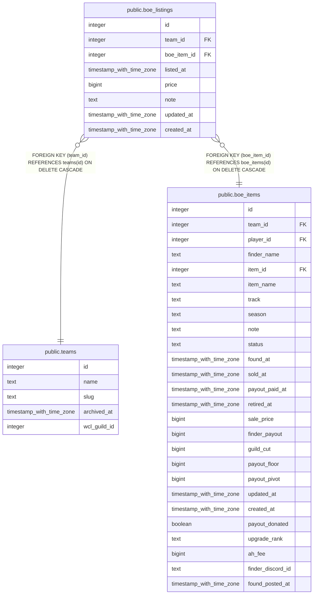

# public.boe_listings

## Columns

| Name | Type | Default | Nullable | Children | Parents | Comment |
| ---- | ---- | ------- | -------- | -------- | ------- | ------- |
| id | integer | nextval('boe_listings_id_seq'::regclass) | false |  |  |  |
| team_id | integer |  | false |  | [public.teams](public.teams.md) |  |
| boe_item_id | integer |  | false |  | [public.boe_items](public.boe_items.md) |  |
| listed_at | timestamp with time zone | now() | false |  |  |  |
| price | bigint |  | false |  |  |  |
| note | text |  | true |  |  |  |
| updated_at | timestamp with time zone |  | true |  |  |  |
| created_at | timestamp with time zone | now() | false |  |  |  |

## Constraints

| Name | Type | Definition |
| ---- | ---- | ---------- |
| boe_listings_price_check | CHECK | CHECK ((price >= 0)) |
| boe_listings_team_id_fkey | FOREIGN KEY | FOREIGN KEY (team_id) REFERENCES teams(id) ON DELETE CASCADE |
| boe_listings_boe_item_id_fkey | FOREIGN KEY | FOREIGN KEY (boe_item_id) REFERENCES boe_items(id) ON DELETE CASCADE |
| boe_listings_pkey | PRIMARY KEY | PRIMARY KEY (id) |

## Indexes

| Name | Definition |
| ---- | ---------- |
| boe_listings_pkey | CREATE UNIQUE INDEX boe_listings_pkey ON public.boe_listings USING btree (id) |
| boe_listings_boe_item_id_idx | CREATE INDEX boe_listings_boe_item_id_idx ON public.boe_listings USING btree (boe_item_id) |

## Triggers

| Name | Definition |
| ---- | ---------- |
| trg_boe_listings_team_id_check | CREATE TRIGGER trg_boe_listings_team_id_check BEFORE INSERT OR UPDATE ON public.boe_listings FOR EACH ROW EXECUTE FUNCTION check_team_id_matches_boe_item() |
| trg_boe_listings_updated_at | CREATE TRIGGER trg_boe_listings_updated_at BEFORE UPDATE ON public.boe_listings FOR EACH ROW EXECUTE FUNCTION set_updated_at() |

## Relations

---

> Generated by [tbls](https://github.com/k1LoW/tbls)
