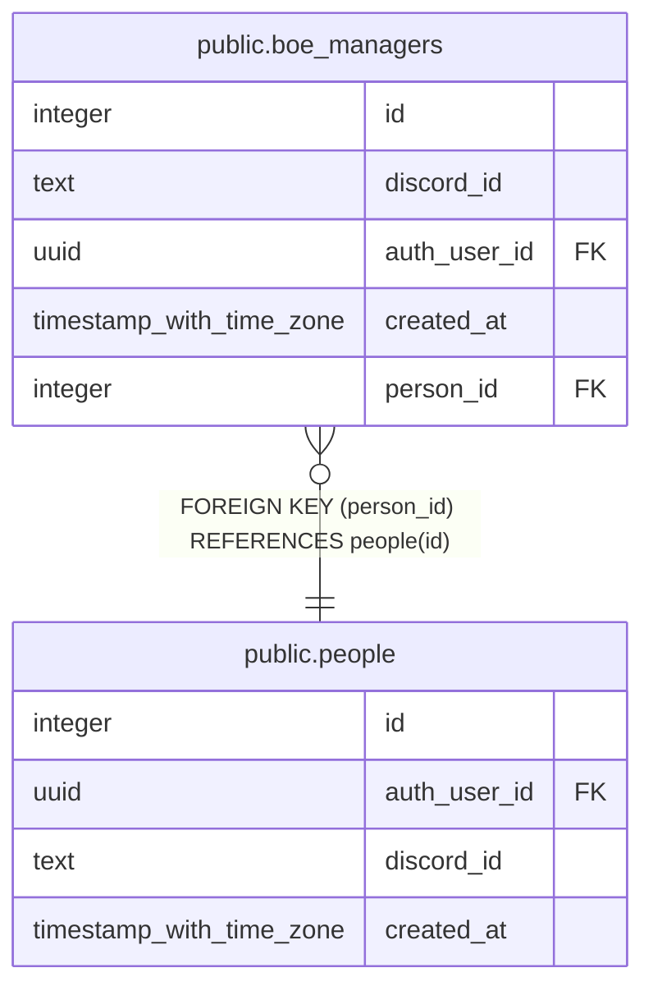

# public.boe_managers

## Columns

| Name | Type | Default | Nullable | Children | Parents | Comment |
| ---- | ---- | ------- | -------- | -------- | ------- | ------- |
| id | integer | nextval('boe_managers_id_seq'::regclass) | false |  |  |  |
| discord_id | text |  | false |  |  |  |
| auth_user_id | uuid |  | true |  |  |  |
| created_at | timestamp with time zone | now() | false |  |  |  |
| person_id | integer |  | false |  | [public.people](public.people.md) |  |

## Constraints

| Name | Type | Definition |
| ---- | ---- | ---------- |
| boe_managers_auth_user_id_fkey | FOREIGN KEY | FOREIGN KEY (auth_user_id) REFERENCES auth.users(id) ON DELETE SET NULL |
| boe_managers_pkey | PRIMARY KEY | PRIMARY KEY (id) |
| boe_managers_discord_id_key | UNIQUE | UNIQUE (discord_id) |
| boe_managers_person_id_fkey | FOREIGN KEY | FOREIGN KEY (person_id) REFERENCES people(id) |

## Indexes

| Name | Definition |
| ---- | ---------- |
| boe_managers_pkey | CREATE UNIQUE INDEX boe_managers_pkey ON public.boe_managers USING btree (id) |
| boe_managers_discord_id_key | CREATE UNIQUE INDEX boe_managers_discord_id_key ON public.boe_managers USING btree (discord_id) |
| boe_managers_person_id_idx | CREATE INDEX boe_managers_person_id_idx ON public.boe_managers USING btree (person_id) |

## Triggers

| Name | Definition |
| ---- | ---------- |
| boe_managers_set_person | CREATE TRIGGER boe_managers_set_person BEFORE INSERT OR UPDATE ON public.boe_managers FOR EACH ROW EXECUTE FUNCTION set_person_from_discord_id() |

## Relations

---

> Generated by [tbls](https://github.com/k1LoW/tbls)
