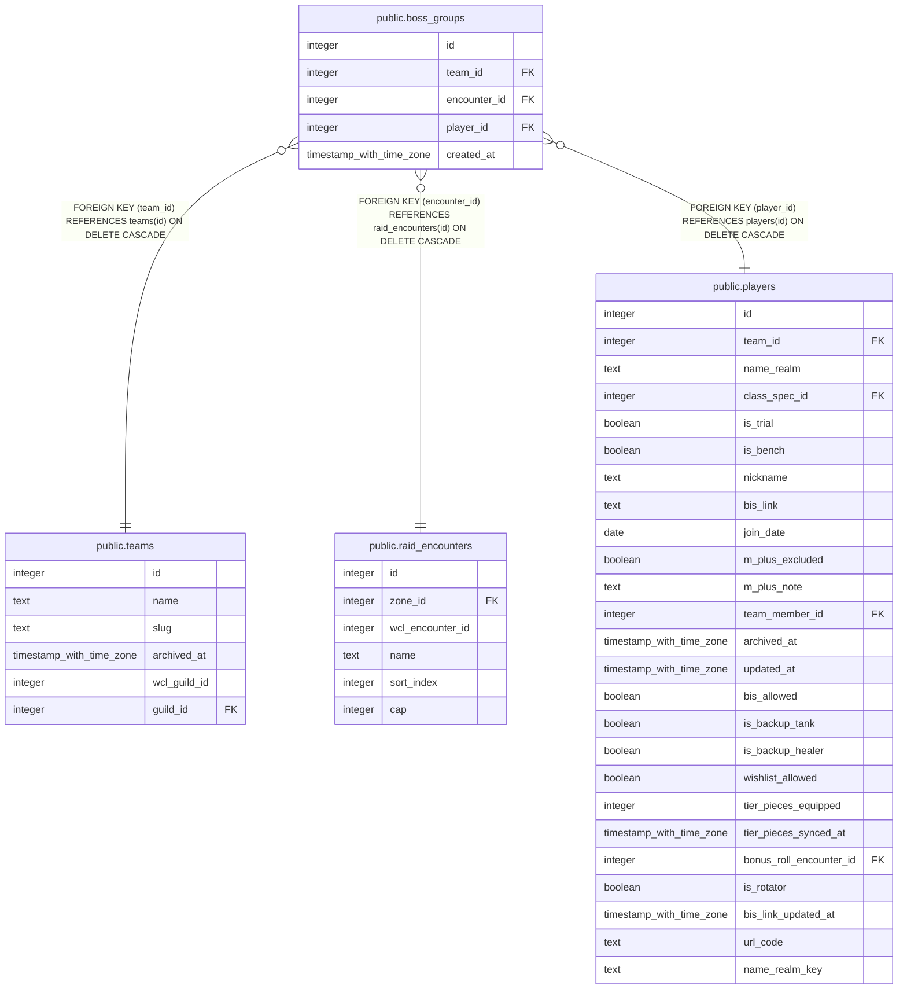

# public.boss_groups

## Description

The standing group per boss for a team (#1216): one row per raider in the group that kills that boss. A new raid night is filled from these. Written only through set_boss_group().

## Columns

| Name | Type | Default | Nullable | Children | Parents | Comment |
| ---- | ---- | ------- | -------- | -------- | ------- | ------- |
| id | integer |  | false |  |  |  |
| team_id | integer |  | false |  | [public.teams](public.teams.md) |  |
| encounter_id | integer |  | false |  | [public.raid_encounters](public.raid_encounters.md) |  |
| player_id | integer |  | false |  | [public.players](public.players.md) |  |
| created_at | timestamp with time zone | now() | false |  |  |  |

## Constraints

| Name | Type | Definition |
| ---- | ---- | ---------- |
| boss_groups_player_id_fkey | FOREIGN KEY | FOREIGN KEY (player_id) REFERENCES players(id) ON DELETE CASCADE |
| boss_groups_team_id_fkey | FOREIGN KEY | FOREIGN KEY (team_id) REFERENCES teams(id) ON DELETE CASCADE |
| boss_groups_encounter_id_fkey | FOREIGN KEY | FOREIGN KEY (encounter_id) REFERENCES raid_encounters(id) ON DELETE CASCADE |
| boss_groups_pkey | PRIMARY KEY | PRIMARY KEY (id) |
| boss_groups_team_id_encounter_id_player_id_key | UNIQUE | UNIQUE (team_id, encounter_id, player_id) |

## Indexes

| Name | Definition |
| ---- | ---------- |
| boss_groups_pkey | CREATE UNIQUE INDEX boss_groups_pkey ON public.boss_groups USING btree (id) |
| boss_groups_team_id_encounter_id_player_id_key | CREATE UNIQUE INDEX boss_groups_team_id_encounter_id_player_id_key ON public.boss_groups USING btree (team_id, encounter_id, player_id) |
| boss_groups_encounter_id_idx | CREATE INDEX boss_groups_encounter_id_idx ON public.boss_groups USING btree (encounter_id) |
| boss_groups_player_id_idx | CREATE INDEX boss_groups_player_id_idx ON public.boss_groups USING btree (player_id) |

## Triggers

| Name | Definition |
| ---- | ---------- |
| trg_boss_groups_team_id_check | CREATE TRIGGER trg_boss_groups_team_id_check BEFORE INSERT OR UPDATE ON public.boss_groups FOR EACH ROW EXECUTE FUNCTION check_team_id_matches_player() |

## Relations

---

> Generated by [tbls](https://github.com/k1LoW/tbls)
