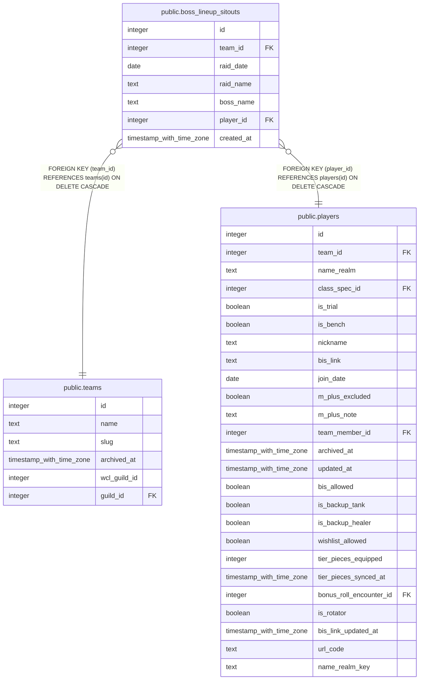

# public.boss_lineup_sitouts

## Description

Per-boss lineups for a raid night (#1216): one row per raider an officer sat out for one boss. A raider with no row is in. Raid and boss are named as Season Settings (team_settings.config.raidProgression) spells them. Written only through set_boss_lineup().

## Columns

| Name | Type | Default | Nullable | Children | Parents | Comment |
| ---- | ---- | ------- | -------- | -------- | ------- | ------- |
| id | integer | nextval('boss_lineup_sitouts_id_seq'::regclass) | false |  |  |  |
| team_id | integer |  | false |  | [public.teams](public.teams.md) |  |
| raid_date | date |  | false |  |  |  |
| raid_name | text |  | false |  |  |  |
| boss_name | text |  | false |  |  |  |
| player_id | integer |  | false |  | [public.players](public.players.md) |  |
| created_at | timestamp with time zone | now() | false |  |  |  |

## Constraints

| Name | Type | Definition |
| ---- | ---- | ---------- |
| boss_lineup_sitouts_player_id_fkey | FOREIGN KEY | FOREIGN KEY (player_id) REFERENCES players(id) ON DELETE CASCADE |
| boss_lineup_sitouts_team_id_fkey | FOREIGN KEY | FOREIGN KEY (team_id) REFERENCES teams(id) ON DELETE CASCADE |
| boss_lineup_sitouts_pkey | PRIMARY KEY | PRIMARY KEY (id) |
| boss_lineup_sitouts_team_id_raid_date_raid_name_boss_name_p_key | UNIQUE | UNIQUE (team_id, raid_date, raid_name, boss_name, player_id) |

## Indexes

| Name | Definition |
| ---- | ---------- |
| boss_lineup_sitouts_pkey | CREATE UNIQUE INDEX boss_lineup_sitouts_pkey ON public.boss_lineup_sitouts USING btree (id) |
| boss_lineup_sitouts_team_id_raid_date_raid_name_boss_name_p_key | CREATE UNIQUE INDEX boss_lineup_sitouts_team_id_raid_date_raid_name_boss_name_p_key ON public.boss_lineup_sitouts USING btree (team_id, raid_date, raid_name, boss_name, player_id) |
| boss_lineup_sitouts_player_id_idx | CREATE INDEX boss_lineup_sitouts_player_id_idx ON public.boss_lineup_sitouts USING btree (player_id) |

## Relations

---

> Generated by [tbls](https://github.com/k1LoW/tbls)
