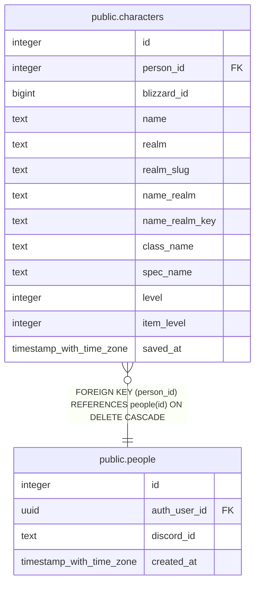

# public.characters

## Description

Characters a person chose to show from their Battle.net account (#942 step 5, #1162). Written only by save_battlenet_characters() from the battlenet-characters Edge Function. A character here is an alt unless the same name_realm_key is a roster row linked to the person.

## Columns

| Name | Type | Default | Nullable | Extra Definition | Children | Parents | Comment |
| ---- | ---- | ------- | -------- | ---------------- | -------- | ------- | ------- |
| id | integer |  | false |  |  |  |  |
| person_id | integer |  | false |  |  | [public.people](public.people.md) |  |
| blizzard_id | bigint |  | false |  |  |  |  |
| name | text |  | false |  |  |  |  |
| realm | text |  | false |  |  |  |  |
| realm_slug | text |  | false |  |  |  |  |
| name_realm | text |  | true | GENERATED ALWAYS AS ((name \|\| '-'::text) \|\| realm) STORED |  |  |  |
| name_realm_key | text |  | true | GENERATED ALWAYS AS lower(replace(((name \|\| '-'::text) \|\| realm), ' '::text, ''::text)) STORED |  |  |  |
| class_name | text |  | true |  |  |  |  |
| spec_name | text |  | true |  |  |  |  |
| level | integer |  | true |  |  |  |  |
| item_level | integer |  | true |  |  |  |  |
| saved_at | timestamp with time zone | now() | false |  |  |  |  |

## Constraints

| Name | Type | Definition |
| ---- | ---- | ---------- |
| characters_person_id_fkey | FOREIGN KEY | FOREIGN KEY (person_id) REFERENCES people(id) ON DELETE CASCADE |
| characters_pkey | PRIMARY KEY | PRIMARY KEY (id) |
| characters_blizzard_id_key | UNIQUE | UNIQUE (blizzard_id) |

## Indexes

| Name | Definition |
| ---- | ---------- |
| characters_pkey | CREATE UNIQUE INDEX characters_pkey ON public.characters USING btree (id) |
| characters_blizzard_id_key | CREATE UNIQUE INDEX characters_blizzard_id_key ON public.characters USING btree (blizzard_id) |
| characters_person_id_idx | CREATE INDEX characters_person_id_idx ON public.characters USING btree (person_id) |

## Relations

---

> Generated by [tbls](https://github.com/k1LoW/tbls)
