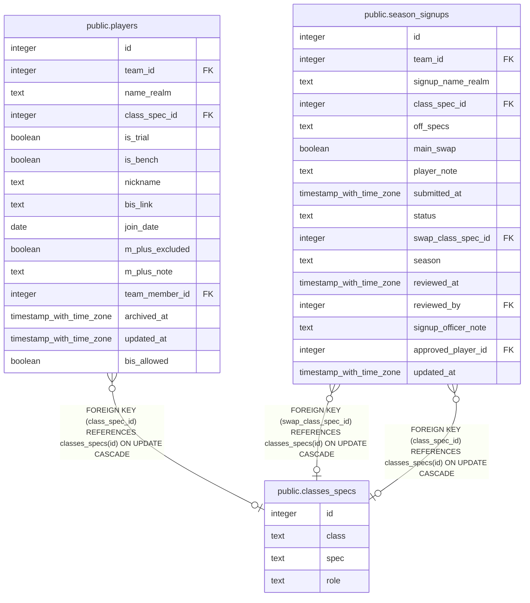

# public.classes_specs

## Columns

| Name | Type | Default | Nullable | Children | Parents | Comment |
| ---- | ---- | ------- | -------- | -------- | ------- | ------- |
| id | integer | nextval('classes_specs_id_seq'::regclass) | false | [public.players](public.players.md) [public.season_signups](public.season_signups.md) |  |  |
| class | text |  | false |  |  |  |
| spec | text |  | false |  |  |  |
| role | text |  | true |  |  |  |

## Constraints

| Name | Type | Definition |
| ---- | ---- | ---------- |
| classes_specs_role_check | CHECK | CHECK ((role = ANY (ARRAY['Tank'::text, 'Heal'::text, 'Melee'::text, 'Ranged'::text]))) |
| classes_specs_pkey | PRIMARY KEY | PRIMARY KEY (id) |
| unique_spec_key | UNIQUE | UNIQUE (class, spec) |
| classes_specs_class_spec_key | UNIQUE | UNIQUE (class, spec) |

## Indexes

| Name | Definition |
| ---- | ---------- |
| classes_specs_pkey | CREATE UNIQUE INDEX classes_specs_pkey ON public.classes_specs USING btree (id) |
| unique_spec_key | CREATE UNIQUE INDEX unique_spec_key ON public.classes_specs USING btree (class, spec) |
| classes_specs_class_spec_key | CREATE UNIQUE INDEX classes_specs_class_spec_key ON public.classes_specs USING btree (class, spec) |

## Relations

---

> Generated by [tbls](https://github.com/k1LoW/tbls)
