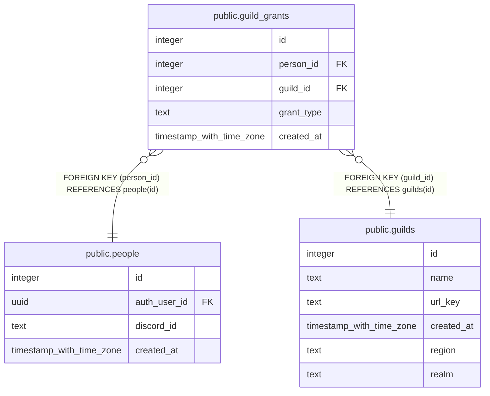

# public.guild_grants

## Description

Guild-wide grants, one row per person per grant per guild (#942). Replaced site_admins, guild_officers and boe_managers, which remain as read-only views until cutover.

## Columns

| Name | Type | Default | Nullable | Children | Parents | Comment |
| ---- | ---- | ------- | -------- | -------- | ------- | ------- |
| id | integer |  | false |  |  |  |
| person_id | integer |  | false |  | [public.people](public.people.md) |  |
| guild_id | integer |  | false |  | [public.guilds](public.guilds.md) |  |
| grant_type | text |  | false |  |  |  |
| created_at | timestamp with time zone | now() | false |  |  |  |

## Constraints

| Name | Type | Definition |
| ---- | ---- | ---------- |
| guild_grants_grant_type_check | CHECK | CHECK ((grant_type = ANY (ARRAY['site_admin'::text, 'guild_officer'::text, 'boe_manager'::text]))) |
| guild_grants_guild_id_fkey | FOREIGN KEY | FOREIGN KEY (guild_id) REFERENCES guilds(id) |
| guild_grants_person_id_fkey | FOREIGN KEY | FOREIGN KEY (person_id) REFERENCES people(id) |
| guild_grants_pkey | PRIMARY KEY | PRIMARY KEY (id) |
| guild_grants_person_id_guild_id_grant_type_key | UNIQUE | UNIQUE (person_id, guild_id, grant_type) |

## Indexes

| Name | Definition |
| ---- | ---------- |
| guild_grants_pkey | CREATE UNIQUE INDEX guild_grants_pkey ON public.guild_grants USING btree (id) |
| guild_grants_person_id_guild_id_grant_type_key | CREATE UNIQUE INDEX guild_grants_person_id_guild_id_grant_type_key ON public.guild_grants USING btree (person_id, guild_id, grant_type) |
| guild_grants_guild_id_idx | CREATE INDEX guild_grants_guild_id_idx ON public.guild_grants USING btree (guild_id) |

## Relations

---

> Generated by [tbls](https://github.com/k1LoW/tbls)
