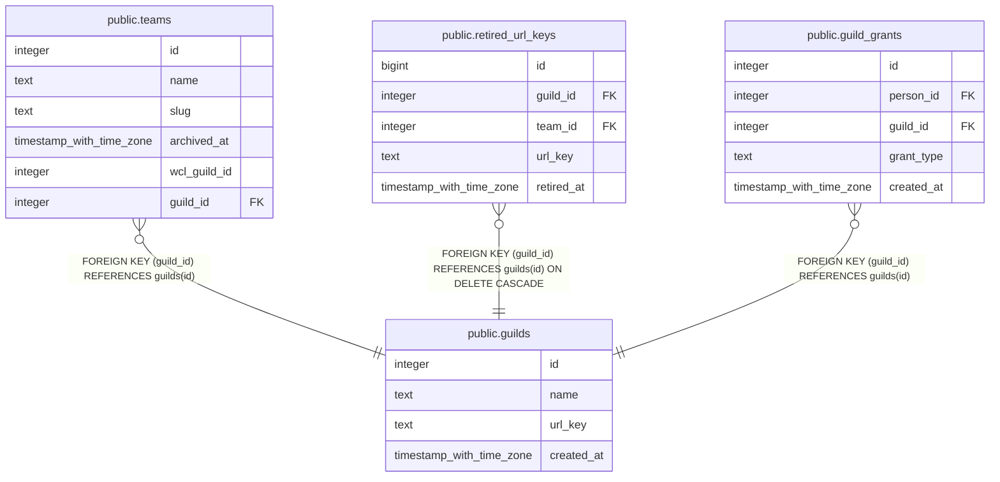

# public.guilds

## Description

One row per guild. url_key is the /g/<key> segment of an address: readable for WGA, a random code for any other guild (#1100, #1114).

## Columns

| Name | Type | Default | Nullable | Children | Parents | Comment |
| ---- | ---- | ------- | -------- | -------- | ------- | ------- |
| id | integer |  | false | [public.teams](public.teams.md) [public.retired_url_keys](public.retired_url_keys.md) [public.guild_grants](public.guild_grants.md) |  |  |
| name | text |  | false |  |  |  |
| url_key | text | new_url_code() | false |  |  |  |
| created_at | timestamp with time zone | now() | false |  |  |  |

## Constraints

| Name | Type | Definition |
| ---- | ---- | ---------- |
| guilds_url_key_format | CHECK | CHECK (((url_key ~ '^[a-z0-9]+(-[a-z0-9]+)*$'::text) AND ((length(url_key) >= 2) AND (length(url_key) <= 32)))) |
| guilds_pkey | PRIMARY KEY | PRIMARY KEY (id) |
| guilds_name_key | UNIQUE | UNIQUE (name) |
| guilds_url_key_key | UNIQUE | UNIQUE (url_key) |

## Indexes

| Name | Definition |
| ---- | ---------- |
| guilds_pkey | CREATE UNIQUE INDEX guilds_pkey ON public.guilds USING btree (id) |
| guilds_name_key | CREATE UNIQUE INDEX guilds_name_key ON public.guilds USING btree (name) |
| guilds_url_key_key | CREATE UNIQUE INDEX guilds_url_key_key ON public.guilds USING btree (url_key) |

## Triggers

| Name | Definition |
| ---- | ---------- |
| guilds_retire_url_key | CREATE TRIGGER guilds_retire_url_key AFTER UPDATE OF url_key ON public.guilds FOR EACH ROW WHEN ((old.url_key IS DISTINCT FROM new.url_key)) EXECUTE FUNCTION retire_guild_url_key() |

## Relations

---

> Generated by [tbls](https://github.com/k1LoW/tbls)
