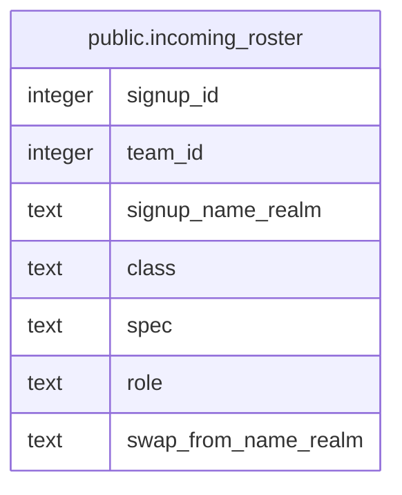

# public.incoming_roster

## Description

<details>
<summary><strong>Table Definition</strong></summary>

```sql
CREATE VIEW incoming_roster AS (
 SELECT s.id AS signup_id,
    s.team_id,
    s.signup_name_realm,
    cs.class,
    cs.spec,
    cs.role,
    s.swap_from_name_realm
   FROM ((season_signups s
     JOIN team_seasons ts ON (((ts.team_id = s.team_id) AND (ts.season_code = s.season))))
     LEFT JOIN classes_specs cs ON ((cs.id = COALESCE(s.swap_class_spec_id, s.class_spec_id))))
  WHERE ((s.status = 'approved'::text) AND (s.approved_player_id IS NULL))
)
```

</details>

## Columns

| Name | Type | Default | Nullable | Children | Parents | Comment |
| ---- | ---- | ------- | -------- | -------- | ------- | ------- |
| signup_id | integer |  | true |  |  |  |
| team_id | integer |  | true |  |  |  |
| signup_name_realm | text |  | true |  |  |  |
| class | text |  | true |  |  |  |
| spec | text |  | true |  |  |  |
| role | text |  | true |  |  |  |
| swap_from_name_realm | text |  | true |  |  |  |

## Referenced Tables

| Name | Columns | Comment | Type |
| ---- | ------- | ------- | ---- |
| [public.season_signups](public.season_signups.md) | 18 |  | BASE TABLE |
| [public.team_seasons](public.team_seasons.md) | 6 | A team's two switches per tier (#939): whether raiders can sign up and whether they can edit their wishlist. No row means both closed. Written only by set_team_season(). | BASE TABLE |
| [public.classes_specs](public.classes_specs.md) | 4 |  | BASE TABLE |

## Relations


```mermaid
erDiagram


"public.incoming_roster" {
  integer signup_id
  integer team_id
  text signup_name_realm
  text class
  text spec
  text role
  text swap_from_name_realm
}
```

---

> Generated by [tbls](https://github.com/k1LoW/tbls)
