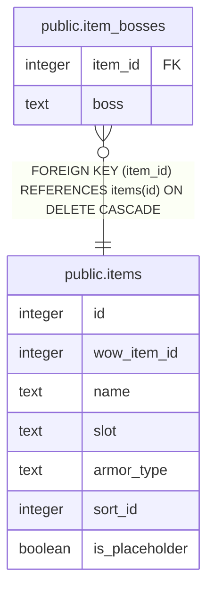

# public.item_bosses

## Columns

| Name | Type | Default | Nullable | Children | Parents | Comment |
| ---- | ---- | ------- | -------- | -------- | ------- | ------- |
| item_id | integer |  | false |  | [public.items](public.items.md) |  |
| boss | text |  | false |  |  |  |

## Constraints

| Name | Type | Definition |
| ---- | ---- | ---------- |
| item_bosses_pkey | PRIMARY KEY | PRIMARY KEY (item_id, boss) |
| item_bosses_item_id_fkey | FOREIGN KEY | FOREIGN KEY (item_id) REFERENCES items(id) ON DELETE CASCADE |

## Indexes

| Name | Definition |
| ---- | ---------- |
| item_bosses_pkey | CREATE UNIQUE INDEX item_bosses_pkey ON public.item_bosses USING btree (item_id, boss) |

## Relations

---

> Generated by [tbls](https://github.com/k1LoW/tbls)
