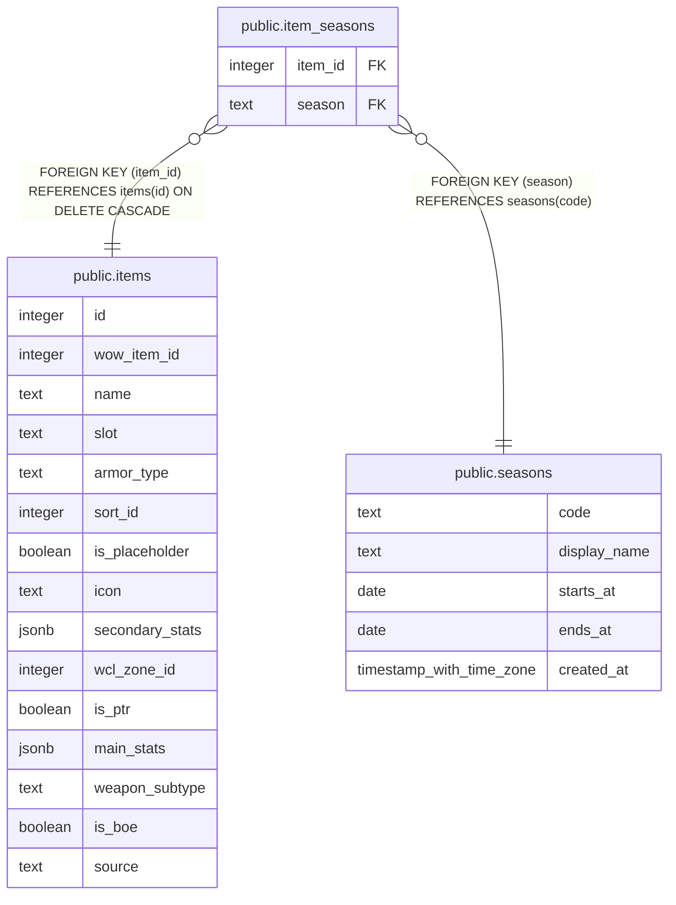

# public.item_seasons

## Description

The seasons a dungeon or crafted item is offered in (#1166). A raid item has no row: its season comes from raid_zones. Filled by scripts/dungeon-items-sql.js, never by a client.

## Columns

| Name | Type | Default | Nullable | Children | Parents | Comment |
| ---- | ---- | ------- | -------- | -------- | ------- | ------- |
| item_id | integer |  | false |  | [public.items](public.items.md) |  |
| season | text |  | false |  | [public.seasons](public.seasons.md) |  |

## Constraints

| Name | Type | Definition |
| ---- | ---- | ---------- |
| item_seasons_item_id_fkey | FOREIGN KEY | FOREIGN KEY (item_id) REFERENCES items(id) ON DELETE CASCADE |
| item_seasons_season_fkey | FOREIGN KEY | FOREIGN KEY (season) REFERENCES seasons(code) |
| item_seasons_pkey | PRIMARY KEY | PRIMARY KEY (item_id, season) |

## Indexes

| Name | Definition |
| ---- | ---------- |
| item_seasons_pkey | CREATE UNIQUE INDEX item_seasons_pkey ON public.item_seasons USING btree (item_id, season) |
| item_seasons_season_idx | CREATE INDEX item_seasons_season_idx ON public.item_seasons USING btree (season) |

## Relations

---

> Generated by [tbls](https://github.com/k1LoW/tbls)
