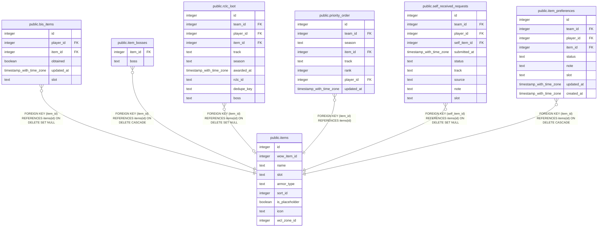

# public.items

## Columns

| Name | Type | Default | Nullable | Children | Parents | Comment |
| ---- | ---- | ------- | -------- | -------- | ------- | ------- |
| id | integer | nextval('items_id_seq'::regclass) | false | [public.bis_items](public.bis_items.md) [public.item_bosses](public.item_bosses.md) [public.rclc_loot](public.rclc_loot.md) [public.priority_order](public.priority_order.md) [public.self_received_requests](public.self_received_requests.md) [public.item_preferences](public.item_preferences.md) |  |  |
| wow_item_id | integer |  | true |  |  |  |
| name | text |  | false |  |  |  |
| slot | text |  | false |  |  |  |
| armor_type | text |  | true |  |  |  |
| sort_id | integer |  | true |  |  |  |
| is_placeholder | boolean | false | false |  |  |  |
| icon | text |  | true |  |  |  |
| wcl_zone_id | integer |  | true |  |  |  |

## Constraints

| Name | Type | Definition |
| ---- | ---- | ---------- |
| items_armor_type_check | CHECK | CHECK ((armor_type = ANY (ARRAY['Plate'::text, 'Mail'::text, 'Leather'::text, 'Cloth'::text]))) |
| items_pkey | PRIMARY KEY | PRIMARY KEY (id) |

## Indexes

| Name | Definition |
| ---- | ---------- |
| items_pkey | CREATE UNIQUE INDEX items_pkey ON public.items USING btree (id) |
| items_lower_name_key | CREATE UNIQUE INDEX items_lower_name_key ON public.items USING btree (lower(name)) |
| items_wow_item_id_key | CREATE UNIQUE INDEX items_wow_item_id_key ON public.items USING btree (wow_item_id) WHERE (wow_item_id IS NOT NULL) |

## Relations

---

> Generated by [tbls](https://github.com/k1LoW/tbls)
