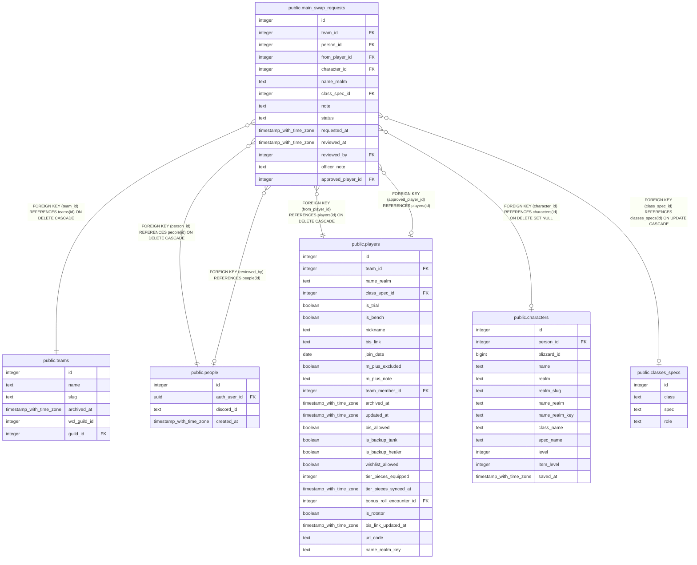

# public.main_swap_requests

## Description

A raider's request to make one of their alts their roster character, outside a signup window (#631, #942 step 5c). Written only by request_main_swap(), cancel_main_swap_request() and review_main_swap_request(). name_realm and class_spec_id are what they asked for, kept here so the request still reads right after the character row changes.

## Columns

| Name | Type | Default | Nullable | Children | Parents | Comment |
| ---- | ---- | ------- | -------- | -------- | ------- | ------- |
| id | integer |  | false |  |  |  |
| team_id | integer |  | false |  | [public.teams](public.teams.md) |  |
| person_id | integer |  | false |  | [public.people](public.people.md) |  |
| from_player_id | integer |  | false |  | [public.players](public.players.md) | Their roster character when they asked. The one that gets archived on approval. |
| character_id | integer |  | true |  | [public.characters](public.characters.md) |  |
| name_realm | text |  | false |  |  |  |
| class_spec_id | integer |  | true |  | [public.classes_specs](public.classes_specs.md) |  |
| note | text |  | true |  |  |  |
| status | text | 'pending'::text | false |  |  |  |
| requested_at | timestamp with time zone | now() | false |  |  |  |
| reviewed_at | timestamp with time zone |  | true |  |  |  |
| reviewed_by | integer |  | true |  | [public.people](public.people.md) |  |
| officer_note | text |  | true |  |  |  |
| approved_player_id | integer |  | true |  | [public.players](public.players.md) | The roster row the approval landed on: the revived character, or the new one. |

## Constraints

| Name | Type | Definition |
| ---- | ---- | ---------- |
| main_swap_requests_status_check | CHECK | CHECK ((status = ANY (ARRAY['pending'::text, 'approved'::text, 'declined'::text, 'cancelled'::text]))) |
| main_swap_requests_class_spec_id_fkey | FOREIGN KEY | FOREIGN KEY (class_spec_id) REFERENCES classes_specs(id) ON UPDATE CASCADE |
| main_swap_requests_approved_player_id_fkey | FOREIGN KEY | FOREIGN KEY (approved_player_id) REFERENCES players(id) |
| main_swap_requests_from_player_id_fkey | FOREIGN KEY | FOREIGN KEY (from_player_id) REFERENCES players(id) ON DELETE CASCADE |
| main_swap_requests_team_id_fkey | FOREIGN KEY | FOREIGN KEY (team_id) REFERENCES teams(id) ON DELETE CASCADE |
| main_swap_requests_person_id_fkey | FOREIGN KEY | FOREIGN KEY (person_id) REFERENCES people(id) ON DELETE CASCADE |
| main_swap_requests_reviewed_by_fkey | FOREIGN KEY | FOREIGN KEY (reviewed_by) REFERENCES people(id) |
| main_swap_requests_character_id_fkey | FOREIGN KEY | FOREIGN KEY (character_id) REFERENCES characters(id) ON DELETE SET NULL |
| main_swap_requests_pkey | PRIMARY KEY | PRIMARY KEY (id) |

## Indexes

| Name | Definition |
| ---- | ---------- |
| main_swap_requests_pkey | CREATE UNIQUE INDEX main_swap_requests_pkey ON public.main_swap_requests USING btree (id) |
| main_swap_requests_team_pending_idx | CREATE INDEX main_swap_requests_team_pending_idx ON public.main_swap_requests USING btree (team_id) WHERE (status = 'pending'::text) |
| main_swap_requests_person_idx | CREATE INDEX main_swap_requests_person_idx ON public.main_swap_requests USING btree (person_id) |
| main_swap_requests_one_pending | CREATE UNIQUE INDEX main_swap_requests_one_pending ON public.main_swap_requests USING btree (team_id, person_id) WHERE (status = 'pending'::text) |

## Relations

---

> Generated by [tbls](https://github.com/k1LoW/tbls)
