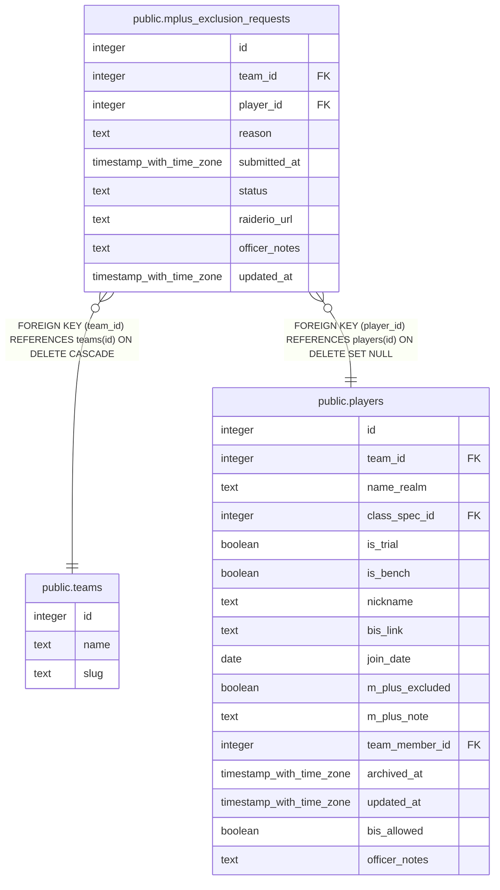

# public.mplus_exclusion_requests

## Columns

| Name | Type | Default | Nullable | Children | Parents | Comment |
| ---- | ---- | ------- | -------- | -------- | ------- | ------- |
| id | integer | nextval('mplus_exclusion_requests_id_seq'::regclass) | false |  |  |  |
| team_id | integer |  | false |  | [public.teams](public.teams.md) |  |
| player_id | integer |  | false |  | [public.players](public.players.md) |  |
| reason | text |  | true |  |  |  |
| submitted_at | timestamp with time zone | now() | false |  |  |  |
| status | text | 'pending'::text | false |  |  |  |
| raiderio_url | text |  | true |  |  |  |
| officer_notes | text |  | true |  |  |  |
| updated_at | timestamp with time zone |  | true |  |  |  |

## Constraints

| Name | Type | Definition |
| ---- | ---- | ---------- |
| mplus_exclusion_requests_status_check | CHECK | CHECK ((status = ANY (ARRAY['pending'::text, 'approved'::text, 'rejected'::text]))) |
| mplus_exclusion_requests_pkey | PRIMARY KEY | PRIMARY KEY (id) |
| mplus_exclusion_requests_player_id_fkey | FOREIGN KEY | FOREIGN KEY (player_id) REFERENCES players(id) ON DELETE SET NULL |
| mplus_exclusion_requests_team_id_fkey | FOREIGN KEY | FOREIGN KEY (team_id) REFERENCES teams(id) ON DELETE CASCADE |

## Indexes

| Name | Definition |
| ---- | ---------- |
| mplus_exclusion_requests_pkey | CREATE UNIQUE INDEX mplus_exclusion_requests_pkey ON public.mplus_exclusion_requests USING btree (id) |
| mplus_excl_one_pending_per_player | CREATE UNIQUE INDEX mplus_excl_one_pending_per_player ON public.mplus_exclusion_requests USING btree (player_id) WHERE (status = 'pending'::text) |

## Triggers

| Name | Definition |
| ---- | ---------- |
| trg_mplus_exclusion_requests_team_id_check | CREATE TRIGGER trg_mplus_exclusion_requests_team_id_check BEFORE INSERT OR UPDATE ON public.mplus_exclusion_requests FOR EACH ROW EXECUTE FUNCTION check_team_id_matches_player() |
| trg_mplus_exclusion_requests_updated_at | CREATE TRIGGER trg_mplus_exclusion_requests_updated_at BEFORE UPDATE ON public.mplus_exclusion_requests FOR EACH ROW EXECUTE FUNCTION set_updated_at() |

## Relations

---

> Generated by [tbls](https://github.com/k1LoW/tbls)
