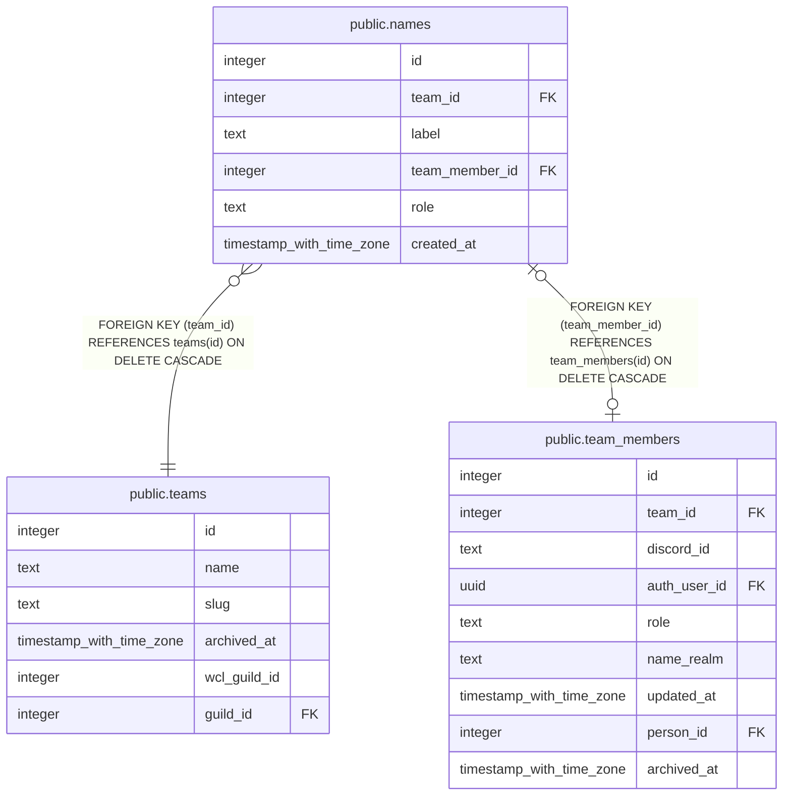

# public.names

## Description

A team roster row's display label (#1355), independent of team_members: bare (team_member_id null, officer-created), or claimed once linked to a real membership. Claiming/assigning/unclaiming only ever updates this row -- team_members is never created or merged as part of it, and a names row outlives its membership being archived.

## Columns

| Name | Type | Default | Nullable | Children | Parents | Comment |
| ---- | ---- | ------- | -------- | -------- | ------- | ------- |
| id | integer |  | false |  |  |  |
| team_id | integer |  | false |  | [public.teams](public.teams.md) |  |
| label | text |  | false |  |  | The display name shown until claimed. Survives Remove claim (the label goes back to bare) and the membership being archived (archive_team_member) -- unique per team, case- and whitespace-insensitive, since claiming is picking one off a list. |
| team_member_id | integer |  | true |  | [public.team_members](public.team_members.md) | Null for a bare, unclaimed Name. Set by self-service claim (claim_name) or an officer's direct assign/remove-claim table write. Unique: one Name per membership. |
| role | text |  | true |  |  | The raid role (Tank/Heal/Melee/Ranged) an officer expects this bare Name to fill, so it can sit on the roster under that tab before it has a character. Meaningless once claimed -- a claimed row's role comes from its character's class_spec_id instead, never from here. |
| created_at | timestamp with time zone | now() | false |  |  |  |

## Constraints

| Name | Type | Definition |
| ---- | ---- | ---------- |
| names_label_check | CHECK | CHECK ((btrim(label) <> ''::text)) |
| names_role_check | CHECK | CHECK ((role = ANY (ARRAY['Tank'::text, 'Heal'::text, 'Melee'::text, 'Ranged'::text]))) |
| names_team_member_id_fkey | FOREIGN KEY | FOREIGN KEY (team_member_id) REFERENCES team_members(id) ON DELETE CASCADE |
| names_team_id_fkey | FOREIGN KEY | FOREIGN KEY (team_id) REFERENCES teams(id) ON DELETE CASCADE |
| names_pkey | PRIMARY KEY | PRIMARY KEY (id) |
| names_team_member_id_key | UNIQUE | UNIQUE (team_member_id) |

## Indexes

| Name | Definition |
| ---- | ---------- |
| names_pkey | CREATE UNIQUE INDEX names_pkey ON public.names USING btree (id) |
| names_team_member_id_key | CREATE UNIQUE INDEX names_team_member_id_key ON public.names USING btree (team_member_id) |
| names_team_id_label_key | CREATE UNIQUE INDEX names_team_id_label_key ON public.names USING btree (team_id, lower(btrim(label))) |

## Triggers

| Name | Definition |
| ---- | ---------- |
| names_check_team_member_same_team | CREATE TRIGGER names_check_team_member_same_team BEFORE INSERT OR UPDATE OF team_member_id ON public.names FOR EACH ROW EXECUTE FUNCTION names_team_member_same_team() |

## Relations

---

> Generated by [tbls](https://github.com/k1LoW/tbls)
