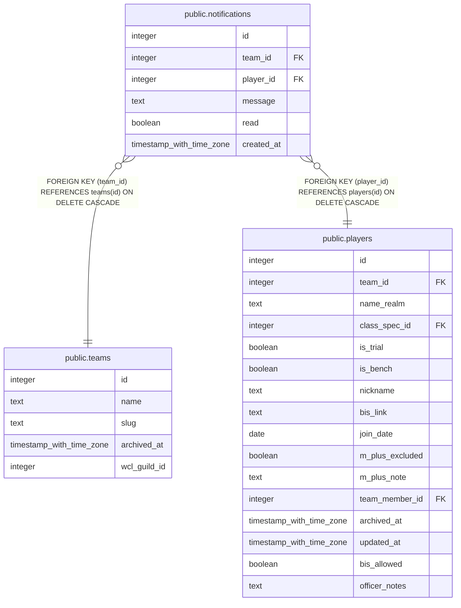

# public.notifications

## Columns

| Name | Type | Default | Nullable | Children | Parents | Comment |
| ---- | ---- | ------- | -------- | -------- | ------- | ------- |
| id | integer | nextval('notifications_id_seq'::regclass) | false |  |  |  |
| team_id | integer |  | false |  | [public.teams](public.teams.md) |  |
| player_id | integer |  | false |  | [public.players](public.players.md) |  |
| message | text |  | false |  |  |  |
| read | boolean | false | false |  |  |  |
| created_at | timestamp with time zone | now() | false |  |  |  |

## Constraints

| Name | Type | Definition |
| ---- | ---- | ---------- |
| notifications_player_id_fkey | FOREIGN KEY | FOREIGN KEY (player_id) REFERENCES players(id) ON DELETE CASCADE |
| notifications_team_id_fkey | FOREIGN KEY | FOREIGN KEY (team_id) REFERENCES teams(id) ON DELETE CASCADE |
| notifications_pkey | PRIMARY KEY | PRIMARY KEY (id) |

## Indexes

| Name | Definition |
| ---- | ---------- |
| notifications_pkey | CREATE UNIQUE INDEX notifications_pkey ON public.notifications USING btree (id) |
| idx_notifications_player_unread | CREATE INDEX idx_notifications_player_unread ON public.notifications USING btree (player_id) WHERE (NOT read) |

## Triggers

| Name | Definition |
| ---- | ---------- |
| trg_notifications_team_id_check | CREATE TRIGGER trg_notifications_team_id_check BEFORE INSERT OR UPDATE ON public.notifications FOR EACH ROW EXECUTE FUNCTION check_team_id_matches_player() |

## Relations

---

> Generated by [tbls](https://github.com/k1LoW/tbls)
