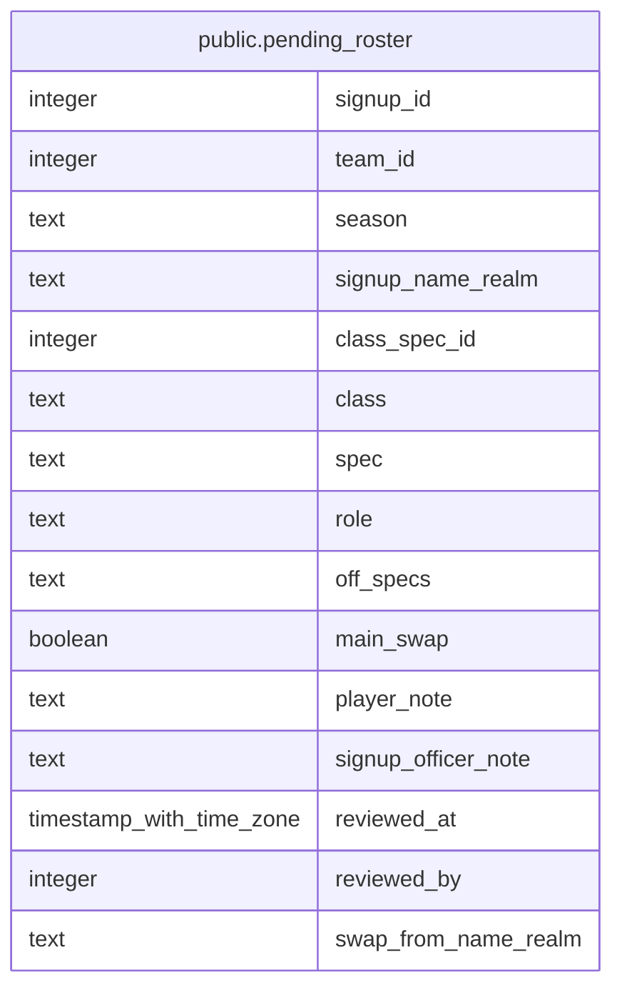

# public.pending_roster

## Description

<details>
<summary><strong>Table Definition</strong></summary>

```sql
CREATE VIEW pending_roster AS (
 SELECT s.id AS signup_id,
    s.team_id,
    s.season,
    s.signup_name_realm,
    COALESCE(s.swap_class_spec_id, s.class_spec_id) AS class_spec_id,
    cs.class,
    cs.spec,
    cs.role,
    s.off_specs,
    s.main_swap,
    s.player_note,
    s.signup_officer_note,
    s.reviewed_at,
    s.reviewed_by,
    s.swap_from_name_realm
   FROM (season_signups s
     LEFT JOIN classes_specs cs ON ((cs.id = COALESCE(s.swap_class_spec_id, s.class_spec_id))))
  WHERE ((s.status = 'approved'::text) AND (s.approved_player_id IS NULL))
)
```

</details>

## Columns

| Name | Type | Default | Nullable | Children | Parents | Comment |
| ---- | ---- | ------- | -------- | -------- | ------- | ------- |
| signup_id | integer |  | true |  |  |  |
| team_id | integer |  | true |  |  |  |
| season | text |  | true |  |  |  |
| signup_name_realm | text |  | true |  |  |  |
| class_spec_id | integer |  | true |  |  |  |
| class | text |  | true |  |  |  |
| spec | text |  | true |  |  |  |
| role | text |  | true |  |  |  |
| off_specs | text |  | true |  |  |  |
| main_swap | boolean |  | true |  |  |  |
| player_note | text |  | true |  |  |  |
| signup_officer_note | text |  | true |  |  |  |
| reviewed_at | timestamp with time zone |  | true |  |  |  |
| reviewed_by | integer |  | true |  |  |  |
| swap_from_name_realm | text |  | true |  |  |  |

## Referenced Tables

| Name | Columns | Comment | Type |
| ---- | ------- | ------- | ---- |
| [public.season_signups](public.season_signups.md) | 18 |  | BASE TABLE |
| [public.classes_specs](public.classes_specs.md) | 4 |  | BASE TABLE |

## Relations



---

> Generated by [tbls](https://github.com/k1LoW/tbls)
