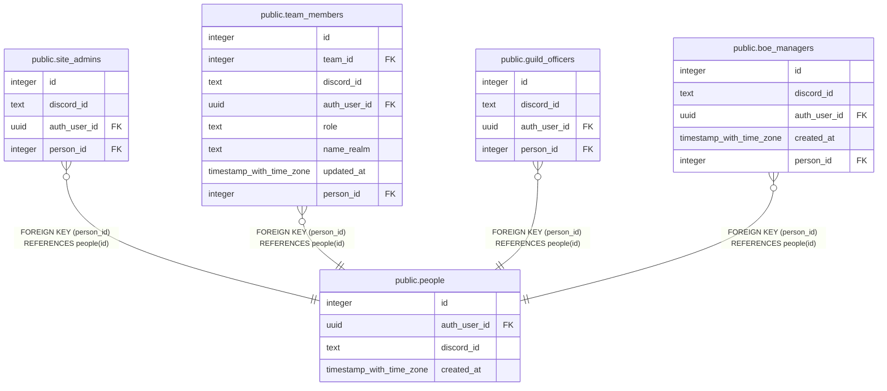

# public.people

## Description

One row per human (#942). auth_user_id is their sign-in account, null for a Discord id listed on a grant before its owner signed in. discord_id is null for an account with no Discord linked. Grant tables point here through person_id.

## Columns

| Name | Type | Default | Nullable | Children | Parents | Comment |
| ---- | ---- | ------- | -------- | -------- | ------- | ------- |
| id | integer |  | false | [public.site_admins](public.site_admins.md) [public.team_members](public.team_members.md) [public.guild_officers](public.guild_officers.md) [public.boe_managers](public.boe_managers.md) |  |  |
| auth_user_id | uuid |  | true |  |  |  |
| discord_id | text |  | true |  |  |  |
| created_at | timestamp with time zone | now() | false |  |  |  |

## Constraints

| Name | Type | Definition |
| ---- | ---- | ---------- |
| people_auth_user_id_fkey | FOREIGN KEY | FOREIGN KEY (auth_user_id) REFERENCES auth.users(id) ON DELETE SET NULL |
| people_pkey | PRIMARY KEY | PRIMARY KEY (id) |
| people_auth_user_id_key | UNIQUE | UNIQUE (auth_user_id) |
| people_discord_id_key | UNIQUE | UNIQUE (discord_id) |

## Indexes

| Name | Definition |
| ---- | ---------- |
| people_pkey | CREATE UNIQUE INDEX people_pkey ON public.people USING btree (id) |
| people_auth_user_id_key | CREATE UNIQUE INDEX people_auth_user_id_key ON public.people USING btree (auth_user_id) |
| people_discord_id_key | CREATE UNIQUE INDEX people_discord_id_key ON public.people USING btree (discord_id) |

## Triggers

| Name | Definition |
| ---- | ---------- |
| people_delete_when_empty | CREATE TRIGGER people_delete_when_empty AFTER UPDATE OF auth_user_id, discord_id ON public.people FOR EACH ROW WHEN (((new.auth_user_id IS NULL) AND (new.discord_id IS NULL))) EXECUTE FUNCTION delete_empty_person() |

## Relations

---

> Generated by [tbls](https://github.com/k1LoW/tbls)
