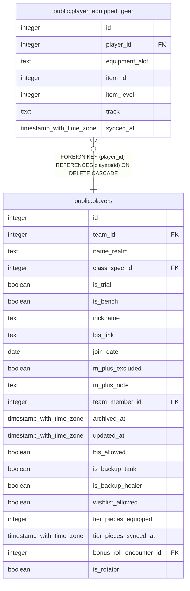

# public.player_equipped_gear

## Description

One row per player per physical gear slot (Blizzard API slot keys: HEAD, FINGER_1, FINGER_2, ...), synced from the Blizzard Character Equipment Summary endpoint. Feeds generate_priority_order()'s equipped-item-level fairness factor.

## Columns

| Name | Type | Default | Nullable | Children | Parents | Comment |
| ---- | ---- | ------- | -------- | -------- | ------- | ------- |
| id | integer | nextval('player_equipped_gear_id_seq'::regclass) | false |  |  |  |
| player_id | integer |  | false |  | [public.players](public.players.md) |  |
| equipment_slot | text |  | false |  |  |  |
| item_id | integer |  | true |  |  |  |
| item_level | integer |  | true |  |  |  |
| track | text |  | true |  |  |  |
| synced_at | timestamp with time zone | now() | false |  |  |  |

## Constraints

| Name | Type | Definition |
| ---- | ---- | ---------- |
| player_equipped_gear_player_id_fkey | FOREIGN KEY | FOREIGN KEY (player_id) REFERENCES players(id) ON DELETE CASCADE |
| player_equipped_gear_pkey | PRIMARY KEY | PRIMARY KEY (id) |
| player_equipped_gear_player_id_equipment_slot_key | UNIQUE | UNIQUE (player_id, equipment_slot) |

## Indexes

| Name | Definition |
| ---- | ---------- |
| player_equipped_gear_pkey | CREATE UNIQUE INDEX player_equipped_gear_pkey ON public.player_equipped_gear USING btree (id) |
| player_equipped_gear_player_id_equipment_slot_key | CREATE UNIQUE INDEX player_equipped_gear_player_id_equipment_slot_key ON public.player_equipped_gear USING btree (player_id, equipment_slot) |

## Relations

---

> Generated by [tbls](https://github.com/k1LoW/tbls)
