# public.player_officer_notes

## Description

Officer-only annotations on a roster slot (#925): the private officer note, and why a player was removed plus the freeform specifics (#476). One row per players row, created on first write. These lived on players until #925, where the table's public read policy and its table-level anon grant made them readable with the publishable key and by every signed-in raider. m_plus_note stayed on players because the public profile renders it. archived_reason keeps the fixed vocabulary its old CHECK constraint carried.

## Columns

| Name | Type | Default | Nullable | Children | Parents | Comment |
| ---- | ---- | ------- | -------- | -------- | ------- | ------- |
| player_id | integer |  | false |  | [public.players](public.players.md) |  |
| team_id | integer |  | false |  | [public.teams](public.teams.md) |  |
| officer_notes | text |  | true |  |  |  |
| archived_reason | text |  | true |  |  |  |
| archived_reason_detail | text |  | true |  |  |  |
| updated_at | timestamp with time zone | now() | false |  |  |  |

## Constraints

| Name | Type | Definition |
| ---- | ---- | ---------- |
| player_officer_notes_archived_reason_check | CHECK | CHECK (((archived_reason IS NULL) OR (archived_reason = ANY (ARRAY['schedule_conflict'::text, 'performance'::text, 'drama'::text, 'moved_guilds'::text, 'switching_mains'::text, 'other'::text])))) |
| player_officer_notes_player_id_fkey | FOREIGN KEY | FOREIGN KEY (player_id) REFERENCES players(id) ON DELETE CASCADE |
| player_officer_notes_team_id_fkey | FOREIGN KEY | FOREIGN KEY (team_id) REFERENCES teams(id) ON DELETE CASCADE |
| player_officer_notes_pkey | PRIMARY KEY | PRIMARY KEY (player_id) |

## Indexes

| Name | Definition |
| ---- | ---------- |
| player_officer_notes_pkey | CREATE UNIQUE INDEX player_officer_notes_pkey ON public.player_officer_notes USING btree (player_id) |

## Triggers

| Name | Definition |
| ---- | ---------- |
| trg_player_officer_notes_team_id_check | CREATE TRIGGER trg_player_officer_notes_team_id_check BEFORE INSERT OR UPDATE ON public.player_officer_notes FOR EACH ROW EXECUTE FUNCTION check_team_id_matches_player() |
| trg_player_officer_notes_updated_at | CREATE TRIGGER trg_player_officer_notes_updated_at BEFORE UPDATE ON public.player_officer_notes FOR EACH ROW EXECUTE FUNCTION set_updated_at() |

## Relations

```mermaid
erDiagram

"public.player_officer_notes" |o--|| "public.players" : "FOREIGN KEY (player_id) REFERENCES players(id) ON DELETE CASCADE"
"public.player_officer_notes" }o--|| "public.teams" : "FOREIGN KEY (team_id) REFERENCES teams(id) ON DELETE CASCADE"

"public.player_officer_notes" {
  integer player_id FK
  integer team_id FK
  text officer_notes
  text archived_reason
  text archived_reason_detail
  timestamp_with_time_zone updated_at
}
"public.players" {
  integer id
  integer team_id FK
  text name_realm
  integer class_spec_id FK
  boolean is_trial
  boolean is_bench
  text nickname
  text bis_link
  date join_date
  boolean m_plus_excluded
  text m_plus_note
  integer team_member_id FK
  timestamp_with_time_zone archived_at
  timestamp_with_time_zone updated_at
  boolean bis_allowed
  boolean is_backup_tank
  boolean is_backup_healer
  boolean wishlist_allowed
  integer tier_pieces_equipped
  timestamp_with_time_zone tier_pieces_synced_at
  integer bonus_roll_encounter_id FK
  boolean is_rotator
}
"public.teams" {
  integer id
  text name
  text slug
  timestamp_with_time_zone archived_at
  integer wcl_guild_id
}
```

---

> Generated by [tbls](https://github.com/k1LoW/tbls)
