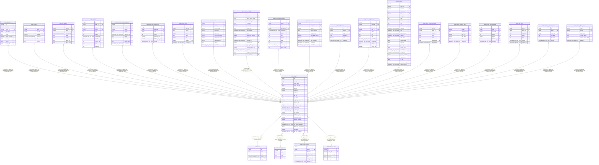

# public.players

## Columns

| Name | Type | Default | Nullable | Children | Parents | Comment |
| ---- | ---- | ------- | -------- | -------- | ------- | ------- |
| id | integer | nextval('players_id_seq'::regclass) | false | [public.attendance](public.attendance.md) [public.bis_items](public.bis_items.md) [public.bis_requests](public.bis_requests.md) [public.rclc_loot](public.rclc_loot.md) [public.mplus_exclusion_requests](public.mplus_exclusion_requests.md) [public.player_wcl_season_perf](public.player_wcl_season_perf.md) [public.priority_order](public.priority_order.md) [public.scoring](public.scoring.md) [public.season_signups](public.season_signups.md) [public.self_received_requests](public.self_received_requests.md) [public.streamers](public.streamers.md) [public.notifications](public.notifications.md) [public.item_preferences](public.item_preferences.md) [public.boe_items](public.boe_items.md) [public.priority_conflict_dismissals](public.priority_conflict_dismissals.md) [public.player_equipped_gear](public.player_equipped_gear.md) [public.priority_stale_dismissals](public.priority_stale_dismissals.md) [public.raid_rsvps](public.raid_rsvps.md) [public.raid_rsvp_reminders_sent](public.raid_rsvp_reminders_sent.md) [public.player_officer_notes](public.player_officer_notes.md) |  |  |
| team_id | integer |  | false |  | [public.teams](public.teams.md) |  |
| name_realm | text |  | false |  |  |  |
| class_spec_id | integer |  | true |  | [public.classes_specs](public.classes_specs.md) |  |
| is_trial | boolean | false | false |  |  |  |
| is_bench | boolean | false | false |  |  |  |
| nickname | text |  | true |  |  |  |
| bis_link | text |  | true |  |  |  |
| join_date | date |  | true |  |  |  |
| m_plus_excluded | boolean | false | false |  |  |  |
| m_plus_note | text |  | true |  |  |  |
| team_member_id | integer |  | true |  | [public.team_members](public.team_members.md) |  |
| archived_at | timestamp with time zone |  | true |  |  |  |
| updated_at | timestamp with time zone |  | true |  |  |  |
| bis_allowed | boolean | false | false |  |  |  |
| is_backup_tank | boolean | false | false |  |  |  |
| is_backup_healer | boolean | false | false |  |  |  |
| wishlist_allowed | boolean | false | false |  |  |  |
| tier_pieces_equipped | integer |  | true |  |  |  |
| tier_pieces_synced_at | timestamp with time zone |  | true |  |  |  |
| bonus_roll_encounter_id | integer |  | true |  | [public.raid_encounters](public.raid_encounters.md) |  |
| is_rotator | boolean | false | false |  |  | Rotator roster status (#924): not automatically Present/Attending on a raid night like Bench, but officer-assigned per raid week (officer_set_rotator_week()) rather than self-RSVP. |
| bis_link_updated_at | timestamp with time zone |  | true |  |  |  |

## Constraints

| Name | Type | Definition |
| ---- | ---- | ---------- |
| players_tier_pieces_equipped_range | CHECK | CHECK (((tier_pieces_equipped IS NULL) OR ((tier_pieces_equipped >= 0) AND (tier_pieces_equipped <= 5)))) |
| players_class_spec_id_fkey | FOREIGN KEY | FOREIGN KEY (class_spec_id) REFERENCES classes_specs(id) ON UPDATE CASCADE |
| players_pkey | PRIMARY KEY | PRIMARY KEY (id) |
| players_team_id_name_realm_key | UNIQUE | UNIQUE (team_id, name_realm) |
| players_team_member_id_fkey | FOREIGN KEY | FOREIGN KEY (team_member_id) REFERENCES team_members(id) ON DELETE SET NULL |
| players_team_id_fkey | FOREIGN KEY | FOREIGN KEY (team_id) REFERENCES teams(id) ON DELETE CASCADE |
| players_bonus_roll_encounter_id_fkey | FOREIGN KEY | FOREIGN KEY (bonus_roll_encounter_id) REFERENCES raid_encounters(id) ON DELETE SET NULL |

## Indexes

| Name | Definition |
| ---- | ---------- |
| players_pkey | CREATE UNIQUE INDEX players_pkey ON public.players USING btree (id) |
| players_team_id_name_realm_key | CREATE UNIQUE INDEX players_team_id_name_realm_key ON public.players USING btree (team_id, name_realm) |

## Triggers

| Name | Definition |
| ---- | ---------- |
| trg_players_updated_at | CREATE TRIGGER trg_players_updated_at BEFORE UPDATE ON public.players FOR EACH ROW EXECUTE FUNCTION set_updated_at() |
| trg_players_restrict_self_update | CREATE TRIGGER trg_players_restrict_self_update BEFORE UPDATE ON public.players FOR EACH ROW EXECUTE FUNCTION restrict_players_self_update_to_bonus_roll() |
| trg_players_bis_link_updated_at | CREATE TRIGGER trg_players_bis_link_updated_at BEFORE UPDATE OF bis_link ON public.players FOR EACH ROW EXECUTE FUNCTION set_updated_at() |

## Relations

```mermaid
erDiagram

"public.attendance" }o--o| "public.players" : "FOREIGN KEY (player_id) REFERENCES players(id) ON DELETE SET NULL"
"public.bis_items" }o--|| "public.players" : "FOREIGN KEY (player_id) REFERENCES players(id) ON DELETE CASCADE"
"public.bis_requests" }o--o| "public.players" : "FOREIGN KEY (player_id) REFERENCES players(id) ON DELETE SET NULL"
"public.rclc_loot" }o--o| "public.players" : "FOREIGN KEY (player_id) REFERENCES players(id) ON DELETE SET NULL"
"public.mplus_exclusion_requests" }o--|| "public.players" : "FOREIGN KEY (player_id) REFERENCES players(id) ON DELETE SET NULL"
"public.player_wcl_season_perf" }o--|| "public.players" : "FOREIGN KEY (player_id) REFERENCES players(id) ON DELETE CASCADE"
"public.priority_order" }o--|| "public.players" : "FOREIGN KEY (player_id) REFERENCES players(id) ON DELETE CASCADE"
"public.scoring" }o--|| "public.players" : "FOREIGN KEY (player_id) REFERENCES players(id) ON DELETE CASCADE"
"public.season_signups" }o--o| "public.players" : "FOREIGN KEY (approved_player_id) REFERENCES players(id) ON DELETE SET NULL"
"public.self_received_requests" }o--o| "public.players" : "FOREIGN KEY (player_id) REFERENCES players(id) ON DELETE SET NULL"
"public.streamers" |o--|| "public.players" : "FOREIGN KEY (player_id) REFERENCES players(id) ON DELETE CASCADE"
"public.notifications" }o--|| "public.players" : "FOREIGN KEY (player_id) REFERENCES players(id) ON DELETE CASCADE"
"public.item_preferences" }o--|| "public.players" : "FOREIGN KEY (player_id) REFERENCES players(id) ON DELETE CASCADE"
"public.boe_items" }o--o| "public.players" : "FOREIGN KEY (player_id) REFERENCES players(id) ON DELETE SET NULL"
"public.priority_conflict_dismissals" }o--o| "public.players" : "FOREIGN KEY (player_id) REFERENCES players(id) ON DELETE SET NULL"
"public.player_equipped_gear" }o--|| "public.players" : "FOREIGN KEY (player_id) REFERENCES players(id) ON DELETE CASCADE"
"public.priority_stale_dismissals" }o--o| "public.players" : "FOREIGN KEY (player_id) REFERENCES players(id) ON DELETE SET NULL"
"public.raid_rsvps" }o--|| "public.players" : "FOREIGN KEY (player_id) REFERENCES players(id) ON DELETE CASCADE"
"public.raid_rsvp_reminders_sent" }o--|| "public.players" : "FOREIGN KEY (player_id) REFERENCES players(id) ON DELETE CASCADE"
"public.player_officer_notes" |o--|| "public.players" : "FOREIGN KEY (player_id) REFERENCES players(id) ON DELETE CASCADE"
"public.players" }o--|| "public.teams" : "FOREIGN KEY (team_id) REFERENCES teams(id) ON DELETE CASCADE"
"public.players" }o--o| "public.classes_specs" : "FOREIGN KEY (class_spec_id) REFERENCES classes_specs(id) ON UPDATE CASCADE"
"public.players" }o--o| "public.team_members" : "FOREIGN KEY (team_member_id) REFERENCES team_members(id) ON DELETE SET NULL"
"public.players" }o--o| "public.raid_encounters" : "FOREIGN KEY (bonus_roll_encounter_id) REFERENCES raid_encounters(id) ON DELETE SET NULL"

"public.players" {
  integer id
  integer team_id FK
  text name_realm
  integer class_spec_id FK
  boolean is_trial
  boolean is_bench
  text nickname
  text bis_link
  date join_date
  boolean m_plus_excluded
  text m_plus_note
  integer team_member_id FK
  timestamp_with_time_zone archived_at
  timestamp_with_time_zone updated_at
  boolean bis_allowed
  boolean is_backup_tank
  boolean is_backup_healer
  boolean wishlist_allowed
  integer tier_pieces_equipped
  timestamp_with_time_zone tier_pieces_synced_at
  integer bonus_roll_encounter_id FK
  boolean is_rotator
  timestamp_with_time_zone bis_link_updated_at
}
"public.attendance" {
  integer id
  integer team_id FK
  integer player_id FK
  date raid_date
  text status
  boolean report_excluded
  text report_id
  text source
  text report_title
}
"public.bis_items" {
  integer id
  integer player_id FK
  integer item_id FK
  boolean obtained
  timestamp_with_time_zone updated_at
  text slot
  text season
}
"public.bis_requests" {
  integer id
  integer team_id FK
  integer player_id FK
  timestamp_with_time_zone submitted_at
  text status
  text bis_link
  text player_note
  text officer_notes
}
"public.rclc_loot" {
  integer id
  integer team_id FK
  integer player_id FK
  integer item_id FK
  text track
  text season
  timestamp_with_time_zone awarded_at
  text rclc_id
  text dedupe_key
  text boss
  text response
}
"public.mplus_exclusion_requests" {
  integer id
  integer team_id FK
  integer player_id FK
  text reason
  timestamp_with_time_zone submitted_at
  text status
  text raiderio_url
  text officer_notes
  timestamp_with_time_zone updated_at
}
"public.player_wcl_season_perf" {
  integer id
  integer player_id FK
  integer team_id FK
  text season
  numeric best_perf_avg
  numeric median_perf_avg
  timestamp_with_time_zone fetched_at
}
"public.priority_order" {
  integer id
  integer team_id FK
  text season
  integer item_id FK
  text track
  integer rank
  integer player_id FK
  timestamp_with_time_zone updated_at
}
"public.scoring" {
  integer id
  integer player_id FK
  numeric recent_score
  numeric trend_score
  numeric best_score
  numeric performance_score
  numeric attendance_score
  numeric attendance_pct
  text season
  timestamp_with_time_zone updated_at
}
"public.season_signups" {
  integer id
  integer team_id FK
  text signup_name_realm
  integer class_spec_id FK
  text off_specs
  boolean main_swap
  text player_note
  timestamp_with_time_zone submitted_at
  text status
  integer swap_class_spec_id FK
  text season
  timestamp_with_time_zone reviewed_at
  integer reviewed_by FK
  text signup_officer_note
  integer approved_player_id FK
  timestamp_with_time_zone updated_at
  text swap_from_name_realm
  uuid auth_user_id FK
}
"public.self_received_requests" {
  integer id
  integer team_id FK
  integer player_id FK
  integer self_item_id FK
  timestamp_with_time_zone submitted_at
  text status
  text track
  text source
  text note
  text slot
  timestamp_with_time_zone updated_at
  text officer_notes
}
"public.streamers" {
  integer id
  integer team_id FK
  integer player_id FK
  text twitch_channel
  text schedule_note
  boolean guild_wide_opt_out
  boolean is_live
  timestamp_with_time_zone last_checked_at
  timestamp_with_time_zone updated_at
  timestamp_with_time_zone created_at
}
"public.notifications" {
  integer id
  integer team_id FK
  integer player_id FK
  text message
  boolean read
  timestamp_with_time_zone created_at
}
"public.item_preferences" {
  integer id
  integer team_id FK
  integer player_id FK
  integer item_id FK
  text status
  text note
  text slot
  timestamp_with_time_zone updated_at
  timestamp_with_time_zone created_at
  text season
  boolean synced_bis
}
"public.boe_items" {
  integer id
  integer team_id FK
  integer player_id FK
  text finder_name
  integer item_id FK
  text item_name
  text track
  text season
  text note
  text status
  timestamp_with_time_zone found_at
  timestamp_with_time_zone sold_at
  timestamp_with_time_zone payout_paid_at
  timestamp_with_time_zone retired_at
  bigint sale_price
  bigint finder_payout
  bigint guild_cut
  bigint payout_floor
  bigint payout_pivot
  timestamp_with_time_zone updated_at
  timestamp_with_time_zone created_at
  boolean payout_donated
  text upgrade_rank
  bigint ah_fee
  text finder_discord_id
  timestamp_with_time_zone found_posted_at
}
"public.priority_conflict_dismissals" {
  integer id
  integer team_id FK
  integer player_id FK
  text season
  text boss
  text track
  uuid dismissed_by FK
  timestamp_with_time_zone dismissed_at
}
"public.player_equipped_gear" {
  integer id
  integer player_id FK
  text equipment_slot
  integer item_id
  integer item_level
  text track
  timestamp_with_time_zone synced_at
}
"public.priority_stale_dismissals" {
  integer id
  integer team_id FK
  integer player_id FK
  text season
  integer item_id FK
  uuid dismissed_by FK
  timestamp_with_time_zone dismissed_at
}
"public.raid_rsvps" {
  integer id
  integer team_id FK
  integer player_id FK
  date raid_date
  text status
  text note
  timestamp_with_time_zone created_at
  timestamp_with_time_zone updated_at
}
"public.raid_rsvp_reminders_sent" {
  integer id
  integer team_id FK
  integer player_id FK
  date raid_date
  text checkpoint
  timestamp_with_time_zone sent_at
}
"public.player_officer_notes" {
  integer player_id FK
  integer team_id FK
  text officer_notes
  text archived_reason
  text archived_reason_detail
  timestamp_with_time_zone updated_at
}
"public.teams" {
  integer id
  text name
  text slug
  timestamp_with_time_zone archived_at
  integer wcl_guild_id
}
"public.classes_specs" {
  integer id
  text class
  text spec
  text role
}
"public.team_members" {
  integer id
  integer team_id FK
  text discord_id
  uuid auth_user_id FK
  text role
  text name_realm
  timestamp_with_time_zone updated_at
}
"public.raid_encounters" {
  integer id
  integer zone_id FK
  integer wcl_encounter_id
  text name
  integer sort_index
}
```

---

> Generated by [tbls](https://github.com/k1LoW/tbls)
