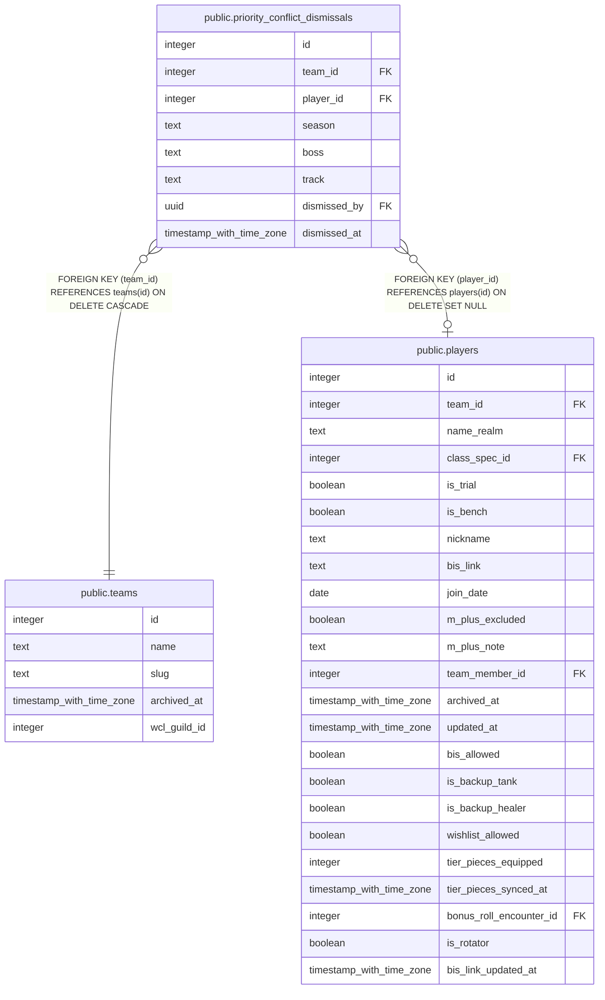

# public.priority_conflict_dismissals

## Description

Officer-acknowledged Priority List same-boss conflicts (a player holding #1 on 2+ items behind one boss+track kill), so buildPriorityConflictsBannerHtml() (js/tabs/tab-priority.js) stops re-flagging a reviewed one.

## Columns

| Name | Type | Default | Nullable | Children | Parents | Comment |
| ---- | ---- | ------- | -------- | -------- | ------- | ------- |
| id | integer | nextval('priority_conflict_dismissals_id_seq'::regclass) | false |  |  |  |
| team_id | integer |  | false |  | [public.teams](public.teams.md) |  |
| player_id | integer |  | true |  | [public.players](public.players.md) |  |
| season | text |  | false |  |  |  |
| boss | text |  | false |  |  |  |
| track | text |  | false |  |  |  |
| dismissed_by | uuid |  | true |  |  |  |
| dismissed_at | timestamp with time zone | now() | false |  |  |  |

## Constraints

| Name | Type | Definition |
| ---- | ---- | ---------- |
| priority_conflict_dismissals_dismissed_by_fkey | FOREIGN KEY | FOREIGN KEY (dismissed_by) REFERENCES auth.users(id) ON DELETE SET NULL |
| priority_conflict_dismissals_player_id_fkey | FOREIGN KEY | FOREIGN KEY (player_id) REFERENCES players(id) ON DELETE SET NULL |
| priority_conflict_dismissals_team_id_fkey | FOREIGN KEY | FOREIGN KEY (team_id) REFERENCES teams(id) ON DELETE CASCADE |
| priority_conflict_dismissals_pkey | PRIMARY KEY | PRIMARY KEY (id) |
| priority_conflict_dismissals_team_id_player_id_season_boss__key | UNIQUE | UNIQUE (team_id, player_id, season, boss, track) |

## Indexes

| Name | Definition |
| ---- | ---------- |
| priority_conflict_dismissals_pkey | CREATE UNIQUE INDEX priority_conflict_dismissals_pkey ON public.priority_conflict_dismissals USING btree (id) |
| priority_conflict_dismissals_team_id_player_id_season_boss__key | CREATE UNIQUE INDEX priority_conflict_dismissals_team_id_player_id_season_boss__key ON public.priority_conflict_dismissals USING btree (team_id, player_id, season, boss, track) |

## Triggers

| Name | Definition |
| ---- | ---------- |
| trg_priority_conflict_dismissals_team_id_check | CREATE TRIGGER trg_priority_conflict_dismissals_team_id_check BEFORE INSERT OR UPDATE ON public.priority_conflict_dismissals FOR EACH ROW EXECUTE FUNCTION check_team_id_matches_player() |

## Relations

---

> Generated by [tbls](https://github.com/k1LoW/tbls)
