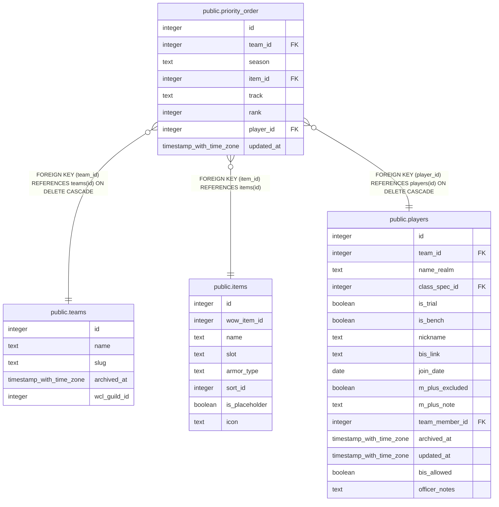

# public.priority_order

## Columns

| Name | Type | Default | Nullable | Children | Parents | Comment |
| ---- | ---- | ------- | -------- | -------- | ------- | ------- |
| id | integer | nextval('priority_order_id_seq'::regclass) | false |  |  |  |
| team_id | integer |  | false |  | [public.teams](public.teams.md) |  |
| season | text |  | false |  |  |  |
| item_id | integer |  | false |  | [public.items](public.items.md) |  |
| track | text |  | false |  |  |  |
| rank | integer |  | false |  |  |  |
| player_id | integer |  | false |  | [public.players](public.players.md) |  |
| updated_at | timestamp with time zone |  | true |  |  |  |

## Constraints

| Name | Type | Definition |
| ---- | ---- | ---------- |
| priority_order_track_check | CHECK | CHECK ((track = ANY (ARRAY['Hero'::text, 'Myth'::text]))) |
| priority_order_item_id_fkey | FOREIGN KEY | FOREIGN KEY (item_id) REFERENCES items(id) |
| priority_order_player_id_fkey | FOREIGN KEY | FOREIGN KEY (player_id) REFERENCES players(id) ON DELETE CASCADE |
| priority_order_no_dupe_player_key | UNIQUE | UNIQUE (team_id, season, item_id, track, player_id) |
| priority_order_pkey | PRIMARY KEY | PRIMARY KEY (id) |
| priority_order_team_id_season_item_track_rank_key | UNIQUE | UNIQUE (team_id, season, item_id, track, rank) |
| priority_order_team_id_fkey | FOREIGN KEY | FOREIGN KEY (team_id) REFERENCES teams(id) ON DELETE CASCADE |

## Indexes

| Name | Definition |
| ---- | ---------- |
| priority_order_no_dupe_player_key | CREATE UNIQUE INDEX priority_order_no_dupe_player_key ON public.priority_order USING btree (team_id, season, item_id, track, player_id) |
| priority_order_pkey | CREATE UNIQUE INDEX priority_order_pkey ON public.priority_order USING btree (id) |
| priority_order_team_id_season_item_track_rank_key | CREATE UNIQUE INDEX priority_order_team_id_season_item_track_rank_key ON public.priority_order USING btree (team_id, season, item_id, track, rank) |

## Triggers

| Name | Definition |
| ---- | ---------- |
| trg_priority_order_updated_at | CREATE TRIGGER trg_priority_order_updated_at BEFORE UPDATE ON public.priority_order FOR EACH ROW EXECUTE FUNCTION set_updated_at() |
| trg_priority_order_team_id_check | CREATE TRIGGER trg_priority_order_team_id_check BEFORE INSERT OR UPDATE ON public.priority_order FOR EACH ROW EXECUTE FUNCTION check_team_id_matches_player() |

## Relations

---

> Generated by [tbls](https://github.com/k1LoW/tbls)
