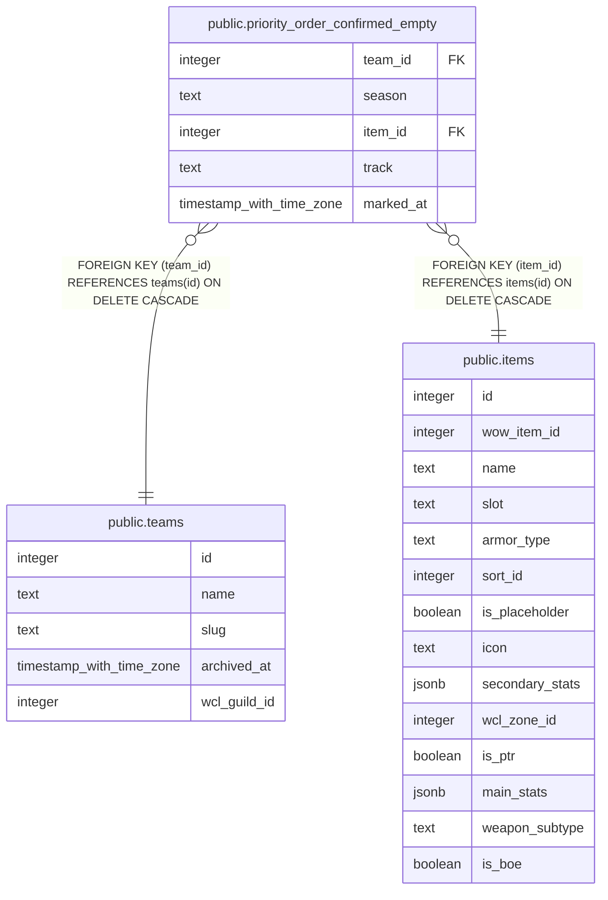

# public.priority_order_confirmed_empty

## Description

Marks a team/season/item/track priority list as deliberately saved empty (no one wants the item) -- keeps it out of the Unmanaged Items list without a placeholder priority_order row. Cleared automatically the next time that item/track is saved with a non-empty roster.

## Columns

| Name | Type | Default | Nullable | Children | Parents | Comment |
| ---- | ---- | ------- | -------- | -------- | ------- | ------- |
| team_id | integer |  | false |  | [public.teams](public.teams.md) |  |
| season | text |  | false |  |  |  |
| item_id | integer |  | false |  | [public.items](public.items.md) |  |
| track | text |  | false |  |  |  |
| marked_at | timestamp with time zone | now() | false |  |  |  |

## Constraints

| Name | Type | Definition |
| ---- | ---- | ---------- |
| priority_order_confirmed_empty_track_check | CHECK | CHECK ((track = ANY (ARRAY['Hero'::text, 'Myth'::text]))) |
| priority_order_confirmed_empty_item_id_fkey | FOREIGN KEY | FOREIGN KEY (item_id) REFERENCES items(id) ON DELETE CASCADE |
| priority_order_confirmed_empty_team_id_fkey | FOREIGN KEY | FOREIGN KEY (team_id) REFERENCES teams(id) ON DELETE CASCADE |
| priority_order_confirmed_empty_pkey | PRIMARY KEY | PRIMARY KEY (team_id, season, item_id, track) |

## Indexes

| Name | Definition |
| ---- | ---------- |
| priority_order_confirmed_empty_pkey | CREATE UNIQUE INDEX priority_order_confirmed_empty_pkey ON public.priority_order_confirmed_empty USING btree (team_id, season, item_id, track) |

## Relations

---

> Generated by [tbls](https://github.com/k1LoW/tbls)
