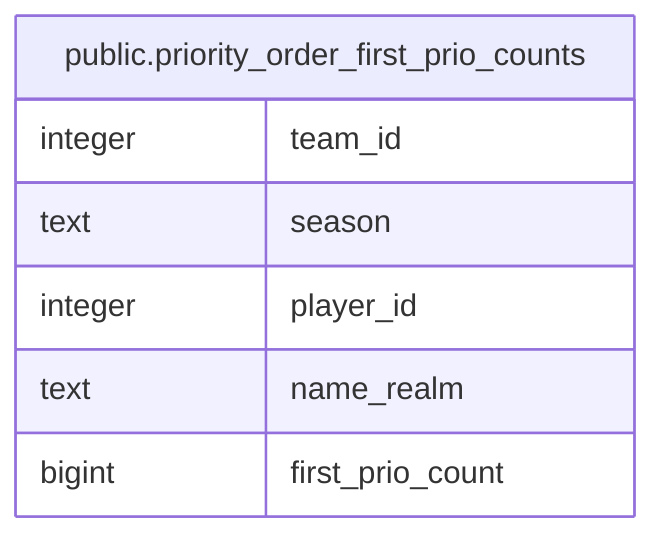

# public.priority_order_first_prio_counts

## Description

<details>
<summary><strong>Table Definition</strong></summary>

```sql
CREATE VIEW priority_order_first_prio_counts AS (
 SELECT team_id,
    season,
    player_id,
    name_realm,
    count(DISTINCT item_id) AS first_prio_count
   FROM priority_order_live_first_prios
  GROUP BY team_id, season, player_id, name_realm
  ORDER BY team_id, season, (count(DISTINCT item_id)) DESC
)
```

</details>

## Columns

| Name | Type | Default | Nullable | Children | Parents | Comment |
| ---- | ---- | ------- | -------- | -------- | ------- | ------- |
| team_id | integer |  | true |  |  |  |
| season | text |  | true |  |  |  |
| player_id | integer |  | true |  |  |  |
| name_realm | text |  | true |  |  |  |
| first_prio_count | bigint |  | true |  |  |  |

## Referenced Tables

| Name | Columns | Comment | Type |
| ---- | ------- | ------- | ---- |
| [public.priority_order_live_first_prios](public.priority_order_live_first_prios.md) | 9 |  | VIEW |

## Relations



---

> Generated by [tbls](https://github.com/k1LoW/tbls)
