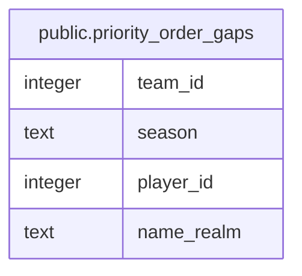

# public.priority_order_gaps

## Description

<details>
<summary><strong>Table Definition</strong></summary>

```sql
CREATE VIEW priority_order_gaps AS (
 SELECT DISTINCT s.team_id,
    s.season,
    p.id AS player_id,
    p.name_realm
   FROM (( SELECT DISTINCT priority_order.team_id,
            priority_order.season
           FROM priority_order) s
     JOIN players p ON ((p.team_id = s.team_id)))
  WHERE ((p.archived_at IS NULL) AND (NOT p.is_bench) AND (NOT (EXISTS ( SELECT 1
           FROM priority_order po
          WHERE ((po.team_id = s.team_id) AND (po.season = s.season) AND (po.player_id = p.id))))))
  ORDER BY s.team_id, s.season, p.name_realm
)
```

</details>

## Columns

| Name | Type | Default | Nullable | Children | Parents | Comment |
| ---- | ---- | ------- | -------- | -------- | ------- | ------- |
| team_id | integer |  | true |  |  |  |
| season | text |  | true |  |  |  |
| player_id | integer |  | true |  |  |  |
| name_realm | text |  | true |  |  |  |

## Referenced Tables

| Name | Columns | Comment | Type |
| ---- | ------- | ------- | ---- |
| [public.priority_order](public.priority_order.md) | 8 |  | BASE TABLE |
| [public.players](public.players.md) | 16 |  | BASE TABLE |

## Relations



---

> Generated by [tbls](https://github.com/k1LoW/tbls)
