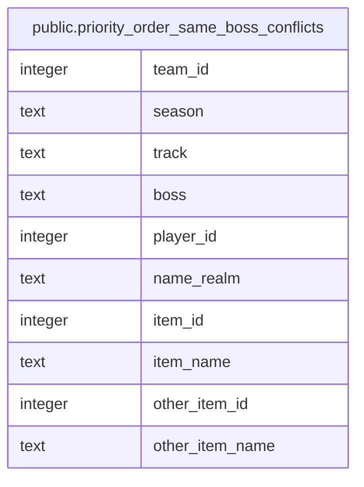

# public.priority_order_same_boss_conflicts

## Description

<details>
<summary><strong>Table Definition</strong></summary>

```sql
CREATE VIEW priority_order_same_boss_conflicts AS (
 SELECT a.team_id,
    a.season,
    a.track,
    a.boss,
    a.player_id,
    a.name_realm,
    a.item_id,
    a.item_name,
    b.item_id AS other_item_id,
    b.item_name AS other_item_name
   FROM (priority_order_live_first_prios a
     JOIN priority_order_live_first_prios b ON (((a.team_id = b.team_id) AND (a.season = b.season) AND (a.track = b.track) AND (a.boss = b.boss) AND (a.player_id = b.player_id) AND (a.item_id < b.item_id))))
  WHERE (a.boss IS NOT NULL)
)
```

</details>

## Columns

| Name | Type | Default | Nullable | Children | Parents | Comment |
| ---- | ---- | ------- | -------- | -------- | ------- | ------- |
| team_id | integer |  | true |  |  |  |
| season | text |  | true |  |  |  |
| track | text |  | true |  |  |  |
| boss | text |  | true |  |  |  |
| player_id | integer |  | true |  |  |  |
| name_realm | text |  | true |  |  |  |
| item_id | integer |  | true |  |  |  |
| item_name | text |  | true |  |  |  |
| other_item_id | integer |  | true |  |  |  |
| other_item_name | text |  | true |  |  |  |

## Referenced Tables

| Name | Columns | Comment | Type |
| ---- | ------- | ------- | ---- |
| [public.priority_order_live_first_prios](public.priority_order_live_first_prios.md) | 9 |  | VIEW |

## Relations



---

> Generated by [tbls](https://github.com/k1LoW/tbls)
