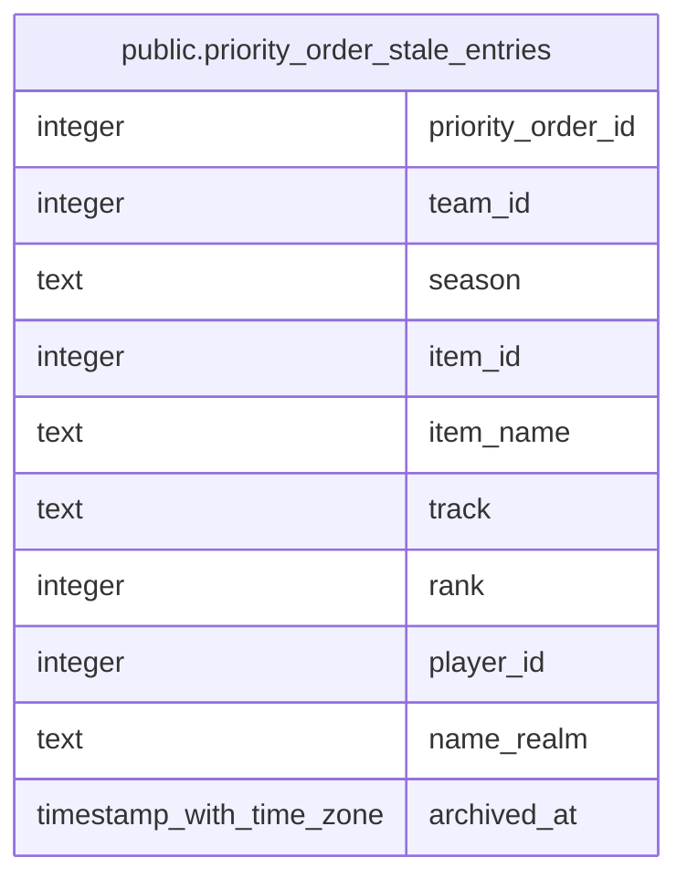

# public.priority_order_stale_entries

## Description

<details>
<summary><strong>Table Definition</strong></summary>

```sql
CREATE VIEW priority_order_stale_entries AS (
 SELECT po.id AS priority_order_id,
    po.team_id,
    po.season,
    po.item_id,
    i.name AS item_name,
    po.track,
    po.rank,
    po.player_id,
    p.name_realm,
    p.archived_at
   FROM ((priority_order po
     JOIN players p ON ((p.id = po.player_id)))
     JOIN items i ON ((i.id = po.item_id)))
  WHERE (p.archived_at IS NOT NULL)
  ORDER BY po.team_id, po.season, i.name, po.track, po.rank
)
```

</details>

## Columns

| Name | Type | Default | Nullable | Children | Parents | Comment |
| ---- | ---- | ------- | -------- | -------- | ------- | ------- |
| priority_order_id | integer |  | true |  |  |  |
| team_id | integer |  | true |  |  |  |
| season | text |  | true |  |  |  |
| item_id | integer |  | true |  |  |  |
| item_name | text |  | true |  |  |  |
| track | text |  | true |  |  |  |
| rank | integer |  | true |  |  |  |
| player_id | integer |  | true |  |  |  |
| name_realm | text |  | true |  |  |  |
| archived_at | timestamp with time zone |  | true |  |  |  |

## Referenced Tables

| Name | Columns | Comment | Type |
| ---- | ------- | ------- | ---- |
| [public.priority_order](public.priority_order.md) | 8 |  | BASE TABLE |
| [public.players](public.players.md) | 16 |  | BASE TABLE |
| [public.items](public.items.md) | 11 |  | BASE TABLE |

## Relations



---

> Generated by [tbls](https://github.com/k1LoW/tbls)
