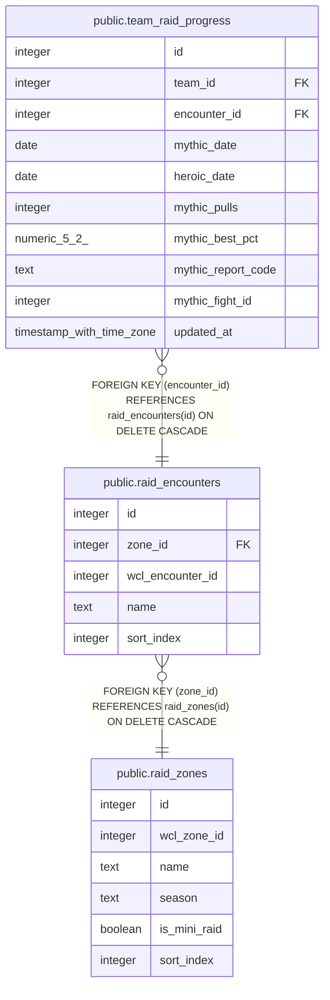

# public.raid_encounters

## Columns

| Name | Type | Default | Nullable | Children | Parents | Comment |
| ---- | ---- | ------- | -------- | -------- | ------- | ------- |
| id | integer | nextval('raid_encounters_id_seq'::regclass) | false | [public.team_raid_progress](public.team_raid_progress.md) |  |  |
| zone_id | integer |  | false |  | [public.raid_zones](public.raid_zones.md) |  |
| wcl_encounter_id | integer |  | false |  |  |  |
| name | text |  | false |  |  |  |
| sort_index | integer | 0 | false |  |  |  |

## Constraints

| Name | Type | Definition |
| ---- | ---- | ---------- |
| raid_encounters_zone_id_fkey | FOREIGN KEY | FOREIGN KEY (zone_id) REFERENCES raid_zones(id) ON DELETE CASCADE |
| raid_encounters_pkey | PRIMARY KEY | PRIMARY KEY (id) |
| raid_encounters_zone_id_wcl_encounter_id_key | UNIQUE | UNIQUE (zone_id, wcl_encounter_id) |

## Indexes

| Name | Definition |
| ---- | ---------- |
| raid_encounters_pkey | CREATE UNIQUE INDEX raid_encounters_pkey ON public.raid_encounters USING btree (id) |
| raid_encounters_zone_id_wcl_encounter_id_key | CREATE UNIQUE INDEX raid_encounters_zone_id_wcl_encounter_id_key ON public.raid_encounters USING btree (zone_id, wcl_encounter_id) |

## Relations

---

> Generated by [tbls](https://github.com/k1LoW/tbls)
