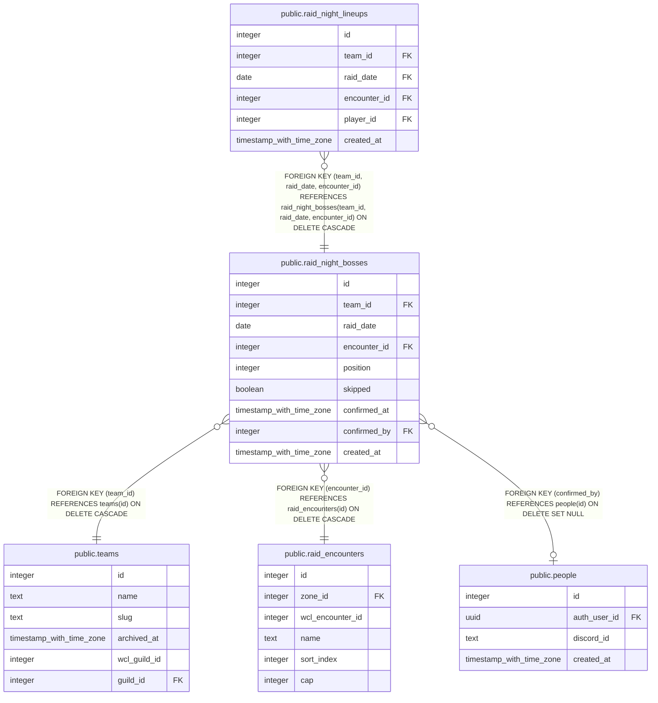

# public.raid_night_bosses

## Description

The bosses on one raid night's list for a team (#1216), in pull order. skipped keeps a boss the team is not pulling that night on the list. confirmed_at and confirmed_by say an officer saved that boss's lineup for the night; until then it follows the boss's standing group. No rows for a night means it is not planned yet.

## Columns

| Name | Type | Default | Nullable | Children | Parents | Comment |
| ---- | ---- | ------- | -------- | -------- | ------- | ------- |
| id | integer |  | false |  |  |  |
| team_id | integer |  | false | [public.raid_night_lineups](public.raid_night_lineups.md) | [public.teams](public.teams.md) |  |
| raid_date | date |  | false | [public.raid_night_lineups](public.raid_night_lineups.md) |  |  |
| encounter_id | integer |  | false | [public.raid_night_lineups](public.raid_night_lineups.md) | [public.raid_encounters](public.raid_encounters.md) |  |
| position | integer |  | false |  |  |  |
| skipped | boolean | false | false |  |  |  |
| confirmed_at | timestamp with time zone |  | true |  |  | When an officer last saved this boss's lineup for the night. Null while the lineup is the automatic copy of the standing group. |
| confirmed_by | integer |  | true |  | [public.people](public.people.md) |  |
| created_at | timestamp with time zone | now() | false |  |  |  |

## Constraints

| Name | Type | Definition |
| ---- | ---- | ---------- |
| raid_night_bosses_team_id_fkey | FOREIGN KEY | FOREIGN KEY (team_id) REFERENCES teams(id) ON DELETE CASCADE |
| raid_night_bosses_encounter_id_fkey | FOREIGN KEY | FOREIGN KEY (encounter_id) REFERENCES raid_encounters(id) ON DELETE CASCADE |
| raid_night_bosses_confirmed_by_fkey | FOREIGN KEY | FOREIGN KEY (confirmed_by) REFERENCES people(id) ON DELETE SET NULL |
| raid_night_bosses_pkey | PRIMARY KEY | PRIMARY KEY (id) |
| raid_night_bosses_team_id_raid_date_encounter_id_key | UNIQUE | UNIQUE (team_id, raid_date, encounter_id) |

## Indexes

| Name | Definition |
| ---- | ---------- |
| raid_night_bosses_pkey | CREATE UNIQUE INDEX raid_night_bosses_pkey ON public.raid_night_bosses USING btree (id) |
| raid_night_bosses_team_id_raid_date_encounter_id_key | CREATE UNIQUE INDEX raid_night_bosses_team_id_raid_date_encounter_id_key ON public.raid_night_bosses USING btree (team_id, raid_date, encounter_id) |
| raid_night_bosses_encounter_id_idx | CREATE INDEX raid_night_bosses_encounter_id_idx ON public.raid_night_bosses USING btree (encounter_id) |
| raid_night_bosses_confirmed_by_idx | CREATE INDEX raid_night_bosses_confirmed_by_idx ON public.raid_night_bosses USING btree (confirmed_by) |

## Relations

---

> Generated by [tbls](https://github.com/k1LoW/tbls)
