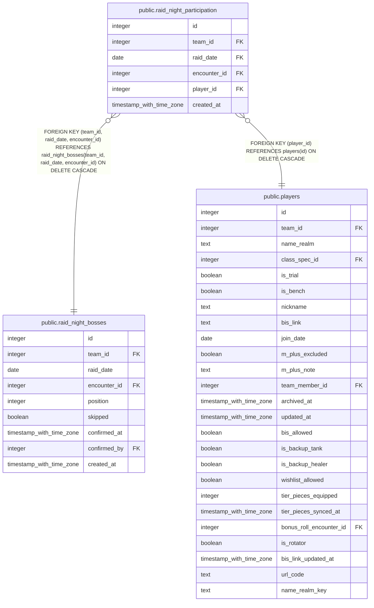

# public.raid_night_participation

## Description

Who was actually in for a real pull of one boss on one raid night (#1242), one row per raider present. Written only by record_raid_night_participation(), called from the attendance sync once a night has a lineup (raid_night_bosses). Compare against raid_night_lineups for planned-vs-actual.

## Columns

| Name | Type | Default | Nullable | Children | Parents | Comment |
| ---- | ---- | ------- | -------- | -------- | ------- | ------- |
| id | integer |  | false |  |  |  |
| team_id | integer |  | false |  | [public.raid_night_bosses](public.raid_night_bosses.md) |  |
| raid_date | date |  | false |  | [public.raid_night_bosses](public.raid_night_bosses.md) |  |
| encounter_id | integer |  | false |  | [public.raid_night_bosses](public.raid_night_bosses.md) |  |
| player_id | integer |  | false |  | [public.players](public.players.md) |  |
| created_at | timestamp with time zone | now() | false |  |  |  |

## Constraints

| Name | Type | Definition |
| ---- | ---- | ---------- |
| raid_night_participation_player_id_fkey | FOREIGN KEY | FOREIGN KEY (player_id) REFERENCES players(id) ON DELETE CASCADE |
| raid_night_participation_team_id_raid_date_encounter_id_fkey | FOREIGN KEY | FOREIGN KEY (team_id, raid_date, encounter_id) REFERENCES raid_night_bosses(team_id, raid_date, encounter_id) ON DELETE CASCADE |
| raid_night_participation_pkey | PRIMARY KEY | PRIMARY KEY (id) |
| raid_night_participation_team_id_raid_date_encounter_id_pla_key | UNIQUE | UNIQUE (team_id, raid_date, encounter_id, player_id) |

## Indexes

| Name | Definition |
| ---- | ---------- |
| raid_night_participation_pkey | CREATE UNIQUE INDEX raid_night_participation_pkey ON public.raid_night_participation USING btree (id) |
| raid_night_participation_team_id_raid_date_encounter_id_pla_key | CREATE UNIQUE INDEX raid_night_participation_team_id_raid_date_encounter_id_pla_key ON public.raid_night_participation USING btree (team_id, raid_date, encounter_id, player_id) |
| raid_night_participation_player_id_idx | CREATE INDEX raid_night_participation_player_id_idx ON public.raid_night_participation USING btree (player_id) |

## Triggers

| Name | Definition |
| ---- | ---------- |
| trg_raid_night_participation_team_id_check | CREATE TRIGGER trg_raid_night_participation_team_id_check BEFORE INSERT OR UPDATE ON public.raid_night_participation FOR EACH ROW EXECUTE FUNCTION check_team_id_matches_player() |

## Relations

---

> Generated by [tbls](https://github.com/k1LoW/tbls)
