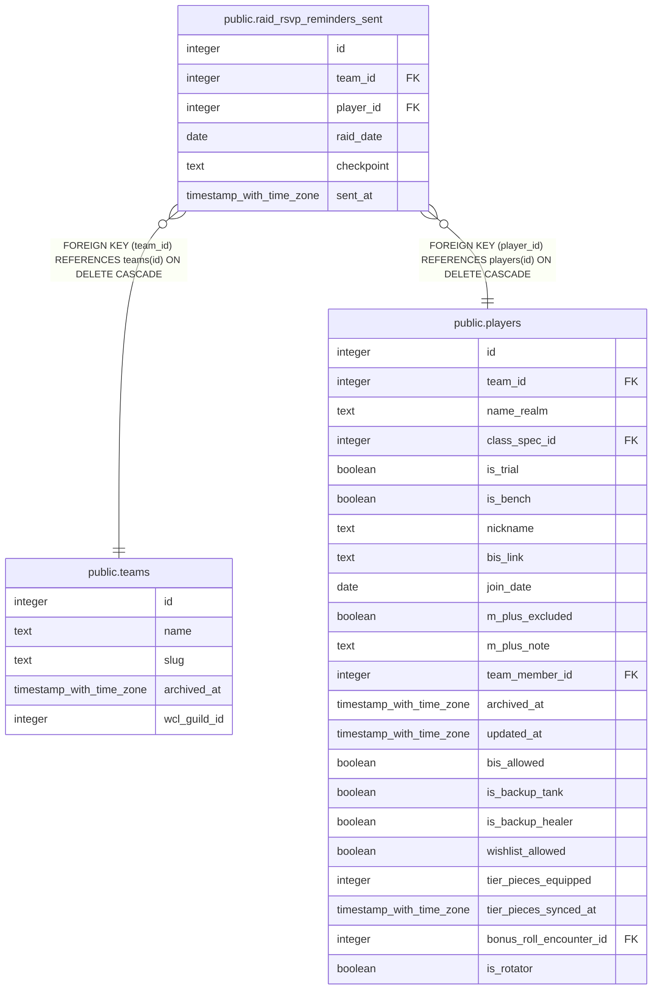

# public.raid_rsvp_reminders_sent

## Description

Dedup log for the optional-night DM reminder sweep (#895, part of #640) -- records that a 24h/2h reminder was already sent for a player/raid_date/checkpoint so the cron sweep does not re-DM on every tick. Insert-only, written solely by the optional-rsvp-reminders Edge Function via the service role. Not the source of truth for whether a player has responded -- that is raid_rsvps.

## Columns

| Name | Type | Default | Nullable | Children | Parents | Comment |
| ---- | ---- | ------- | -------- | -------- | ------- | ------- |
| id | integer | nextval('raid_rsvp_reminders_sent_id_seq'::regclass) | false |  |  |  |
| team_id | integer |  | false |  | [public.teams](public.teams.md) |  |
| player_id | integer |  | false |  | [public.players](public.players.md) |  |
| raid_date | date |  | false |  |  |  |
| checkpoint | text |  | false |  |  |  |
| sent_at | timestamp with time zone | now() | false |  |  |  |

## Constraints

| Name | Type | Definition |
| ---- | ---- | ---------- |
| raid_rsvp_reminders_sent_checkpoint_check | CHECK | CHECK ((checkpoint = ANY (ARRAY['24h'::text, '2h'::text]))) |
| raid_rsvp_reminders_sent_player_id_fkey | FOREIGN KEY | FOREIGN KEY (player_id) REFERENCES players(id) ON DELETE CASCADE |
| raid_rsvp_reminders_sent_team_id_fkey | FOREIGN KEY | FOREIGN KEY (team_id) REFERENCES teams(id) ON DELETE CASCADE |
| raid_rsvp_reminders_sent_pkey | PRIMARY KEY | PRIMARY KEY (id) |
| raid_rsvp_reminders_sent_team_id_player_id_raid_date_checkp_key | UNIQUE | UNIQUE (team_id, player_id, raid_date, checkpoint) |

## Indexes

| Name | Definition |
| ---- | ---------- |
| raid_rsvp_reminders_sent_pkey | CREATE UNIQUE INDEX raid_rsvp_reminders_sent_pkey ON public.raid_rsvp_reminders_sent USING btree (id) |
| raid_rsvp_reminders_sent_team_id_player_id_raid_date_checkp_key | CREATE UNIQUE INDEX raid_rsvp_reminders_sent_team_id_player_id_raid_date_checkp_key ON public.raid_rsvp_reminders_sent USING btree (team_id, player_id, raid_date, checkpoint) |

## Relations

---

> Generated by [tbls](https://github.com/k1LoW/tbls)
