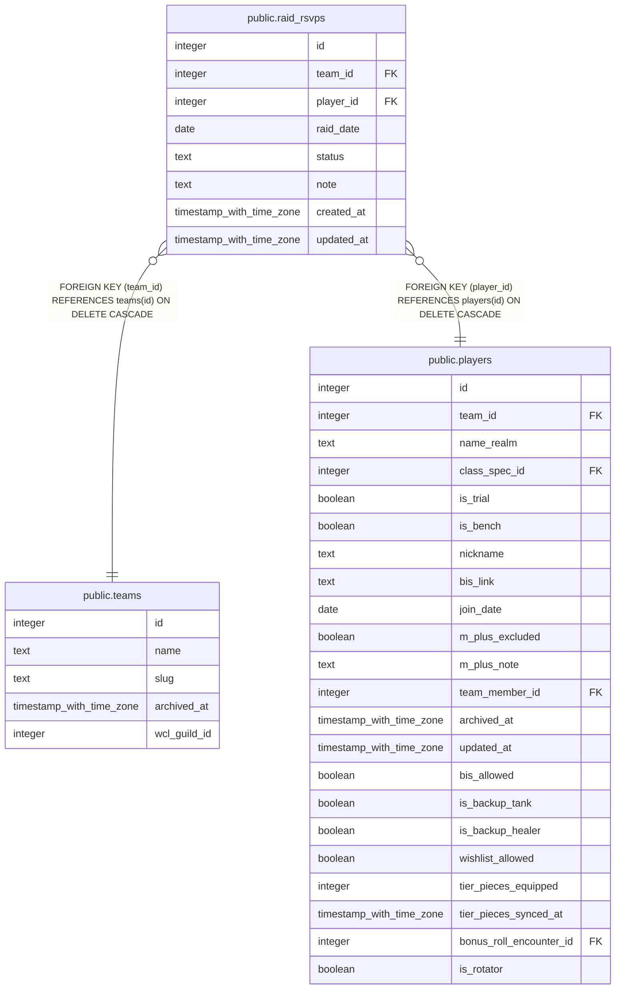

# public.raid_rsvps

## Description

A raider's self-declared override for one raid night (#893, part of #640) -- absence of a row means the computed default (Present, or Bench/Rotator via players.is_bench/is_rotator) applies. Forward-looking intent only, never synced into public.attendance. Written only through set_own_rsvp() or officer_set_rsvp() (SECURITY DEFINER); the Rotator-In status is written only through officer_set_rotator_week(). No direct INSERT/UPDATE/DELETE grant for anyone.

## Columns

| Name | Type | Default | Nullable | Children | Parents | Comment |
| ---- | ---- | ------- | -------- | -------- | ------- | ------- |
| id | integer | nextval('raid_rsvps_id_seq'::regclass) | false |  |  |  |
| team_id | integer |  | false |  | [public.teams](public.teams.md) |  |
| player_id | integer |  | false |  | [public.players](public.players.md) |  |
| raid_date | date |  | false |  |  |  |
| status | text |  | false |  |  |  |
| note | text |  | true |  |  |  |
| created_at | timestamp with time zone | now() | false |  |  |  |
| updated_at | timestamp with time zone | now() | false |  |  |  |

## Constraints

| Name | Type | Definition |
| ---- | ---- | ---------- |
| raid_rsvps_status_check | CHECK | CHECK ((status = ANY (ARRAY['Attending'::text, 'Late'::text, 'Leaving Early'::text, 'Tentative'::text, 'Absent'::text, 'Rotator-In'::text]))) |
| raid_rsvps_player_id_fkey | FOREIGN KEY | FOREIGN KEY (player_id) REFERENCES players(id) ON DELETE CASCADE |
| raid_rsvps_team_id_fkey | FOREIGN KEY | FOREIGN KEY (team_id) REFERENCES teams(id) ON DELETE CASCADE |
| raid_rsvps_pkey | PRIMARY KEY | PRIMARY KEY (id) |
| raid_rsvps_team_id_player_id_raid_date_key | UNIQUE | UNIQUE (team_id, player_id, raid_date) |

## Indexes

| Name | Definition |
| ---- | ---------- |
| raid_rsvps_pkey | CREATE UNIQUE INDEX raid_rsvps_pkey ON public.raid_rsvps USING btree (id) |
| raid_rsvps_team_id_player_id_raid_date_key | CREATE UNIQUE INDEX raid_rsvps_team_id_player_id_raid_date_key ON public.raid_rsvps USING btree (team_id, player_id, raid_date) |

## Triggers

| Name | Definition |
| ---- | ---------- |
| trg_raid_rsvps_updated_at | CREATE TRIGGER trg_raid_rsvps_updated_at BEFORE UPDATE ON public.raid_rsvps FOR EACH ROW EXECUTE FUNCTION set_updated_at() |

## Relations

---

> Generated by [tbls](https://github.com/k1LoW/tbls)
