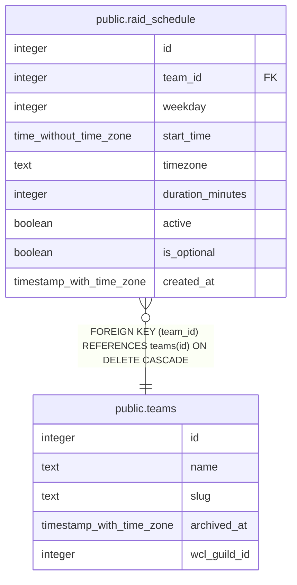

# public.raid_schedule

## Description

The raid calendar's officer-owned recurring weekly rule (#892, part of #640): one row per weekday/time this team normally raids. is_optional flags a night with no automatic default-Present (#895) -- every non-bench roster player must explicitly RSVP. Raid nights are computed on the fly from this table plus raid_schedule_exceptions (js/calendar.js, computeRaidNights()), not materialized as rows.

## Columns

| Name | Type | Default | Nullable | Children | Parents | Comment |
| ---- | ---- | ------- | -------- | -------- | ------- | ------- |
| id | integer | nextval('raid_schedule_id_seq'::regclass) | false |  |  |  |
| team_id | integer |  | false |  | [public.teams](public.teams.md) |  |
| weekday | integer |  | false |  |  |  |
| start_time | time without time zone |  | false |  |  |  |
| timezone | text | 'America/New_York'::text | false |  |  |  |
| duration_minutes | integer | 180 | false |  |  |  |
| active | boolean | true | false |  |  |  |
| is_optional | boolean | false | false |  |  |  |
| created_at | timestamp with time zone | now() | false |  |  |  |

## Constraints

| Name | Type | Definition |
| ---- | ---- | ---------- |
| raid_schedule_weekday_check | CHECK | CHECK (((weekday >= 0) AND (weekday <= 6))) |
| raid_schedule_team_id_fkey | FOREIGN KEY | FOREIGN KEY (team_id) REFERENCES teams(id) ON DELETE CASCADE |
| raid_schedule_pkey | PRIMARY KEY | PRIMARY KEY (id) |
| raid_schedule_team_id_weekday_start_time_key | UNIQUE | UNIQUE (team_id, weekday, start_time) |

## Indexes

| Name | Definition |
| ---- | ---------- |
| raid_schedule_pkey | CREATE UNIQUE INDEX raid_schedule_pkey ON public.raid_schedule USING btree (id) |
| raid_schedule_team_id_weekday_start_time_key | CREATE UNIQUE INDEX raid_schedule_team_id_weekday_start_time_key ON public.raid_schedule USING btree (team_id, weekday, start_time) |

## Relations

---

> Generated by [tbls](https://github.com/k1LoW/tbls)
