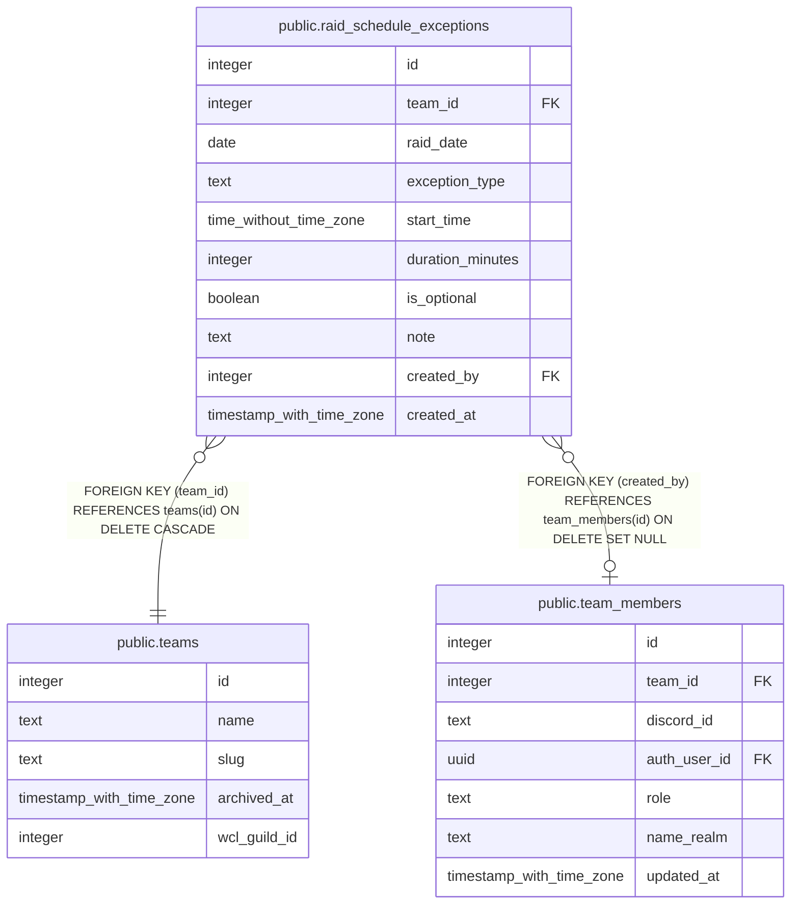

# public.raid_schedule_exceptions

## Description

One-off cancellation or addition on top of raid_schedule's recurring rule (#892) -- exception_type distinguishes skipping a normally-scheduled night from adding an extra one. is_optional only applies to an 'added' row.

## Columns

| Name | Type | Default | Nullable | Children | Parents | Comment |
| ---- | ---- | ------- | -------- | -------- | ------- | ------- |
| id | integer | nextval('raid_schedule_exceptions_id_seq'::regclass) | false |  |  |  |
| team_id | integer |  | false |  | [public.teams](public.teams.md) |  |
| raid_date | date |  | false |  |  |  |
| exception_type | text |  | false |  |  |  |
| start_time | time without time zone |  | true |  |  |  |
| duration_minutes | integer |  | true |  |  |  |
| is_optional | boolean | false | false |  |  |  |
| note | text |  | true |  |  |  |
| created_by | integer |  | true |  | [public.team_members](public.team_members.md) |  |
| created_at | timestamp with time zone | now() | false |  |  |  |

## Constraints

| Name | Type | Definition |
| ---- | ---- | ---------- |
| raid_schedule_exceptions_type_check | CHECK | CHECK ((exception_type = ANY (ARRAY['cancelled'::text, 'added'::text]))) |
| raid_schedule_exceptions_created_by_fkey | FOREIGN KEY | FOREIGN KEY (created_by) REFERENCES team_members(id) ON DELETE SET NULL |
| raid_schedule_exceptions_team_id_fkey | FOREIGN KEY | FOREIGN KEY (team_id) REFERENCES teams(id) ON DELETE CASCADE |
| raid_schedule_exceptions_pkey | PRIMARY KEY | PRIMARY KEY (id) |
| raid_schedule_exceptions_team_id_raid_date_exception_type_key | UNIQUE | UNIQUE (team_id, raid_date, exception_type) |

## Indexes

| Name | Definition |
| ---- | ---------- |
| raid_schedule_exceptions_pkey | CREATE UNIQUE INDEX raid_schedule_exceptions_pkey ON public.raid_schedule_exceptions USING btree (id) |
| raid_schedule_exceptions_team_id_raid_date_exception_type_key | CREATE UNIQUE INDEX raid_schedule_exceptions_team_id_raid_date_exception_type_key ON public.raid_schedule_exceptions USING btree (team_id, raid_date, exception_type) |

## Relations

---

> Generated by [tbls](https://github.com/k1LoW/tbls)
