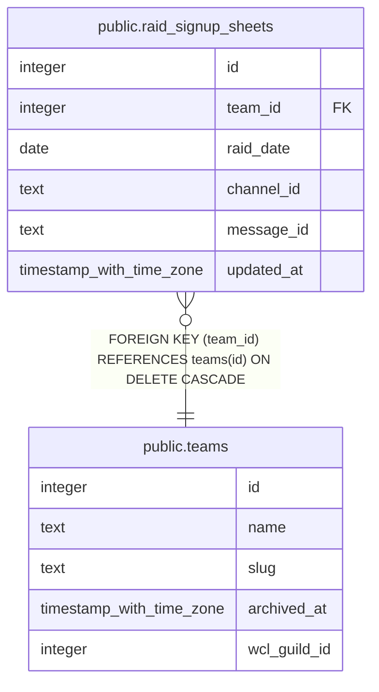

# public.raid_signup_sheets

## Description

Bookkeeping for the bot-owned aggregated signup-sheet Discord message (#900, part of #640): tracks which channel/message holds the one edited-in-place embed per team/raid_date. Written and read only by the bot's service-role client via claim_raid_signup_sheet(); no read use case for an officer or end user. Mirrors raid_rsvp_reminders_sent's locked-down shape (#895).

## Columns

| Name | Type | Default | Nullable | Children | Parents | Comment |
| ---- | ---- | ------- | -------- | -------- | ------- | ------- |
| id | integer | nextval('raid_signup_sheets_id_seq'::regclass) | false |  |  |  |
| team_id | integer |  | false |  | [public.teams](public.teams.md) |  |
| raid_date | date |  | false |  |  |  |
| channel_id | text |  | true |  |  |  |
| message_id | text |  | true |  |  |  |
| updated_at | timestamp with time zone | now() | false |  |  |  |

## Constraints

| Name | Type | Definition |
| ---- | ---- | ---------- |
| raid_signup_sheets_team_id_fkey | FOREIGN KEY | FOREIGN KEY (team_id) REFERENCES teams(id) ON DELETE CASCADE |
| raid_signup_sheets_pkey | PRIMARY KEY | PRIMARY KEY (id) |
| raid_signup_sheets_team_id_raid_date_key | UNIQUE | UNIQUE (team_id, raid_date) |

## Indexes

| Name | Definition |
| ---- | ---------- |
| raid_signup_sheets_pkey | CREATE UNIQUE INDEX raid_signup_sheets_pkey ON public.raid_signup_sheets USING btree (id) |
| raid_signup_sheets_team_id_raid_date_key | CREATE UNIQUE INDEX raid_signup_sheets_team_id_raid_date_key ON public.raid_signup_sheets USING btree (team_id, raid_date) |

## Relations

---

> Generated by [tbls](https://github.com/k1LoW/tbls)
