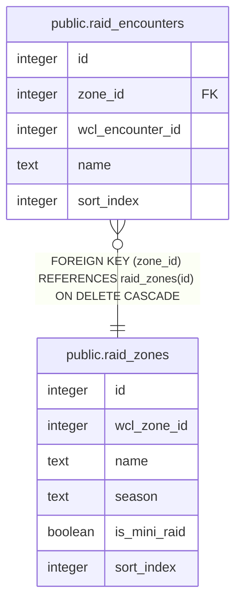

# public.raid_zones

## Columns

| Name | Type | Default | Nullable | Children | Parents | Comment |
| ---- | ---- | ------- | -------- | -------- | ------- | ------- |
| id | integer | nextval('raid_zones_id_seq'::regclass) | false | [public.raid_encounters](public.raid_encounters.md) |  |  |
| wcl_zone_id | integer |  | false |  |  |  |
| name | text |  | false |  |  |  |
| season | text |  | false |  |  |  |
| is_mini_raid | boolean | false | false |  |  |  |
| sort_index | integer | 0 | false |  |  |  |

## Constraints

| Name | Type | Definition |
| ---- | ---- | ---------- |
| raid_zones_pkey | PRIMARY KEY | PRIMARY KEY (id) |
| raid_zones_wcl_zone_id_season_key | UNIQUE | UNIQUE (wcl_zone_id, season) |

## Indexes

| Name | Definition |
| ---- | ---------- |
| raid_zones_pkey | CREATE UNIQUE INDEX raid_zones_pkey ON public.raid_zones USING btree (id) |
| raid_zones_wcl_zone_id_season_key | CREATE UNIQUE INDEX raid_zones_wcl_zone_id_season_key ON public.raid_zones USING btree (wcl_zone_id, season) |

## Relations

---

> Generated by [tbls](https://github.com/k1LoW/tbls)
