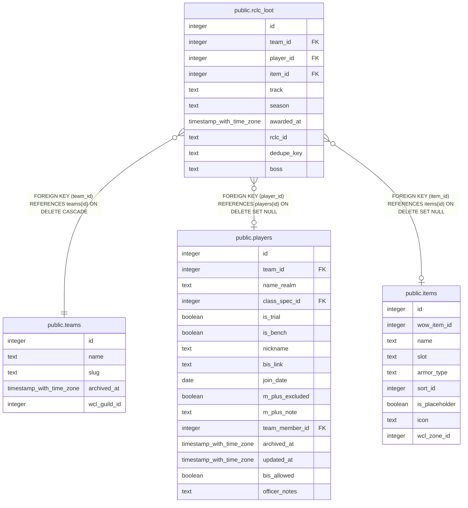

# public.rclc_loot

## Columns

| Name | Type | Default | Nullable | Children | Parents | Comment |
| ---- | ---- | ------- | -------- | -------- | ------- | ------- |
| id | integer | nextval('loot_id_seq'::regclass) | false |  |  |  |
| team_id | integer |  | false |  | [public.teams](public.teams.md) |  |
| player_id | integer |  | true |  | [public.players](public.players.md) |  |
| item_id | integer |  | true |  | [public.items](public.items.md) |  |
| track | text |  | true |  |  |  |
| season | text |  | true |  |  |  |
| awarded_at | timestamp with time zone | now() | false |  |  |  |
| rclc_id | text |  | true |  |  |  |
| dedupe_key | text |  | true |  |  |  |
| boss | text |  | true |  |  |  |

## Constraints

| Name | Type | Definition |
| ---- | ---- | ---------- |
| rclc_loot_track_check | CHECK | CHECK ((track = ANY (ARRAY['Champion'::text, 'Hero'::text, 'Myth'::text]))) |
| loot_item_id_fkey | FOREIGN KEY | FOREIGN KEY (item_id) REFERENCES items(id) ON DELETE SET NULL |
| loot_dedupe_key_key | UNIQUE | UNIQUE (dedupe_key) |
| loot_pkey | PRIMARY KEY | PRIMARY KEY (id) |
| loot_player_id_fkey | FOREIGN KEY | FOREIGN KEY (player_id) REFERENCES players(id) ON DELETE SET NULL |
| loot_team_id_fkey | FOREIGN KEY | FOREIGN KEY (team_id) REFERENCES teams(id) ON DELETE CASCADE |

## Indexes

| Name | Definition |
| ---- | ---------- |
| loot_dedupe_key_key | CREATE UNIQUE INDEX loot_dedupe_key_key ON public.rclc_loot USING btree (dedupe_key) |
| loot_pkey | CREATE UNIQUE INDEX loot_pkey ON public.rclc_loot USING btree (id) |

## Triggers

| Name | Definition |
| ---- | ---------- |
| trg_rclc_loot_team_id_check | CREATE TRIGGER trg_rclc_loot_team_id_check BEFORE INSERT OR UPDATE ON public.rclc_loot FOR EACH ROW EXECUTE FUNCTION check_team_id_matches_player() |

## Relations

---

> Generated by [tbls](https://github.com/k1LoW/tbls)
