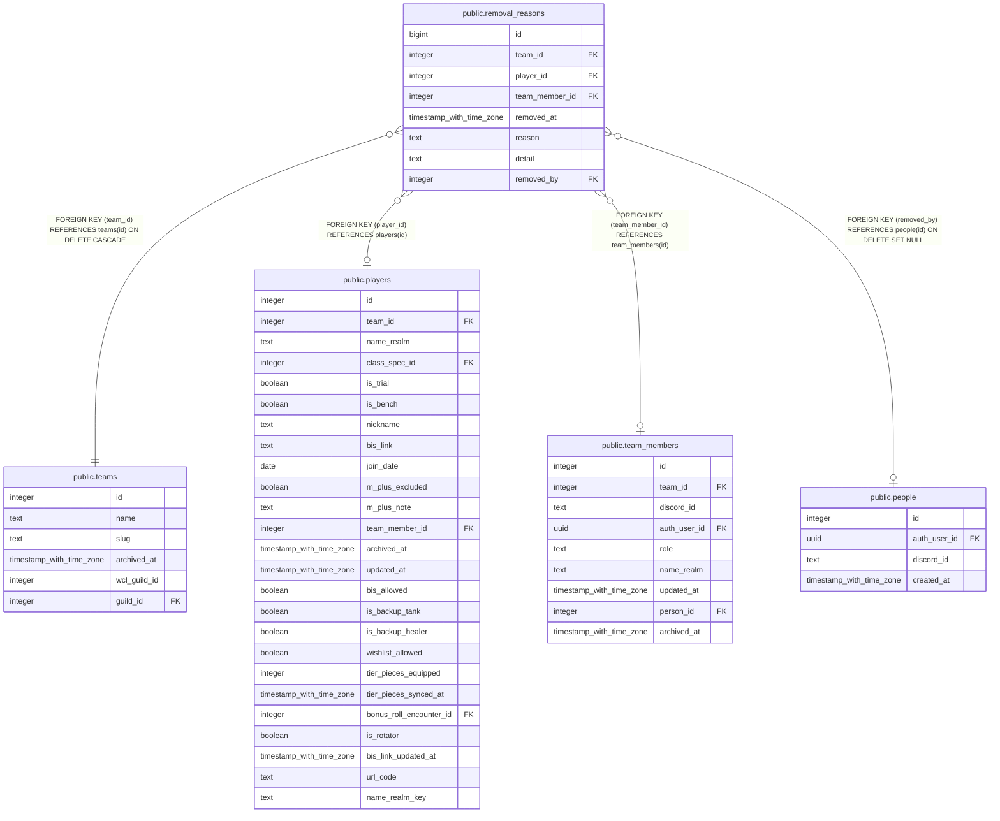

# public.removal_reasons

## Description

Every reason a character or a membership was removed for (#1427), never updated or deleted. A character's row comes from a trigger on player_officer_notes, a membership's from archive_team_member(). The notes row still holds the latest reason; this holds all of them.

## Columns

| Name | Type | Default | Nullable | Children | Parents | Comment |
| ---- | ---- | ------- | -------- | -------- | ------- | ------- |
| id | bigint |  | false |  |  |  |
| team_id | integer |  | false |  | [public.teams](public.teams.md) |  |
| player_id | integer |  | true |  | [public.players](public.players.md) | The character removed. Null on a membership's own row (archive_team_member()). |
| team_member_id | integer |  | true |  | [public.team_members](public.team_members.md) | The membership: the one ended, on a membership's row, or the one the character was linked to when it was removed. Rows copied from the audit log carry the character's link as it stood when they were copied. |
| removed_at | timestamp with time zone | now() | false |  |  | When they were removed: the character's archived_at, so a correction written later stays under the same removal. One row per removal, reason and detail. |
| reason | text |  | false |  |  |  |
| detail | text |  | true |  |  |  |
| removed_by | integer |  | true |  | [public.people](public.people.md) | The person who removed them, from my_person_id(); null for a write with nobody signed in, and for an audit entry whose account has no person. |

## Constraints

| Name | Type | Definition |
| ---- | ---- | ---------- |
| removal_reasons_about_someone | CHECK | CHECK (((player_id IS NOT NULL) OR (team_member_id IS NOT NULL))) |
| removal_reasons_reason_check | CHECK | CHECK ((reason = ANY (ARRAY['schedule_conflict'::text, 'performance'::text, 'drama'::text, 'moved_guilds'::text, 'switching_mains'::text, 'other'::text]))) |
| removal_reasons_player_id_fkey | FOREIGN KEY | FOREIGN KEY (player_id) REFERENCES players(id) |
| removal_reasons_team_member_id_fkey | FOREIGN KEY | FOREIGN KEY (team_member_id) REFERENCES team_members(id) |
| removal_reasons_team_id_fkey | FOREIGN KEY | FOREIGN KEY (team_id) REFERENCES teams(id) ON DELETE CASCADE |
| removal_reasons_removed_by_fkey | FOREIGN KEY | FOREIGN KEY (removed_by) REFERENCES people(id) ON DELETE SET NULL |
| removal_reasons_pkey | PRIMARY KEY | PRIMARY KEY (id) |

## Indexes

| Name | Definition |
| ---- | ---------- |
| removal_reasons_pkey | CREATE UNIQUE INDEX removal_reasons_pkey ON public.removal_reasons USING btree (id) |
| removal_reasons_team_id_idx | CREATE INDEX removal_reasons_team_id_idx ON public.removal_reasons USING btree (team_id) |
| removal_reasons_player_id_idx | CREATE INDEX removal_reasons_player_id_idx ON public.removal_reasons USING btree (player_id) |
| removal_reasons_team_member_id_idx | CREATE INDEX removal_reasons_team_member_id_idx ON public.removal_reasons USING btree (team_member_id) |
| removal_reasons_one_per_reason | CREATE UNIQUE INDEX removal_reasons_one_per_reason ON public.removal_reasons USING btree (player_id, removed_at, reason, detail) NULLS NOT DISTINCT WHERE (player_id IS NOT NULL) |

## Triggers

| Name | Definition |
| ---- | ---------- |
| trg_removal_reasons_team_id_check | CREATE TRIGGER trg_removal_reasons_team_id_check BEFORE INSERT OR UPDATE ON public.removal_reasons FOR EACH ROW EXECUTE FUNCTION check_team_id_matches_player() |
| trg_removal_reasons_membership_team_check | CREATE TRIGGER trg_removal_reasons_membership_team_check BEFORE INSERT OR UPDATE ON public.removal_reasons FOR EACH ROW EXECUTE FUNCTION check_removal_reason_membership_team() |

## Relations

---

> Generated by [tbls](https://github.com/k1LoW/tbls)
