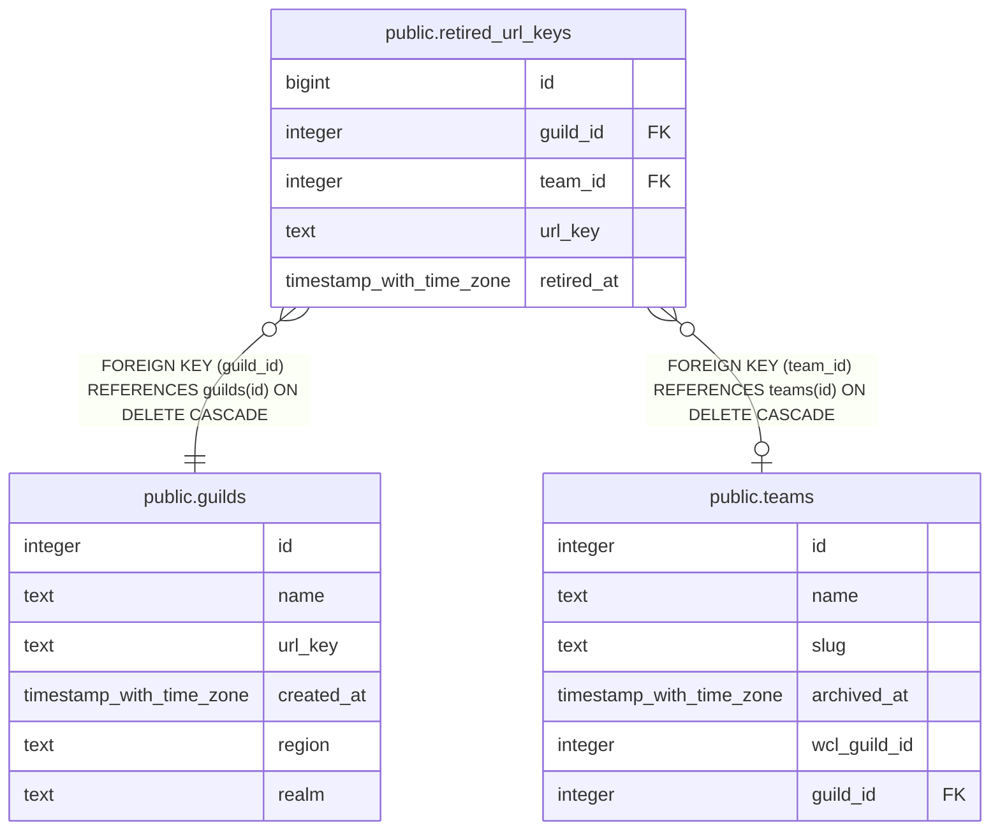

# public.retired_url_keys

## Description

Keys a guild (team_id null) or team used to have, so old addresses still resolve. Written only by the key-change triggers on guilds and teams (#1114). guild_id is the guild the key lived under.

## Columns

| Name | Type | Default | Nullable | Children | Parents | Comment |
| ---- | ---- | ------- | -------- | -------- | ------- | ------- |
| id | bigint |  | false |  |  |  |
| guild_id | integer |  | false |  | [public.guilds](public.guilds.md) |  |
| team_id | integer |  | true |  | [public.teams](public.teams.md) |  |
| url_key | text |  | false |  |  |  |
| retired_at | timestamp with time zone | now() | false |  |  |  |

## Constraints

| Name | Type | Definition |
| ---- | ---- | ---------- |
| retired_url_keys_team_id_fkey | FOREIGN KEY | FOREIGN KEY (team_id) REFERENCES teams(id) ON DELETE CASCADE |
| retired_url_keys_guild_id_fkey | FOREIGN KEY | FOREIGN KEY (guild_id) REFERENCES guilds(id) ON DELETE CASCADE |
| retired_url_keys_pkey | PRIMARY KEY | PRIMARY KEY (id) |
| retired_url_keys_one_per_owner | UNIQUE | UNIQUE NULLS NOT DISTINCT (guild_id, team_id, url_key) |

## Indexes

| Name | Definition |
| ---- | ---------- |
| retired_url_keys_pkey | CREATE UNIQUE INDEX retired_url_keys_pkey ON public.retired_url_keys USING btree (id) |
| retired_url_keys_one_per_owner | CREATE UNIQUE INDEX retired_url_keys_one_per_owner ON public.retired_url_keys USING btree (guild_id, team_id, url_key) NULLS NOT DISTINCT |

## Relations

---

> Generated by [tbls](https://github.com/k1LoW/tbls)
