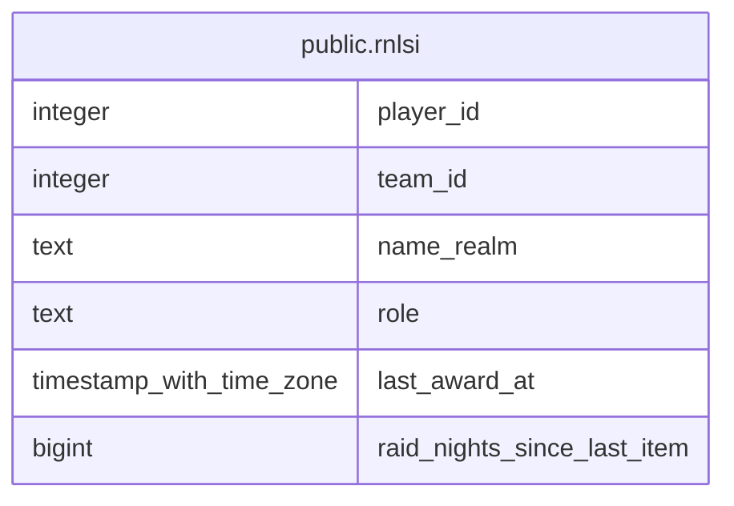

# public.rnlsi

## Description

<details>
<summary><strong>Table Definition</strong></summary>

```sql
CREATE VIEW rnlsi AS (
 SELECT p.id AS player_id,
    p.team_id,
    p.name_realm,
    cs.role,
    la.last_award_at,
    ( SELECT count(DISTINCT a.raid_date) AS count
           FROM attendance a
          WHERE ((a.team_id = p.team_id) AND ((la.last_award_at IS NULL) OR (a.raid_date > (la.last_award_at)::date)))) AS raid_nights_since_last_item
   FROM ((players p
     LEFT JOIN classes_specs cs ON ((cs.id = p.class_spec_id)))
     LEFT JOIN LATERAL ( SELECT max(rl.awarded_at) AS last_award_at
           FROM rclc_loot rl
          WHERE (rl.player_id = p.id)) la ON (true))
  WHERE (p.archived_at IS NULL)
  ORDER BY p.team_id, cs.role, ( SELECT count(DISTINCT a.raid_date) AS count
           FROM attendance a
          WHERE ((a.team_id = p.team_id) AND ((la.last_award_at IS NULL) OR (a.raid_date > (la.last_award_at)::date)))) DESC
)
```

</details>

## Columns

| Name | Type | Default | Nullable | Children | Parents | Comment |
| ---- | ---- | ------- | -------- | -------- | ------- | ------- |
| player_id | integer |  | true |  |  |  |
| team_id | integer |  | true |  |  |  |
| name_realm | text |  | true |  |  |  |
| role | text |  | true |  |  |  |
| last_award_at | timestamp with time zone |  | true |  |  |  |
| raid_nights_since_last_item | bigint |  | true |  |  |  |

## Referenced Tables

| Name | Columns | Comment | Type |
| ---- | ------- | ------- | ---- |
| [public.attendance](public.attendance.md) | 7 |  | BASE TABLE |
| [public.players](public.players.md) | 16 |  | BASE TABLE |
| [public.classes_specs](public.classes_specs.md) | 4 |  | BASE TABLE |
| [LATERAL](LATERAL.md) | 0 |  |  |
| [public.rclc_loot](public.rclc_loot.md) | 10 |  | BASE TABLE |

## Relations



---

> Generated by [tbls](https://github.com/k1LoW/tbls)
